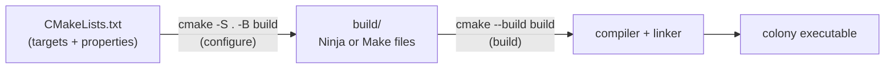

# CMake: the minimum

## What it is

CMake is a **build-system generator**. It compiles nothing itself: you describe your program as a set of **targets** (executables and libraries) in a `CMakeLists.txt`, and CMake generates the real build files (Ninja or Makefiles) that drive the compiler and linker. What those tools then do with your source files is covered in [Compilation model](compilation-model.md) — this page is only about describing the build.

One rule carries the whole page: **everything is a target**. Every command that describes your program starts with `add_` or `target_`; the handful of others on this page (project setup, `FetchContent`) are one-time boilerplate. The global commands from old tutorials — `include_directories()`, `link_libraries()`, poking `CMAKE_CXX_FLAGS` — are legacy, and you can ignore all of them.

## Why you care

The engine is about to stop being one file. The simulation core, the SDL3 platform layer, and the mod-facing API want to be separate libraries, and EnTT and SDL3 are external dependencies that must be fetched, built, and linked identically on every machine. CMake is the `package.json`-plus-build-script of the C++ world — except nothing is implicit, so you write roughly 20 lines to get what npm gives you for free.

## Quick start

The smallest real project:

```text
colony/
├── CMakeLists.txt
└── src/
    └── main.cpp
```

```cpp
// src/main.cpp — stand-in loop until SDL3 arrives below
#include <cstdint>
#include <cstdio>

int main() {
    std::uint64_t tick = 0;
    for (int frame = 0; frame < 3; ++frame) {
        ++tick;  // one fixed 60 Hz simulation step
    }
    std::printf("ran %llu ticks\n", static_cast<unsigned long long>(tick));
    return 0;
}
```

```cmake
cmake_minimum_required(VERSION 3.28)
project(colony LANGUAGES CXX)

add_executable(colony src/main.cpp)
target_compile_features(colony PRIVATE cxx_std_20)
```

Configure once, then build every time you change code:

```sh
cmake -S . -B build      # configure: generate the build system into build/
cmake --build build      # build: actually compile and link
./build/colony
```

!!! tip
    You almost never re-run the configure line by hand. `cmake --build build` notices when any `CMakeLists.txt` changed and re-configures automatically.

### Splitting out a library

When the simulation grows past one file, make it a library target and link it:

```cmake
# fragment — does not run alone; append to the CMakeLists.txt above
add_library(sim
  src/sim/world.cpp
  src/sim/tick.cpp)
target_include_directories(sim PUBLIC include)
target_compile_features(sim PUBLIC cxx_std_20)

target_link_libraries(colony PRIVATE sim)
```

`target_include_directories(sim PUBLIC include)` says: `sim`'s headers live in `include/`, and anything linking `sim` gets that include path for free. What belongs in those headers is [Headers in practice](headers-in-practice.md)'s job.

### Fetching EnTT and SDL3

`FetchContent` downloads dependencies at configure time and builds them as part of your project:

```cmake
# fragment — does not run alone; append to the CMakeLists.txt above
include(FetchContent)

FetchContent_Declare(EnTT
  GIT_REPOSITORY https://github.com/skypjack/entt.git
  GIT_TAG        v3.13.2)

FetchContent_Declare(SDL3
  GIT_REPOSITORY https://github.com/libsdl-org/SDL.git
  GIT_TAG        release-3.2.0)

FetchContent_MakeAvailable(EnTT SDL3)

target_link_libraries(sim    PUBLIC  EnTT::EnTT)
target_link_libraries(colony PRIVATE SDL3::SDL3)
```

That is the entire dependency story: declare, make available, link the imported target. Linking `EnTT::EnTT` automatically hands `sim` EnTT's include paths and compile requirements — no extra wiring.

## How it works

CMake runs in two phases, and keeping them straight explains almost every error message you will see:



The **configure** step reads `CMakeLists.txt` top to bottom, records every target and its properties, and writes generated build files into `build/`. The **build** step just runs them. Everything in `build/` is disposable — delete the directory and reconfigure whenever the build state seems haunted.

Targets propagate properties to whoever links them, controlled by one keyword on each `target_*` command:

| Keyword | Used to build this target | Passed on to targets that link it |
|---|---|---|
| `PRIVATE` | yes | no |
| `PUBLIC` | yes | yes |
| `INTERFACE` | no | yes |

In the recipe above, `sim` links `EnTT::EnTT` as `PUBLIC` because `sim`'s own headers mention EnTT types (component registries in function signatures), so consumers of `sim` need EnTT too. SDL3 is `PRIVATE` to `colony` because nothing else includes SDL headers. This is why "everything is a target" wins: each dependency carries its own **usage requirements**, so consumers link one name and get the includes, flags, and transitive libraries automatically.

!!! warning
    A decade of Stack Overflow answers uses the global commands: `include_directories()`, `link_libraries()`, `set(CMAKE_CXX_FLAGS ...)`. They mutate state for every target defined after them and fail silently as the project grows. If a snippet does not say `target_`, do not paste it.

## What to expect

The first configure clones EnTT and SDL3; the first build then compiles SDL3 from source — expect a one-time wait of several minutes. After that, builds are incremental and fast. Debug versus optimized builds are one flag at configure time: `cmake -S . -B build -DCMAKE_BUILD_TYPE=Debug`. Wiring AddressSanitizer and UndefinedBehaviorSanitizer flags into that debug configuration is exactly where [Debugging with sanitizers](debugging-with-sanitizers.md) picks up.

!!! note
    The CMake language itself is stringly-typed and genuinely quirky; nobody enjoys it. You do not need to learn it — the 20-odd lines on this page cover the engine for months.

Deliberately out of scope: `install()`, exporting packages, toolchain files, cross-compiling, and presets. Those live in [What to defer](what-to-defer.md) for a reason.

## Go deeper

- [Compilation model](compilation-model.md) — what the generated build files actually make the compiler and linker do
- [Headers in practice](headers-in-practice.md) — the header hygiene your `target_include_directories` paths serve
- [Debugging with sanitizers](debugging-with-sanitizers.md) — adding sanitizer flags to a debug configuration
- [What to defer](what-to-defer.md) — install/export, packaging, toolchain files, cross-compiling

Sources:

- CMake official tutorial — https://cmake.org/cmake/help/latest/guide/tutorial/index.html — accessed 2026-07-05
- An Introduction to Modern CMake (cliutils) — https://cliutils.gitlab.io/modern-cmake/ — accessed 2026-07-05
- CMake documentation — target_link_libraries — https://cmake.org/cmake/help/latest/command/target_link_libraries.html — accessed 2026-07-05

Video: Effective CMake — Daniel Pfeifer — C++Now 2017 — https://www.youtube.com/watch?v=bsXLMQ6WgIk — 87 min — watch after you have a working multi-target build and want the full target-based design philosophy behind these 20 lines.
