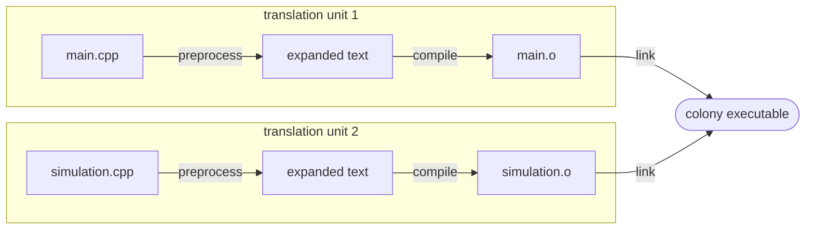

# The C++ compilation model

## What it is

C++ has no import-and-run loop. Python resolves `import` while your program runs; C# loads assemblies into a VM. C++ does everything ahead of time, in three stages. The **preprocessor** textually expands each `.cpp` file (pasting in `#include`d files, substituting macros) into one self-contained **translation unit**. The **compiler** turns each translation unit into native machine code in an **object file** (`.o`). The **linker** stitches the object files, plus any libraries, into a single executable. The compiler works on one translation unit at a time and remembers nothing between them — only the linker ever sees the whole program.

## Why you care

The engine will be dozens of `.cpp` files, and build failures come in two families from two different programs. **Compiler errors** mean one translation unit is broken in isolation. **Linker errors** mean every file compiled fine, but the pieces don't fit together. Knowing which stage failed tells you where the fix lives — editing code when the real problem is a missing file on the link line loses afternoons.

| Message you'll see | Stage that failed | Typical cause |
|---|---|---|
| `error: unknown type name 'Entty'` | compile | typo, or a declaration this translation unit can't see |
| `error: redefinition of 'advance_tick'` | compile | same name defined twice **inside one** translation unit |
| `undefined symbol` / `undefined reference to` | link | the object file with the definition isn't on the link line |
| `duplicate symbol` | link | same name defined in **two** translation units |

## Quick start

A tick loop split across two files — the smallest shape the engine will ever have. `simulation.cpp` owns the simulation step:

```cpp
// fragment — does not compile alone (no main(); link it with main.o)
// simulation.cpp
#include <cstdio>

void advance_tick(unsigned long long tick) {
    // A real engine would update every entity here: movement, jobs, hunger.
    std::printf("tick %llu: colony simulated\n", tick);
}
```

`main.cpp` runs the loop. It never sees `simulation.cpp`'s contents — only a declaration of `advance_tick`, so its calls type-check:

```cpp
// fragment — does not compile alone (advance_tick is defined in simulation.cpp)
// main.cpp
void advance_tick(unsigned long long tick); // a promise: "the linker will find this"

int main() {
    // Three ticks stand in for the engine's fixed 60 Hz loop.
    for (unsigned long long tick = 0; tick < 3; ++tick) {
        advance_tick(tick);
    }
}
```

Build it by hand, one stage at a time:

```sh
clang++ -std=c++20 -Wall -Wextra -c simulation.cpp   # -> simulation.o
clang++ -std=c++20 -Wall -Wextra -c main.cpp         # -> main.o
clang++ main.o simulation.o -o colony                # link
./colony
```

```text
tick 0: colony simulated
tick 1: colony simulated
tick 2: colony simulated
```

!!! tip
    `clang++ -std=c++20 -Wall -Wextra main.cpp simulation.cpp -o colony` does all three stages in one command. The separate `-c` steps are what build systems automate: change `simulation.cpp` and only `simulation.o` recompiles before a relink.

## How it works

Each stage consumes only what the previous one produced:

1. **Preprocess.** `#include` pastes the named file's text in verbatim — not an import. The output is the translation unit: pure C++ text with no `#` directives left.
2. **Compile.** The compiler checks and translates that text using only what's visible in it, producing an object file: machine code plus a symbol table — names this unit **defines**, and names it **uses but expects elsewhere**. That's why `main.cpp` needs the `advance_tick` declaration: without it, the call is a compiler error.
3. **Link.** The linker gathers every object file and library and matches each "expected elsewhere" name to exactly one definition. Zero matches is an undefined symbol; two matches is a duplicate symbol.



The model predicts a real failure: omit `simulation.cpp` and the compile stage still succeeds — `main.cpp` kept its promise locally — but the link cannot:

```text
$ clang++ -std=c++20 -Wall -Wextra main.cpp -o colony
Undefined symbols for architecture arm64:
  "advance_tick(unsigned long long)", referenced from:
      _main in main-c851b4.o
ld: symbol(s) not found for architecture arm64
clang++: error: linker command failed with exit code 1
```

The `ld:` prefix is the linker speaking, not the compiler.

!!! warning
    On `undefined symbol`, no edit to the file you're staring at helps — the compiler already succeeded. The fix is almost always adding the `.cpp` (or library) that defines the name to the link line.

The mirror-image failure: paste `advance_tick`'s **body** into both files. Each translation unit compiles happily — the compiler has no memory across units — and the linker rejects the program with `duplicate symbol`. This one-definition constraint is why headers hold declarations, not definitions.

## Pros / Cons

| Pros | Cons |
|---|---|
| Incremental: one changed `.cpp` means one recompile plus a relink | No whole-program view while compiling — mismatches surface late, as blunt linker errors |
| Translation units are independent, so builds parallelize across cores | `#include` re-expands the same text into every unit, so build times grow with project size |
| Names resolve at build time; the executable is plain machine code with no import machinery eating your 16.6 ms tick budget | Declarations must be kept in sync with definitions by hand |

## What to expect

Hand-writing declarations in every consumer, as `main.cpp` did, stops scaling at file three; headers exist to share them — [Headers in practice](headers-in-practice.md) covers include guards, forward declarations, and organization next. You won't type `clang++` commands day-to-day: [CMake](cmake-minimum.md) generates exactly these preprocess-compile-link invocations for every source file and library (EnTT, SDL3) in the engine. C++20 modules eventually replace textual inclusion, but they're deliberately parked in [What to defer](what-to-defer.md).

!!! info
    Every IDE "Run" button and CI job orchestrates these same three stages — there is no other path from source to executable. When any build tool fails, the table above still applies.

## Go deeper

- [Headers in practice](headers-in-practice.md) — sharing declarations across translation units without hand-copying them
- [CMake minimum](cmake-minimum.md) — automating the commands you just ran by hand
- [What to defer](what-to-defer.md) — C++20 modules and why we're not using them yet

**Sources**

- learncpp.com 0.5 — Introduction to the compiler, linker, and libraries — https://www.learncpp.com/cpp-tutorial/introduction-to-the-compiler-linker-and-libraries/ — accessed 2026-07-05
- learncpp.com 2.8 — Programs with multiple code files — https://www.learncpp.com/cpp-tutorial/programs-with-multiple-code-files/ — accessed 2026-07-05
- cppreference — Phases of translation — https://en.cppreference.com/w/cpp/language/translation_phases — accessed 2026-07-05

Video: How the C++ Compiler Works — The Cherno — https://www.youtube.com/watch?v=3tIqpEmWMLI — 18 min — watch after reading, if the compile stage still feels like a black box.
