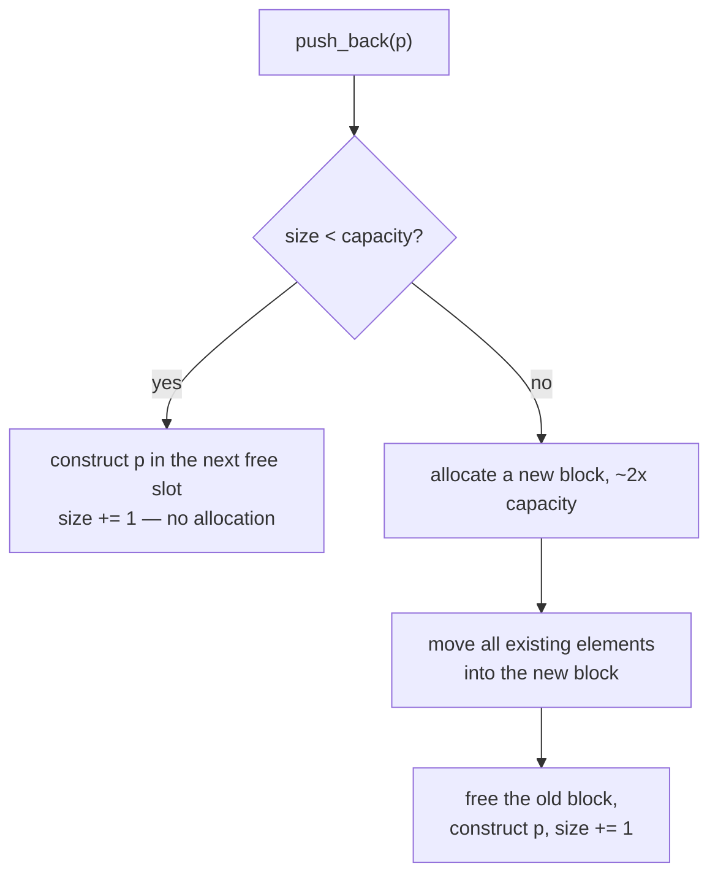

# Core containers

## What it is

The standard library ships dozens of containers; engine code needs four. `std::vector<T>` is a growable contiguous array — Python's `list`, a JS `Array` — and C++'s default container (Core Guidelines SL.con.2). `std::array<T, N>` is a fixed-size array with length baked into the type; it allocates nothing. `std::unordered_map<K, V>` is the hash map: Python's `dict`, C#'s `Dictionary`. `std::string` is mutable text — essentially a `std::vector<char>` with text conveniences.

All four are value types ([Value semantics](value-semantics.md)): the container **owns** its elements, copying it copies them, and its destructor frees everything at scope exit — [RAII](raii.md) doing the job your last language's garbage collector did.

## Why you care

A 60 Hz tick gives you 16.6 ms to update every colony entity. The dominant cost is not arithmetic but **memory access**: the CPU fetches 64-byte cache lines, and adjacent reads are roughly a hundred times cheaper than following a pointer to a random heap address. Iterating a `std::vector` is the first kind; a structure of separately heap-allocated elements — the invisible default in Python, JS, and C# — is the second.

!!! info
    EnTT stores each component type contiguously — its sparse sets are `std::vector`s underneath. Iterating a view of `Position` components walks a vector. That layout, not clever code, makes ticking thousands of entities at 60 Hz feasible.

## Quick start

All four in one colony tick — compiles as pasted:

```cpp
#include <array>
#include <cstdio>
#include <string>
#include <unordered_map>
#include <vector>

struct Position {
    float x = 0.0f;
    float y = 0.0f;
};

int main() {
    // One component type, thousands of entities: EnTT's shape too.
    std::vector<Position> positions;
    positions.reserve(10'000);              // one allocation up front
    for (int i = 0; i < 10'000; ++i) {
        positions.push_back({static_cast<float>(i), 100.0f});
    }

    for (Position& p : positions) {         // contiguous walk: the 60 Hz workhorse
        p.y -= 9.8f / 60.0f;                // one tick of gravity
    }

    // Keyed lookups: the colony stockpile by resource name.
    std::unordered_map<std::string, int> stockpile;
    stockpile["wood"] = 40;
    stockpile["stone"] = 12;

    // Count fixed at compile time: the four grid neighbours.
    const std::array<Position, 4> offsets{{{0, 1}, {0, -1}, {1, 0}, {-1, 0}}};

    std::string name = "colonist_" + std::to_string(7);
    std::printf("%s: y=%.3f, wood=%d, %zu offsets\n", name.c_str(),
                static_cast<double>(positions[7].y), stockpile["wood"],
                offsets.size());
}
```

`reserve(10'000)` pre-allocates, so ten thousand `push_back`s cost one heap allocation instead of a dozen-plus grow-and-move cycles.

!!! tip
    When you know (or can bound) the element count — entities spawned this tick, tiles in a chunk — call `reserve` first. A one-line, always-safe win.

## How it works

A `std::vector` tracks **size** (elements in use) and **capacity** (slots allocated). While size is below capacity, `push_back` constructs the element in the next free slot — no allocation. When capacity runs out, it allocates a larger block (typically 2x), moves every element across ([move semantics usage](move-semantics-usage.md)), and frees the old block. Elements move only if their move constructor is `noexcept` (true for every type here); otherwise they **copy**, keeping the strong exception guarantee. Doubling makes `push_back` amortized O(1).



`std::unordered_map` trades layout for lookup. Keys hash into buckets; each entry is its own heap node: finding `stockpile["wood"]` is O(1) on average, but iteration hops across the heap node by node — and, unlike Python's `dict`, in an **unspecified order** that reshuffles as the map grows, so never let it drive simulation order. Right for occasional keyed lookups, wrong for a per-tick inner loop.

!!! warning
    `operator[]` on `std::unordered_map` **inserts** a default value when the key is missing. `stockpile["irom"]` silently creates a zero entry: a typo becomes a phantom resource and a mystery save-file key found hours later. For pure reads, use `find` or `at`:

```cpp
// fragment — does not compile alone
auto it = stockpile.find("iron");
if (it != stockpile.end()) { use(it->second); }
int wood = stockpile.at("wood");   // throws if missing — loud, not silent
```

`std::array<Position, 4>` is exactly four `Position`s in place — no heap, no runtime size field — for counts fixed at compile time. `std::string` is contiguous too, and short strings (up to 22 chars in libc++, 15 in libstdc++/MSVC) live inside the string object with **no allocation at all** — why short names and map keys stay cheap.

## Pros / Cons

| Container | Layout | Great at | You pay with | Reach for it when |
|---|---|---|---|---|
| `std::vector` | contiguous, heap | per-tick iteration; `push_back` at the end | reallocation on growth; O(n) insert in the middle | in doubt — it is the default (SL.con.2) |
| `std::array` | contiguous, in place | zero allocation; length fixed in the type at compile time | length can never change | the count is a compile-time constant (4 neighbours, 3 axes) |
| `std::unordered_map` | hash buckets of heap nodes | O(1) average lookup by key | cache-hostile iteration; per-entry allocation | keyed lookups dominate and you rarely iterate |
| `std::string` | contiguous + small-string optimization | text; use as a hash key | conversion at C boundaries (`.c_str()` for SDL3) | it is text |

Rule of thumb: **iterated every tick → `std::vector`; found by key → `std::unordered_map`; count known at compile time → `std::array`; text → `std::string`**.

## What to expect

The `positions` loop above is range-for; its variants and `auto` are in [lambdas, auto, range-for](lambdas-auto-range-for.md). Reallocation has a sharp edge: pointers, references, and iterators into a vector go stale when it grows. That bug class bites GC-language arrivals hardest; [footguns from other languages](footguns-from-other-languages.md) dissects it, and [debugging with sanitizers](debugging-with-sanitizers.md) shows AddressSanitizer catching it at the exact line. `std::list`, `std::map`, `std::deque`, and the algorithms/ranges library are parked in [what to defer](what-to-defer.md): none earns a hot-path slot yet.

## Go deeper

- [Value semantics](value-semantics.md) — what container ownership means.
- [RAII](raii.md) — the destructor discipline that frees container memory.
- [Move semantics usage](move-semantics-usage.md) — why reallocation moves, not copies.
- [Lambdas, auto, range-for](lambdas-auto-range-for.md) — the loop syntax above.
- [Footguns from other languages](footguns-from-other-languages.md) — iterator/pointer invalidation as a bug class.
- [What to defer](what-to-defer.md) — containers and algorithms to ignore for now.

Sources:

- learncpp.com 16.2 — Introduction to std::vector and list constructors — https://www.learncpp.com/cpp-tutorial/introduction-to-stdvector-and-list-constructors/ — accessed 2026-07-05
- cppreference — std::vector — https://en.cppreference.com/w/cpp/container/vector — accessed 2026-07-05
- cppreference — std::unordered_map — https://en.cppreference.com/w/cpp/container/unordered_map — accessed 2026-07-05
- C++ Core Guidelines — SL.con.2: Prefer STL vector by default — https://isocpp.github.io/CppCoreGuidelines/CppCoreGuidelines#rsl-vector — accessed 2026-07-05

Video: Back to Basics: Classic STL — Bob Steagall — CppCon 2021 — https://www.youtube.com/watch?v=tXUXl_RzkAk — 62 min — watch after reading.
