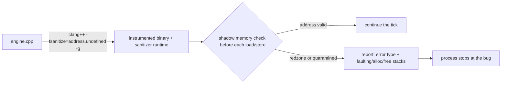

# Debugging with sanitizers

## What it is

Sanitizers are bug detectors the compiler builds into your binary. Add `-fsanitize=address,undefined -g` to your Clang flags, and every memory access and the most common operations that trigger undefined behavior (UB) get a runtime check. **AddressSanitizer (ASan)** catches use-after-free, heap and stack buffer overflows, and double-free. **UndefinedBehaviorSanitizer (UBSan)** catches signed integer overflow, out-of-range shifts, and null dereference. When a check fires, you get a symbolized stack trace pointing at the exact line — the closest C++ gets to a Python traceback.

## Why you care

In Python, reading past the end of a list raises `IndexError` at the offending line. In C++, `vec[i]` out of bounds is UB: maybe a crash, more often a silent read or write of whatever lives next door. In a server-authoritative sim that is the worst case — a dangling component pointer scribbles on a resource count during tick 1400, nothing crashes, and the clients desync on tick 1403. The crash site, if there is one, is nowhere near the bug.

Sanitizers turn that back into fail-fast: the process stops **at the first bad access**, printing the faulting stack, the stack that allocated the memory, and the stack that freed it. This page covers turning them on, reading a report, and keeping them on every day.

## Quick start

A classic engine bug: cache a pointer to a component, then let the container reallocate under it (see [Core containers](core-containers.md)).

```cpp
// deliberately buggy — ASan aborts this at the printf (expected output below)
#include <cstdio>
#include <vector>

struct Health { int hp; };

int main() {
    std::vector<Health> components;
    components.push_back(Health{100});
    Health* boss = &components[0];        // pointer into the vector's buffer
    for (int i = 0; i < 1000; ++i) {
        components.push_back(Health{50}); // reallocates; boss now dangles
    }
    std::printf("boss hp: %d\n", boss->hp); // use-after-free
}
```

Build with sanitizers and run:

```sh
clang++ -std=c++20 -Wall -Wextra -g -O1 -fno-omit-frame-pointer \
    -fsanitize=address,undefined dangle.cpp -o dangle
./dangle
```

`-g` puts file:line in the traces; `-O1 -fno-omit-frame-pointer` keeps stacks accurate without making the build crawl. Instead of printing a garbage hp — or worse, a plausible one — the program dies immediately:

```text
==4242==ERROR: AddressSanitizer: heap-use-after-free on address 0x602000000010
READ of size 4 at 0x602000000010 thread T0
    #0 0x000104ce7ef4 in main dangle.cpp:13
0x602000000010 is located 0 bytes inside of 4-byte region [0x602000000010,0x602000000014)
freed by thread T0 here:
    #1 0x000104ce8354 in std::vector<Health>::push_back(Health&&) ...
    #2 0x000104ce7e8c in main dangle.cpp:11
previously allocated by thread T0 here:
    #2 0x000104ce7dd4 in main dangle.cpp:8
```

Read it as three stacks: **where the bad read happened** (line 13), **who freed the memory** (the reallocating `push_back` at line 11), and **who allocated it** (line 8). That triple is usually the entire diagnosis.

!!! tip
    Export `UBSAN_OPTIONS=print_stacktrace=1` in your shell profile — without it, UBSan prints one line with no stack. On Linux, also set `ASAN_OPTIONS=abort_on_error=1`: there ASan `_exit()`s with code 1 instead of raising SIGABRT where a debugger could catch it. On macOS aborting is already the default.

To keep sanitizers on in the everyday debug build, add them to the target from [CMake minimum](cmake-minimum.md) — the flags must appear at compile **and** link time:

```cmake
# fragment — does not compile alone; goes in the CMakeLists.txt from cmake-minimum
target_compile_options(engine PRIVATE
    $<$<CONFIG:Debug>:-fsanitize=address,undefined -g -fno-omit-frame-pointer>)
target_link_options(engine PRIVATE
    $<$<CONFIG:Debug>:-fsanitize=address,undefined>)
```

## How it works

ASan has two halves. At compile time, Clang inserts a check before every load and store. At link time, a runtime library takes over `malloc` and `free`: each allocation gets poisoned **redzones** on both sides, and freed blocks sit in a **quarantine** instead of being reused, so a stale pointer still points at memory known to be dead. The inserted checks consult **shadow memory** — a map recording, for every 8 bytes of address space, whether your program may touch them.



UBSan is lighter: no shadow memory, just an inline check at each operation the standard declares UB — signed overflow, bad shifts, null dereference, out-of-bounds on arrays of known size. By default it **prints and keeps running**; add `-fno-sanitize-recover=undefined` to make the first report fatal, which is what you want in a determinism-sensitive engine.

!!! warning
    Sanitizer flags must reach **every** translation unit and the link line. A half-sanitized binary links, runs, and quietly misses bugs in the uninstrumented half — people lose hours concluding "ASan found nothing" when ASan was never watching that code.

## Pros / Cons

| Pros | Cons |
|------|------|
| Essentially no false positives — in a fully instrumented build, a report almost always means a real bug | ~2x slowdown, 2–3x memory: a large colony may not hold 60 Hz in this build |
| Exact file:line plus allocation and free history | Misses uninitialized reads and data races — different tools own those |
| Catches bugs whose tests silently "pass" | Flags must reach the whole build, or coverage silently shrinks |
| No code changes: works as-is with EnTT, SDL3, any library | Leak detection is on by default on Linux but not macOS |

!!! info
    Sanitizers only check code that actually runs. They replace the interpreter's runtime checks, not your tests — a use-after-free in the pathfinder stays invisible until a test or a play session executes the pathfinder.

## What to expect

Your first sanitized runs will fire in code you thought was fine: pointers invalidated by `push_back` like the example above, iterators held across an `erase`, signed tick arithmetic that overflows in long sessions. The catalog of which Python/JS/C# habits produce which report lives in [Footguns from other languages](footguns-from-other-languages.md) — read it with a sanitized build handy.

Data races (ThreadSanitizer), uninitialized reads (MemorySanitizer), and fuzzing are real tools you do not need for a single-threaded 60 Hz tick; they are parked in [What to defer](what-to-defer.md). Keep `address,undefined` in the debug preset permanently, and build a plain release binary only when you profile.

## Go deeper

- [Footguns from other languages](footguns-from-other-languages.md) — the bug patterns these reports point at.
- [Core containers](core-containers.md) — why that `push_back` invalidated the pointer.
- [CMake minimum](cmake-minimum.md) — where the flags snippet above actually lives.
- [What to defer](what-to-defer.md) — ThreadSanitizer, MemorySanitizer, fuzzing.

Sources:

- Clang documentation — AddressSanitizer — https://clang.llvm.org/docs/AddressSanitizer.html — accessed 2026-07-05
- Clang documentation — UndefinedBehaviorSanitizer — https://clang.llvm.org/docs/UndefinedBehaviorSanitizer.html — accessed 2026-07-05
- google/sanitizers wiki — AddressSanitizer — https://github.com/google/sanitizers/wiki/AddressSanitizer — accessed 2026-07-05

Video: C++ Weekly Ep 84 — C++ Sanitizers (Jason Turner) — https://www.youtube.com/watch?v=MB6NPkB4YVs — 12 min — watch after reading to see ASan and UBSan firing live on small examples.
