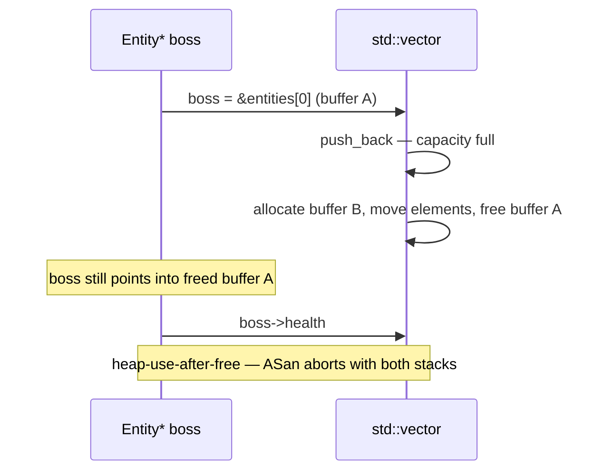

# Footguns from other languages

## What it is

The six C++ traps that most reliably bite programmers arriving from Python, JavaScript, or C#. Each is an instinct safe under a garbage collector but wrong here; each entry names the warning or sanitizer that catches it — the track's consolidation page.

## Why you care

In your previous languages, the worst outcome is an exception with a stack trace. In C++, most of these mistakes are **undefined behavior** (UB): the program compiles, usually appears to work, and silently corrupts state.

On a server-authoritative 60 Hz sim, that means a drifting stockpile count, a desync twenty minutes into co-op, and no stack trace pointing anywhere. The tools below turn a lost evening into an immediate, located error.

## Quick start

Skim the table, then turn on the opt-in warning. AddressSanitizer (ASan) and UndefinedBehaviorSanitizer (UBSan) handle the runtime half — see [Debugging with sanitizers](debugging-with-sanitizers.md).

| Trap | Coming from Python/JS/C# | What C++ does | Caught by |
|---|---|---|---|
| Uninitialized locals | error, `undefined`, or zeroed | garbage bits; reading them is UB | `-Wuninitialized` (in `-Wall`) |
| Returning a reference to a local | returned values stay alive | dangling reference; UB | `-Wreturn-stack-address`, ASan |
| Pointer into a `std::vector` across `push_back` | references stay valid | buffer may move; UB | ASan (`heap-use-after-free`) |
| `unordered_map` `operator[]` on a missing key | `KeyError` / `undefined` | inserts a zeroed value | nothing — use `.contains()` / `.at()` |
| `for (auto e : entities)` | loop variable is the element | loop variable is a copy | nothing — write `auto&` by reflex |
| Integer conversion, overflow | bigints, or defined wraparound | signed overflow is UB; narrowing truncates | `-Wconversion`, UBSan |

`-Wall -Wextra` omits one warning; ask for it by name:

```sh
clang++ -std=c++20 -Wall -Wextra -Wconversion tick.cpp
```

!!! tip
    Set these flags once with `target_compile_options` on your CMake target — see [CMake minimum](cmake-minimum.md).

## How it works

### Uninitialized locals

C# refuses to compile a read of an unassigned local; Python raises `NameError`; JavaScript gives `undefined`. C++ hands you whatever bits were in the stack slot; reading them is UB.

```cpp
// fragment — does not compile alone
int damage_this_tick;    // garbage bits, not 0 — reading it is undefined behavior
Vec2 velocity;           // both floats garbage: entities teleport, sometimes

int healed = 0;          // the fix is a habit: initialize, always
Vec2 spawn{};            // {} zero-initializes every member
```

`-Wuninitialized` (in `-Wall`) catches straightforward cases but misses struct members and cross-function flows, so the durable fix is Core Guidelines [ES.20](https://isocpp.github.io/CppCoreGuidelines/CppCoreGuidelines#res-always): always initialize.

### Returning a reference to a local

A garbage collector keeps returned values alive; here the local dies at the closing brace and the reference dangles.

```cpp
#include <string>

const std::string& tick_label() {
    std::string label = "tick 4218";
    return label;  // warning: reference to stack memory of local variable 'label'
}

int main() {
    const std::string& s = tick_label();  // s dangles: label died at the brace
    // return s.size() > 0 ? 1 : 0;       // UB — uncomment and ASan (with
    //                                    // detect_stack_use_after_return=1)
    //                                    // aborts here: stack-use-after-return
    (void)s;
    return 0;
}
```

Clang's `-Wreturn-stack-address` (on by default) catches the direct return; ASan's `stack-use-after-return` mode catches it behind a call chain.

### Pointers into a vector across `push_back`

A `std::vector` owns one contiguous buffer. When `push_back` outgrows capacity, it allocates a bigger buffer, moves every element, and frees the old one — any pointer or reference you kept now aims at freed memory.



```cpp
#include <cstdio>
#include <vector>

struct Entity { int id; float health; };

int main() {
    std::vector<Entity> entities;
    entities.push_back({1, 100.0f});

    Entity* boss = &entities[0];       // pointer into the vector's current buffer

    for (int i = 2; i <= 64; ++i)      // a wave spawns; growth reallocates
        entities.push_back({i, 50.0f});

    // std::printf("%.1f\n", boss->health);  // UB — uncomment and ASan aborts
    //                                        // here: heap-use-after-free, with
    //                                        // the use, free, and alloc stacks
    (void)boss;
    return 0;
}
```

No compile-time diagnostic exists; this is ASan's home turf. Full invalidation rules — and why to store an index or `entt::entity` id across ticks instead — are in [Core containers](core-containers.md).

### `operator[]` on maps inserts

In Python, `stockpile["stone"]` raises `KeyError` on a missing key. `std::unordered_map`'s `operator[]` value-initializes (zero for ints and POD members) and inserts it — a read that mutates.

```cpp
#include <cstdio>
#include <string>
#include <unordered_map>

int main() {
    std::unordered_map<std::string, int> stockpile{{"wood", 12}};

    if (stockpile["stone"] > 0) {}             // silently inserts {"stone", 0}
    std::printf("%zu\n", stockpile.size());    // 2 — the query mutated the map

    if (stockpile.contains("stone")) {}        // what you meant (C++20)
    std::printf("%d\n", stockpile.at("wood")); // or .at(): throws like Python
}
```

Caught by nothing: legal, specified, just surprising. Use `.contains()`, `.find()`, or `.at()` — `operator[]` does not even exist on a `const` map.

### Accidental copies in range-for

`for x in xs:` hands Python the element itself. `for (auto e : entities)` copies each element, because `auto` deduces a value — see [value semantics](value-semantics.md) and [Lambdas, auto, range-for](lambdas-auto-range-for.md).

```cpp
// fragment — does not compile alone
for (auto e : entities)      // copies each Entity out of the vector
    e.health -= 10.0f;       // damages the copy; the colony never notices

for (auto& e : entities)     // reference: mutations land
    e.health -= 10.0f;
```

!!! warning
    The mutation form compiles clean and warns nowhere — damage lands on copies, every entity walks away at full health, and the sim is quietly wrong. It costs hours because nothing fails.

`-Wall`'s `-Wrange-loop-construct` fires only on `const auto` copies of expensive types such as `std::string`; a small POD component like `Entity` gets no diagnostic. Write `auto&` (or `const auto&`) by reflex.

### Integer conversion, overflow

Python integers never overflow; C# defines wraparound. In C++, unsigned arithmetic wraps silently (legal), signed overflow is UB, and narrowing conversions truncate without a peep.

```cpp
#include <cstdint>
#include <cstdio>

int main() {
    std::uint32_t wood = 3;
    wood -= 5;                       // unsigned wrap: 4294967294 wood in stock
    std::printf("%u\n", wood);

    std::int32_t a = 2'000'000'000;
    std::int64_t total = std::int64_t{a} + a;  // widen first; a + a would be UB
    std::printf("%lld\n", static_cast<long long>(total));
}
```

`-Wconversion` and `-Wsign-conversion` catch this at compile time; UBSan (`-fsanitize=signed-integer-overflow`) at runtime.

## What to expect

The first weeks feel booby-trapped; that recalibrates once warnings-as-errors and regular sanitizer runs are routine. Roughly half the traps are ignored value semantics, the other half lifetimes the garbage collector used to manage.

!!! info
    Sanitizers only observe code that executes — a UB path your tests never take stays invisible; a clean run is evidence, not proof. Keep compile-time warnings on even with a green sanitizer build.

Two traps have no tool — `operator[]` insertion and the mutated range-for copy — those you catch in review. How much more C++ must you learn to be safe? [What to defer](what-to-defer.md) draws that boundary.

## Go deeper

- [Value semantics](value-semantics.md) — the copy model behind half of these bugs
- [Core containers](core-containers.md) — full iterator invalidation rules for `std::vector` and the maps
- [Debugging with sanitizers](debugging-with-sanitizers.md) — building and running ASan and UBSan
- [Lambdas, auto, range-for](lambdas-auto-range-for.md) — what `auto` deduces and why it copies
- [What to defer](what-to-defer.md) — what you can safely ignore for now

Sources:

- learncpp.com 1.6 — Uninitialized variables and undefined behavior — https://www.learncpp.com/cpp-tutorial/uninitialized-variables-and-undefined-behavior/ — accessed 2026-07-05
- cppreference — Undefined behavior — https://en.cppreference.com/w/cpp/language/ub — accessed 2026-07-05
- C++ Core Guidelines — ES.20: Always initialize an object — https://isocpp.github.io/CppCoreGuidelines/CppCoreGuidelines#res-always — accessed 2026-07-05

Video: Curiously Recurring C++ Bugs at Facebook — Louis Brandy — CppCon 2017 — https://www.youtube.com/watch?v=lkgszkPnV8g — 52 min — watch after reading; the talk opens with this page's `operator[]` and uninitialized-member traps.
