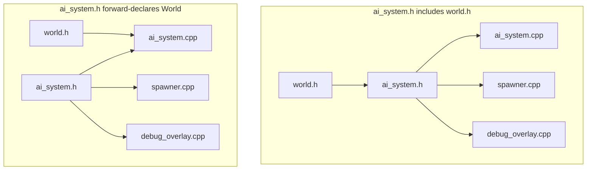

# Headers in practice

## What it is

The daily discipline of splitting engine code into headers (`.h`) holding **declarations** and source files (`.cpp`) holding **definitions**. Unlike Python or C#, C++ has no import system that reads compiled metadata — every `.cpp` compiles in isolation, and a header is literally text pasted in by `#include`. The paste-compile-link pipeline itself is [Compilation model](compilation-model.md); this page is the habits that keep it from hurting you.

## Why you care

Two failure modes will eat your first week:

- **Linker errors, not compiler errors.** Define a function in a header, include it from two `.cpp` files: each compiles cleanly, then the link fails with `duplicate symbol`. No Python/JS/C# equivalent exists, so it reads like gibberish at first.
- **Rebuild avalanches.** Editing a header recompiles every `.cpp` that includes it, transitively. Component headers like `Health` end up included by half the systems, so a sloppy include graph turns a one-line tweak into a coffee-break rebuild.

Four habits prevent both: declare in headers, define in one `.cpp`, guard every header, keep headers light with forward declarations; `inline` covers helpers that belong in headers.

## Quick start

A system's public surface goes in the header; its body in exactly one `.cpp`:

```cpp
// fragment — does not compile alone (this is src/damage_system.h)
#pragma once
#include <cstdint>

struct Health {
    std::int32_t current{100};
    std::int32_t max{100};
};

// Declaration only: enough for any caller to compile against.
void apply_damage(Health& h, std::int32_t amount);
```

```cpp
// fragment — does not compile alone (this is src/damage_system.cpp)
#include "damage_system.h"

#include <algorithm>

// The one and only definition in the entire program.
void apply_damage(Health& h, std::int32_t amount) {
    h.current = std::max(h.current - amount, 0);
}
```

Any other `.cpp` — combat, save serializer, a mod — includes `damage_system.h`, compiles against the declaration, and the linker wires every call to the single definition.

## How it works

### Declarations vs definitions

A declaration says "this name exists, with this type"; a definition provides the body or storage. The **one-definition rule (ODR)** demands exactly one definition per function or variable program-wide; break it and you get a linker error — or, if the duplicates differ, silent undefined behavior (UB). Since a header is pasted into many `.cpp` files, what it may contain follows:

| Fine in a header | Must live in exactly one `.cpp` |
|---|---|
| Function **declarations** | Function **definitions** (unless `inline`) |
| `struct`/`class` definitions (identical in every file — automatic when everyone includes the same header) | Non-`inline` global variable definitions |
| Templates, `constexpr` functions, type aliases, `enum`s | |

!!! warning
    The `duplicate symbol` error from a function defined in a header only appears once a **second** `.cpp` includes it — maybe weeks later, in someone's mod. Core Guidelines [SF.2](https://isocpp.github.io/CppCoreGuidelines/CppCoreGuidelines#rs-inline): no non-`inline` definitions in headers, ever.

### Guard every header

If a header lands in the same `.cpp` twice — with transitive includes it eventually will — its `struct` definitions repeat and compilation fails. So every header opens with a guard; the classic form per Core Guidelines [SF.8](https://isocpp.github.io/CppCoreGuidelines/CppCoreGuidelines#rs-guards) is a macro sandwich:

```cpp
// fragment — does not compile alone (classic include guard)
#ifndef GAME_SRC_DAMAGE_SYSTEM_H
#define GAME_SRC_DAMAGE_SYSTEM_H
// ...declarations...
#endif
```

!!! tip
    `#pragma once` does the same job in one line with no macro name to typo (see Quick start). Technically non-standard, but every compiler you'll target (Clang, GCC, MSVC) supports it. Use it and move on.

### Forward declarations keep component headers light

A header that only touches a type through a pointer or reference does not need its full definition — a **forward declaration** is enough:

```cpp
#include <cstdint>

struct World;  // forward declaration: "this type exists" — no #include

struct TickContext {
    World* world{};        // pointer: its size is known regardless
    std::uint64_t tick{};  // current tick of the fixed 60 Hz simulation
};

int main() {
    TickContext ctx;
    return static_cast<int>(ctx.tick);
}
```

Only the `.cpp` files that reach into `World` include `world.h`. The include graph shows the payoff:



Left: editing `world.h` recompiles three files; right: one. Multiplied across the engine: two-second versus two-minute iteration. Forward declarations also break include cycles (A includes B includes A), which [SF.9](https://isocpp.github.io/CppCoreGuidelines/CppCoreGuidelines#rs-cycles) forbids.

### `inline` for helpers that belong in headers

Some helpers are too small to split — converting ticks to seconds, say. Mark them `inline` and the ODR relaxes: identical definitions may appear in every `.cpp`; the linker keeps one.

```cpp
// fragment — does not compile alone (this is src/tick_time.h)
#pragma once
#include <cstdint>

inline constexpr double tick_seconds = 1.0 / 60.0;

inline double ticks_to_seconds(std::uint64_t ticks) {
    return static_cast<double>(ticks) * tick_seconds;
}
```

Today `inline` does **not** mean "please inline this call" — optimizers decide that. It means "multiple identical definitions allowed". `constexpr` functions are implicitly `inline`; templates get the same permission from a separate ODR carve-out — which is why header-only libraries like EnTT can exist.

## Pros / Cons

| Technique | Wins | Costs |
|---|---|---|
| `#pragma once` | One line, nothing to typo | Non-standard (in practice: universal) |
| `#ifndef` guards | Standard, works everywhere | Verbose; a duplicated macro name fails silently |
| Forward declarations | Faster rebuilds, breaks cycles | Pointer/reference use only; touching members still needs the full include |
| `inline` in headers | Header-only convenience | Every includer recompiles the body; edits ripple everywhere |

## What to expect

- `#include "..."` searches next to the including file first; `#include <...>` searches library paths — which come from `target_include_directories`, [CMake minimum](cmake-minimum.md) territory.
- EnTT is header-only: `#include <entt/entt.hpp>` pulls in a lot of template code — a normal, accepted compile-time cost for the ECS.
- You will forget a guard and define a global in a header — once each. The errors will make sense now.

!!! info
    C++20 modules (`import`) are the designed replacement for headers, but build-system and ecosystem support is too uneven to bet an engine on — see [What to defer](what-to-defer.md).

## Go deeper

- [Compilation model](compilation-model.md) — why `#include` is textual paste and what the linker does with definitions.
- [CMake minimum](cmake-minimum.md) — include paths, targets, wiring the multi-file build.
- [What to defer](what-to-defer.md) — modules and other things not worth learning yet.

**Sources**

- learncpp.com 2.11 — Header files — https://www.learncpp.com/cpp-tutorial/header-files/ — accessed 2026-07-05
- learncpp.com 2.12 — Header guards — https://www.learncpp.com/cpp-tutorial/header-guards/ — accessed 2026-07-05
- cppreference — Source file inclusion (#include) — https://en.cppreference.com/w/cpp/preprocessor/include — accessed 2026-07-05
- C++ Core Guidelines — SF: Source files — https://isocpp.github.io/CppCoreGuidelines/CppCoreGuidelines#s-source — accessed 2026-07-05

Video: C++ Header Files — The Cherno — https://www.youtube.com/watch?v=9RJTQmK0YPI — 15 min — watch after reading to see the duplicate-symbol error produced and fixed live.
