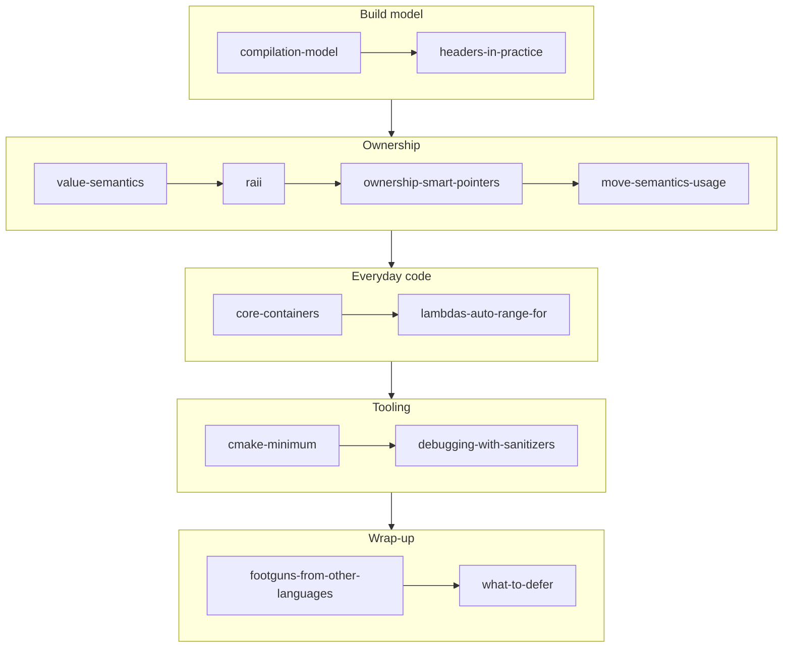

# C++ for Game Devs

## What it is

This track is the working subset of C++20 you need to build and mod our colony-sim engine — a fixed 60 Hz tick loop, EnTT for entities and components, SDL3 for the platform layer, server-authoritative networking. It is not a language course: it teaches the ~20% of C++ the engine actually uses, names the traps that bite people coming from garbage-collected languages, and explicitly defers the rest.

## Why you care

You are an experienced programmer — Python, JavaScript, or C# — but new to C++. That combination has a specific failure mode: the syntax looks familiar enough that you skip the fundamentals, then lose an afternoon to a linker error, a dangling reference, or an accidental copy inside the tick loop. Every page here targets exactly that gap, with examples drawn from the engine: ticks, entities, components, resources.

!!! tip
    Every code block in this track compiles as pasted with `clang++ -std=c++20 -Wall -Wextra` unless its first line says otherwise. When in doubt, paste and run — that habit replaces the REPL you are used to.

## How it works

Read in order. The first two pages build the compile-and-link mental model, the middle four are one continuous argument about who owns what, and the rest equips you to write, build, and debug real system code.

| Page | What you'll learn |
|---|---|
| [The C++ compilation model](compilation-model.md) | How preprocess → compile → link turns `.cpp` files into an executable, and what "undefined reference" really means. |
| [Headers in practice](headers-in-practice.md) | Splitting code into `.h`/`.cpp`: declarations vs definitions, `#pragma once`, forward declarations, `inline`. |
| [Value semantics](value-semantics.md) | Variables are objects, not references — assignment copies, and what a copy costs at 60 Hz. |
| [RAII](raii.md) | Destructors run at scope exit, so resources clean themselves up; the Rule of Zero. |
| [Ownership with smart pointers](ownership-smart-pointers.md) | `unique_ptr` as the default owner, `shared_ptr` as the rare exception, raw pointers as observers. |
| [Move semantics in practice](move-semantics-usage.md) | `std::move` is a cast; moves happen on return and in vector growth; moved-from means valid-but-unspecified. |
| [Core containers](core-containers.md) | `vector`, `array`, `unordered_map`, `string` — and why contiguous iteration makes 60 Hz feasible. |
| [Lambdas, auto, range-for](lambdas-auto-range-for.md) | The minimum modern-C++ fluency to read and write EnTT view code, including capture pitfalls. |
| [CMake: the minimum](cmake-minimum.md) | The ~20 lines the engine needs, target-based only, plus FetchContent for EnTT and SDL3. |
| [Debugging with sanitizers](debugging-with-sanitizers.md) | ASan/UBSan as your interpreter safety net: crashes at the bug, not three ticks later. |
| [Footguns from other languages](footguns-from-other-languages.md) | The traps that specifically bite Python/JS/C# programmers, and the tool that catches each. |
| [What to defer](what-to-defer.md) | Templates, coroutines, modules, allocators — what each is, why not yet, and the trigger for "now". |

## What to expect

About an evening per page if you type the examples out — do type them out. By the end you can read every file in the engine, add a system, wire it into the build, and debug it when it crashes. You will not be a language lawyer; [What to defer](what-to-defer.md) explains why that boundary is deliberate.

## Go deeper

Start with [The C++ compilation model](compilation-model.md). All twelve pages are linked in the table above.

Sources:

- cppreference.com — C++ reference — https://en.cppreference.com/ — accessed 2026-07-05
- C++ Core Guidelines — https://isocpp.github.io/CppCoreGuidelines/CppCoreGuidelines — accessed 2026-07-05
- Video: "Back to Basics: The Structure of a Program" (CppCon 2023, Bob Steagall) — 60 min — watch after the first two pages if the build model still feels foggy.
