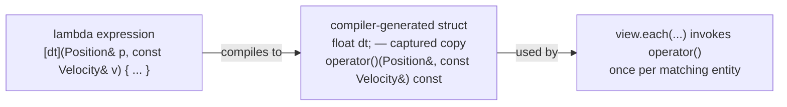

# Lambdas, `auto`, range-for

## What it is

Three pieces of modern C++ syntax doing jobs you already know from elsewhere: **lambdas** are anonymous functions (Python's `lambda`, JS arrow functions — but you explicitly choose what they capture), **`auto`** is compile-time type inference (C#'s `var`), and **range-for** is the for-each loop. Unlike their scripting-language cousins they cost nothing at runtime: a lambda compiles to a plain struct, `auto` is resolved before the program ever runs, and range-for desugars to ordinary iterator code.

## Why you care

Every system in this engine has the same shape: take the registry, get a view of some components, run a function over every match, 60 times a second. EnTT's `.each(...)` takes a lambda, iterating a view directly is a range-for, and view types are template spellings nobody writes out, so `auto` is everywhere. If `[&]` versus `[=]` is opaque, you cannot read a single system in the codebase. This page is the fluency bar, nothing more.

## Quick start

A movement system, stdlib-only so it compiles as pasted:

```cpp
#include <cstdio>
#include <utility>
#include <vector>

struct Position { float x, y; };
struct Velocity { float dx, dy; };

int main() {
    const float dt = 1.0f / 60.0f; // one fixed tick
    std::vector<std::pair<Position, Velocity>> bodies{
        {{0.0f, 0.0f}, {60.0f, 0.0f}},
        {{10.0f, 5.0f}, {0.0f, -30.0f}},
    };

    // Lambda: an unnamed function defined where it is used.
    // [dt] copies dt inside; Position& lets it mutate the caller's data.
    auto integrate = [dt](Position& p, const Velocity& v) {
        p.x += v.dx * dt;
        p.y += v.dy * dt;
    };

    // Range-for: every element, no index bookkeeping. auto& = mutable reference.
    for (auto& [pos, vel] : bodies) {
        integrate(pos, vel);
        std::printf("pos=(%.3f, %.3f)\n", pos.x, pos.y);
    }
}
```

The real thing in EnTT is the same shape:

```cpp
// fragment — does not compile alone (registry and dt live elsewhere)
registry.view<Position, const Velocity>().each(
    [dt](Position& pos, const Velocity& vel) {
        pos.x += vel.dx * dt;
        pos.y += vel.dy * dt;
    });

// Same view as a range-for with structured bindings:
for (auto&& [entity, pos, vel] : registry.view<Position, const Velocity>().each()) {
    pos.x += vel.dx * dt; // entity is the handle; pos and vel are references
}
```

## How it works

### A lambda is a struct in disguise

Writing `[dt](Position& p, const Velocity& v) { ... }` makes the compiler generate an unnamed struct: one data member per captured variable, plus an `operator()` holding the body. Evaluating the lambda expression constructs an instance; calling it invokes `operator()`. No heap allocation, no garbage collector, no hidden runtime.



### Captures: you choose what comes along

Python closures capture everything, by reference, implicitly. C++ makes you say it, per variable:

| You write | The lambda gets | Reach for it when |
|---|---|---|
| `[]` | nothing | the body only uses its parameters |
| `[dt]` | its own copy of `dt` | reading small values; safe even if the lambda outlives this scope |
| `[&world]` | a reference to `world` | mutating or avoiding a copy, **and** the lambda runs before the scope ends |
| `[=]`, `[&]` | copy / reference of everything mentioned | `[&]` is fine for an immediate `.each(...)`; never for anything stored |

The difference is observable:

```cpp
#include <cassert>

int main() {
    int tick = 0;
    auto snapshot = [tick]  { return tick; }; // copies tick now
    auto live     = [&tick] { return tick; }; // refers to the variable itself
    tick = 42;
    assert(snapshot() == 0);
    assert(live() == 42);
}
```

!!! warning
    Reference captures are only valid while the referenced local is alive. An immediate `.each([&] ...)` runs before the function returns, so it is fine. A lambda you **store** — a queued command, an event handler firing next tick — must capture by value, because the locals it references are gone when it finally runs. Getting this wrong compiles cleanly and corrupts memory at 60 Hz.

### `auto` deduces a value

`auto x = expr;` gives `x` the type of `expr` — with references and top-level `const` stripped. Plain `auto` therefore makes a **copy** (see [Value semantics](value-semantics.md)); to keep a reference you ask for one: `auto&`, `const auto&`.

### Range-for is iterator sugar

`for (auto& e : v)` compiles down to the classic `begin()`/`end()` iterator loop and works on `std::vector`, EnTT views, and anything else providing them; plain arrays are special-cased by the language to the same effect. The declaration on the left decides what each `e` is:

| Form | Each `e` is | Use for |
|---|---|---|
| `for (auto e : v)` | a copy | cheap values: `int`, `float`, `entt::entity` |
| `for (auto& e : v)` | a mutable reference | updating components in place |
| `for (const auto& e : v)` | a read-only reference | the default for anything bigger than a pointer |
| `for (auto&& e : v)` | whatever the range yields | EnTT views and other proxy iterators; always works |

!!! tip
    Loop defaults that never betray you: `const auto&` to read, `auto&` to mutate, plain `auto` only for cheap-to-copy handles. When in doubt, `const auto&`.

!!! info
    `auto` in engine code is not laziness. The type of `registry.view<Position, const Velocity>()` is an implementation-defined template spelling several lines long; `auto` is the only sane way to hold it. Keep explicit types where they inform (`float dt`), use `auto` where the type is noise.

## What to expect

Structured bindings — `auto&& [entity, pos, vel]` — show up in nearly every system; they are just multi-variable unpacking, like Python tuple assignment. What this page deliberately leaves out lives elsewhere: how a dangling reference capture actually fails, and how to catch it, is dissected in [Footguns from other languages](footguns-from-other-languages.md); `std::function`, storing callables long-term, and generic lambdas with `auto` parameters are parked in [What to defer](what-to-defer.md); and the behavior of the containers you iterate — including what invalidates them mid-loop — is owned by [Core containers](core-containers.md).

## Go deeper

- [Core containers](core-containers.md) — what you are usually range-for-ing over
- [Value semantics](value-semantics.md) — why plain `auto` and `[x]` copy
- [Footguns from other languages](footguns-from-other-languages.md) — dangling captures in depth
- [What to defer](what-to-defer.md) — `std::function`, stored callables, generic lambdas

Sources:

- learncpp.com 20.6 — Introduction to lambdas (anonymous functions) — https://www.learncpp.com/cpp-tutorial/introduction-to-lambdas-anonymous-functions/ — accessed 2026-07-05
- learncpp.com 10.8 — Type deduction for objects using the auto keyword — https://www.learncpp.com/cpp-tutorial/type-deduction-for-objects-using-the-auto-keyword/ — accessed 2026-07-05
- cppreference — Lambda expressions — https://en.cppreference.com/w/cpp/language/lambda — accessed 2026-07-05
- cppreference — Range-based for loop — https://en.cppreference.com/w/cpp/language/range-for — accessed 2026-07-05

Video: Back To Basics: Lambda Expressions — Barbara Geller, Ansel Sermersheim — CppCon 2020 — https://www.youtube.com/watch?v=ZIPNFcw6V9o — 61 min — watch after reading, once you have written a few `.each(...)` calls and want the full capture rules.
