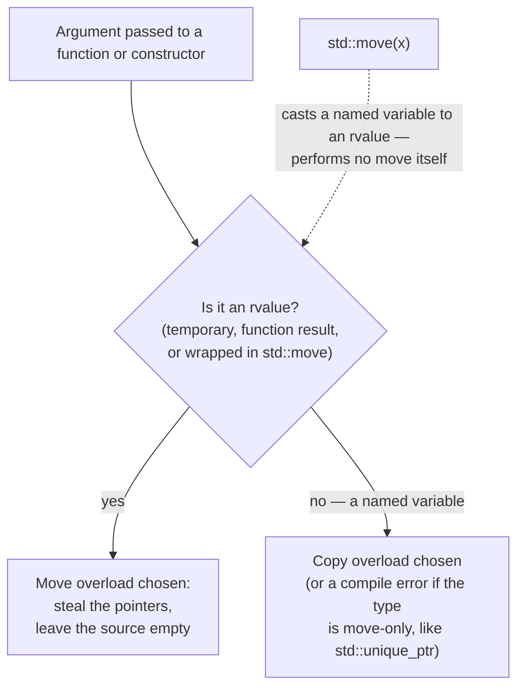

# Move semantics in practice

## What it is

Moving transfers one object's guts into another instead of duplicating them: a moved `std::vector` hands over its heap pointer — nothing element-by-element happens. It is the escape hatch from the copy-by-default world of [value semantics](value-semantics.md). `std::move` itself is **just a cast** marking a named variable "safe to steal from"; the actual transfer happens in whatever constructor or assignment receives the result.

This page is usage-only: how to move, where moves happen automatically, and what a moved-from object is afterward. Writing move constructors is out of scope.

## Why you care

In this engine you hit moves on day one:

- `std::unique_ptr` — the default owner from [smart pointers](ownership-smart-pointers.md) — cannot be copied. Moving is the **only** way to hand a loaded asset from the loader to a simulation system without breaking single ownership.
- The server builds a big per-tick snapshot for clients; returning it by value is cheap because returns elide or move — no output parameters needed.
- Half of early compiler errors mention "deleted copy constructor" or "rvalue reference"; you need just enough vocabulary to read them.

## Quick start

Hand a `unique_ptr`-owned resource from one system to another:

```cpp
#include <iostream>
#include <memory>
#include <string>
#include <utility>

struct NavMesh {
    std::string region;
};

class SimulationSystem {
public:
    void adopt(std::unique_ptr<NavMesh> mesh) {
        mesh_ = std::move(mesh);  // move again: from parameter into member
    }
    bool has_mesh() const { return mesh_ != nullptr; }

private:
    std::unique_ptr<NavMesh> mesh_;
};

int main() {
    auto mesh = std::make_unique<NavMesh>("colony-west");
    SimulationSystem sim;

    // sim.adopt(mesh);          // error: copying a unique_ptr is deleted
    sim.adopt(std::move(mesh));  // OK: ownership transferred into the system

    std::cout << "sim owns mesh: " << sim.has_mesh() << '\n';      // 1
    std::cout << "source is null: " << (mesh == nullptr) << '\n';  // 1
}
```

Forget the `std::move` and clang says something like this (wording varies by standard library — libc++ on macOS says "implicitly-deleted copy constructor"):

```text
// fragment — does not compile alone (this is compiler output)
error: call to deleted constructor of 'std::unique_ptr<NavMesh>'
note: 'unique_ptr' has been explicitly marked deleted here
```

Translation: "this parameter needs a copy, copies are deleted for this type, cast the argument with `std::move` if you meant to give it away."

!!! tip
    Rule of thumb: write `std::move` only when handing a **named variable** to something that takes ownership. Temporaries and return values already move (or better) automatically — extra `std::move` there is noise or a pessimization.

## How it works

A type can offer two flavors of "construct me from another object": copy (source untouched) and move (source's resources stolen). Temporaries and function results — rvalues, in error-message speak — select the move overload; named variables (lvalues) select the copy. All `std::move` does is `static_cast` its argument to an rvalue reference so the move overload wins.



Moves also happen unasked: for movable types like `std::vector`, a `return local;` either constructs the result directly in the caller (copy elision) or falls back to a move — never a deep copy. Hence Core Guidelines rule F.48: **don't** write `return std::move(local);` — the cast disables elision and forces the strictly worse option.

```cpp
#include <cstdint>
#include <vector>

struct EntityState {
    std::uint32_t entity;
    float x, y;
};

// Runs once per 60 Hz tick: build the state the server sends to clients.
std::vector<EntityState> capture_snapshot() {
    std::vector<EntityState> snapshot;
    snapshot.reserve(10'000);
    for (std::uint32_t id = 0; id < 10'000; ++id) {
        snapshot.push_back({id, 0.0f, 0.0f});  // real code: read the EnTT registry
    }
    return snapshot;  // no std::move here — see F.48
}

int main() {
    auto snap = capture_snapshot();  // elided or moved, never a 10,000-element copy
    return snap.size() == 10'000u ? 0 : 1;
}
```

What is left behind? For standard-library types, a moved-from object is **valid but unspecified**: destroying it is safe (RAII still holds — see [RAII](raii.md)), assigning it a fresh value is safe, but reading it is meaningless. `std::unique_ptr` gives a stronger guarantee: moved-from means null.

```cpp
// fragment — does not compile alone
std::string job = "haul granite";
job_queue.push_back(std::move(job));  // job's buffer stolen by the vector
job = "mine iron";                    // OK: assignment gives it a known value again
```

!!! warning
    Reading a moved-from variable is the classic move bug, and it compiles cleanly. The variable stays in scope looking innocent; ten lines later someone checks `job.empty()` and gets an answer that depends on library internals. Treat every variable you passed to `std::move` as dead until reassigned.

## Pros / Cons

| Pros | Cons |
| --- | --- |
| Ownership transfer is visible in signatures: take `std::unique_ptr` by value, caller must `std::move` | Moved-from variables stay in scope; reading one is a silent logic bug |
| Big results return by value cheaply — no output parameters, no manual `new` | `std::move` on a `return` statement blocks copy elision (F.48) |
| Move-only types make double-ownership a compile error instead of a runtime crash | Moving a small trivial struct (three floats) is just a copy — no speedup |

## What to expect

Inside EnTT and SDL3 wrapper headers you will see `T&&` parameters and `std::forward`. Read past them: they exist so libraries preserve move-ness through layers. Writing that machinery — move constructors, perfect forwarding, reference-collapsing rules — is parked in [what to defer](what-to-defer.md).

Expect `std::vector` to move its elements when it grows; the mechanics live in [core containers](core-containers.md). Also expect no tooling safety net by default: use-after-move is usually **not** undefined behavior (UB), so the tools in [debugging with sanitizers](debugging-with-sanitizers.md) stay silent — clang-tidy's `bugprone-use-after-move` check catches it. Coming from Python or C#, where assignment silently shares a reference, this trap is cataloged in [footguns from other languages](footguns-from-other-languages.md).

!!! info
    Reality check: moves are not free, just proportional to the handle instead of the data. Moving a `std::vector` copies three pointers regardless of size; moving an `EntityState` of three fields costs the same as copying it. `std::move` never makes code faster by itself — it only permits a cheaper overload that must actually exist.

## Go deeper

- [Value semantics](value-semantics.md) — the copy-by-default baseline that moves escape
- [RAII](raii.md) — why moved-from objects still destruct safely
- [Ownership with smart pointers](ownership-smart-pointers.md) — `std::unique_ptr` basics assumed above
- [Core containers](core-containers.md) — moves during `std::vector` growth
- [Footguns from other languages](footguns-from-other-languages.md) — use-after-move among friends
- [What to defer](what-to-defer.md) — writing move constructors, perfect forwarding, rvalue-reference theory

Sources:

- learncpp.com 22.1 — Introduction to smart pointers and move semantics — https://www.learncpp.com/cpp-tutorial/introduction-to-smart-pointers-move-semantics/ — accessed 2026-07-05
- learncpp.com 22.4 — std::move — https://www.learncpp.com/cpp-tutorial/stdmove/ — accessed 2026-07-05
- cppreference — std::move — https://en.cppreference.com/w/cpp/utility/move — accessed 2026-07-05
- C++ Core Guidelines — F.48: Don't return std::move(local) — https://isocpp.github.io/CppCoreGuidelines/CppCoreGuidelines#rf-return-move-local — accessed 2026-07-05

Video: Back to Basics: Move Semantics (part 1 of 2) — Klaus Iglberger, CppCon 2019 — https://www.youtube.com/watch?v=St0MNEU5b0o — 55 min — watch after reading, once `T&&` in library headers starts bothering you.
