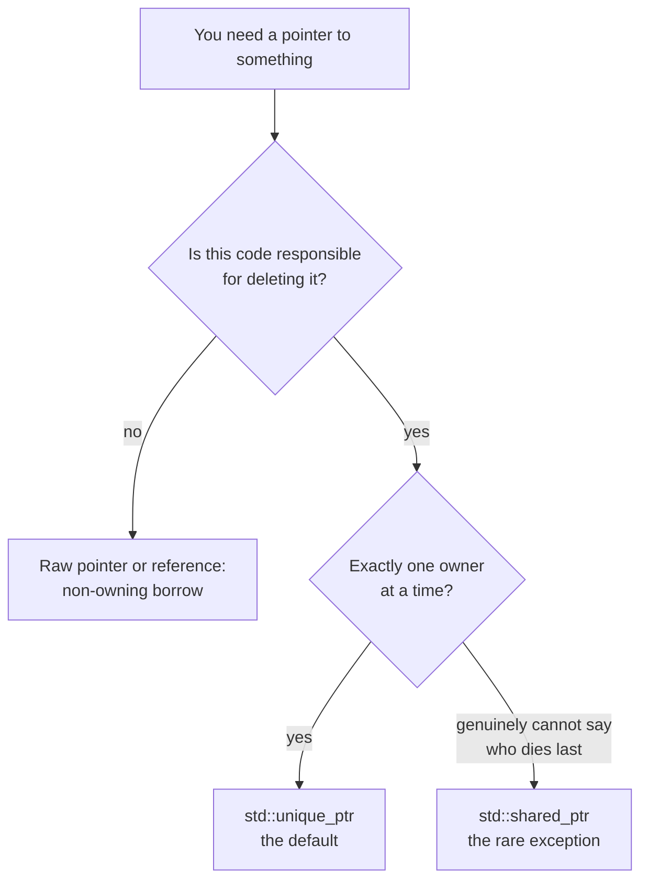

# Ownership with smart pointers

## What it is

Smart pointers are standard-library types that encode the answer to one question in the type system: **who deletes this heap object?** `std::unique_ptr` says "exactly one owner, and this is it". `std::shared_ptr` says "several owners; the last one to let go deletes". A raw pointer or reference says "nobody here — I only borrow". Underneath, they are ordinary destructor-driven objects (see [RAII](raii.md)), so the delete runs exactly once, on every exit path.

## Why you care

In Python, JS, or C#, the garbage collector answers the ownership question for you: anything reachable stays alive. C++ has no collector, and the pre-2011 answer — pairing every `new` with a `delete` by hand — is where the legendary C++ bugs come from. Smart pointers turn ownership into a compile-time fact instead of a comment.

They also map one-to-one onto the engine's rules:

- **The registry owns components.** In EnTT, components are plain values inside the registry's storage (see [Value semantics](value-semantics.md)) — no pointer at all.
- **The engine owns mod-loaded systems.** Mods hand the engine polymorphic `System` objects; the engine holds each in a `std::unique_ptr` and destroys them at shutdown.
- **Systems only borrow.** During a tick, a system gets references or raw pointers to components and resources. It never deletes anything.

The C++ Core Guidelines make this the project-wide default: represent ownership with `std::unique_ptr` or `std::shared_ptr`, never with an owning raw pointer ([R.20](https://isocpp.github.io/CppCoreGuidelines/CppCoreGuidelines#rr-owner)).

## Quick start

```cpp
#include <cstdio>
#include <memory>
#include <vector>

// A mod-loaded system: polymorphic, heap-allocated, engine-owned.
struct System {
    virtual ~System() = default;
    virtual void tick() = 0;
};

struct FarmingSystem : System {
    void tick() override { std::puts("farming tick"); }
};

int main() {
    std::vector<std::unique_ptr<System>> systems;
    systems.push_back(std::make_unique<FarmingSystem>());

    for (auto& s : systems) {
        s->tick();  // borrow for the call; the vector keeps ownership
    }
}   // vector destroyed -> each unique_ptr destroyed -> each System deleted
```

`std::make_unique` heap-allocates the `FarmingSystem` and wraps it immediately. Nobody writes `delete`: when the vector dies, each `std::unique_ptr` destructor fires and deletes its `System` through the `virtual` destructor.

!!! tip
    `std::make_unique<T>(args...)` and `std::make_shared<T>(args...)` replace `new` entirely. In a modern codebase you may never type `new` or `delete` again.

## How it works



**`std::unique_ptr` is the default.** It is the size of a raw pointer and compiles to the same code, plus a guaranteed `delete` in its destructor. Because ownership is unique, it cannot be copied — the compiler rejects the attempt. Transferring ownership means moving it, which is the next page's job.

**Borrowing.** To let other code use the object without transferring ownership, hand out `owner.get()` (raw pointer) or `*owner` (reference). The borrower's only obligation is to not outlive the owner — which the engine guarantees structurally: systems borrow for the duration of one 60 Hz tick, and the registry outlives every tick.

```cpp
#include <cstdio>
#include <memory>

struct Stockpile { int wood = 40; };

// Borrows: reads, never deletes. The caller keeps ownership.
void report(const Stockpile* s) { std::printf("wood: %d\n", s->wood); }

int main() {
    auto stockpile = std::make_unique<Stockpile>();
    report(stockpile.get());  // hand out a view; stockpile still owns
}                             // the unique_ptr deletes the Stockpile here
```

**`std::shared_ptr` is the rare exception.** It adds a heap-allocated, atomically updated reference count: copying bumps it, destruction drops it, and hitting zero deletes. Reach for it only when no single owner exists — say, a background pathfinding job that must keep a `NavMesh` alive even if the main thread drops it mid-computation.

```cpp
#include <cstdio>
#include <memory>
#include <vector>

struct NavMesh { /* expensive to rebuild */ };

int main() {
    auto mesh = std::make_shared<NavMesh>();
    std::vector<std::shared_ptr<NavMesh>> jobs{mesh, mesh};  // jobs keep it alive
    mesh.reset();  // main thread lets go early; the mesh survives
    std::printf("owners left: %ld\n", jobs.front().use_count());  // 2
}
```

!!! warning
    Never construct a second smart pointer from the same raw pointer, and never `delete p.get()`. Both cause a double delete — undefined behavior (UB) that corrupts the heap and crashes far from the cause, hours of debugging later.

| Engine situation | Right tool |
|---|---|
| Component data | Plain value owned by the registry — no pointer |
| Mod-loaded system, polymorphic resource | `std::unique_ptr`, usually inside a container |
| A system using a component this tick | Reference or raw pointer — non-owning borrow |
| Lifetime genuinely shared across jobs/threads | `std::shared_ptr` |

## Pros / Cons

**Pros**

- Leaks and double deletes become type errors instead of 3 a.m. debugging sessions.
- `std::unique_ptr` costs nothing over a raw pointer.
- Signatures document intent: a `std::unique_ptr` parameter means "I take ownership"; a raw pointer means "I borrow".

**Cons**

- `std::shared_ptr` has real costs — atomic ref-count traffic plus control-block overhead — unwelcome inside a 60 Hz tick loop.
- The type names are wordy; `auto` and `std::make_unique` keep it bearable.

!!! note
    `std::shared_ptr` is not a garbage collector. Two objects holding `std::shared_ptr`s to each other keep both counts above zero forever and leak silently. If your design wants cycles, it actually wants one owner and some borrowers.

## What to expect

Handing a `std::unique_ptr` **into** a function or container requires `std::move`; doing that (and returning ownership cheaply) is covered in [Move semantics usage](move-semantics-usage.md). `std::weak_ptr`, custom deleters, and allocator-aware ownership exist but are deliberately parked in [What to defer](what-to-defer.md). Borrowed raw pointers can dangle when the owner dies first; those bug patterns — and catching them with AddressSanitizer — live in [Footguns from other languages](footguns-from-other-languages.md).

In practice: expect to write `std::unique_ptr` weekly, `std::shared_ptr` a few times a year, and an owning `new`/`delete` never.

## Go deeper

- [RAII](raii.md) — the destructor mechanism all smart pointers are built on.
- [Value semantics](value-semantics.md) — why components are values in the registry, not pointers.
- [Move semantics usage](move-semantics-usage.md) — passing and returning `std::unique_ptr` efficiently.
- [Footguns from other languages](footguns-from-other-languages.md) — dangling-borrow patterns and the sanitizers that catch them.
- [What to defer](what-to-defer.md) — `std::weak_ptr`, custom deleters, allocators.

**Sources**

- learncpp.com 22.5 — std::unique_ptr — https://www.learncpp.com/cpp-tutorial/stdunique_ptr/ — accessed 2026-07-05
- cppreference — std::unique_ptr — https://en.cppreference.com/w/cpp/memory/unique_ptr — accessed 2026-07-05
- C++ Core Guidelines — R.20: Use unique_ptr or shared_ptr to represent ownership — https://isocpp.github.io/CppCoreGuidelines/CppCoreGuidelines#rr-owner — accessed 2026-07-05

Video: Back to Basics: C++ Smart Pointers — David Olsen — CppCon 2022 — https://www.youtube.com/watch?v=YokY6HzLkXs — 49 min — watch after reading this page and its move-semantics sibling; it consolidates the whole ownership spine.
