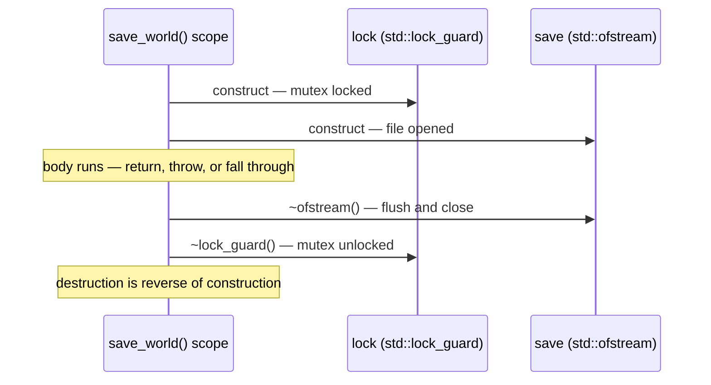

# RAII

## What it is

RAII — **Resource Acquisition Is Initialization** — is the worst-named good idea in C++: tie every resource (file, lock, socket, SDL3 window, heap allocation) to an object's lifetime. The constructor acquires, the destructor releases, and C++ guarantees the destructor runs at the closing brace of the owning scope — on normal exit, on early `return`, and during an exception a caller catches (one that escapes `main` terminates the process without guaranteed unwinding). C++ has no `finally`, `using`, or garbage collector because with RAII, cleanup is a property of the **type**, not something every call site must remember.

!!! info
    Destructors are not Python's `__del__` or C#'s finalizers. Those run "eventually, maybe, on some thread." A C++ destructor runs at an exact, predictable line — the closing brace — every time. You can set your 60 Hz tick clock by it.

## Why you care

In Python or C#, cleanup is opt-in at each call site: forget one `with` or `using` and the handle leaks. C APIs like SDL3 are harsher still — acquisition and release are two separate calls you must pair by hand across every exit path:

```cpp
// fragment — does not compile alone
SDL_Window* win = SDL_CreateWindow("colony", 1280, 720, 0);
if (!load_assets()) return false;  // leaks the window on this path
SDL_DestroyWindow(win);            // manual release: every early exit must remember it
```

This pattern is everywhere in the engine: SDL3 windows and renderers, save-file handles, the mutex guarding world state while the network thread reads it. A mutex left locked by one early return deadlocks the next tick; a file handle leaked per autosave exhausts the process eventually. RAII deletes the whole bug class instead of asking you to be careful.

## Quick start

[Value semantics](value-semantics.md) showed that local objects die at the closing brace of their scope. RAII types do useful work in that death:

```cpp
#include <fstream>
#include <mutex>
#include <vector>

std::mutex world_mutex;
std::vector<int> entity_health{100, 80, 55};

void save_world(const char* path) {
    std::lock_guard lock(world_mutex);  // constructor locks the mutex
    std::ofstream save(path);           // constructor opens the file
    for (int hp : entity_health) {
        save << hp << '\n';
    }
}   // closing brace: file flushed and closed, then mutex unlocked — every exit path

int main() {
    save_world("world.sav");
}
```

No cleanup calls anywhere. If the body threw and a caller caught it, or someone later adds an early `return`, both destructors still run.

## How it works

At every scope exit the compiler injects destructor calls for that scope's locals, in reverse order of construction. Exceptions trigger the same calls during stack unwinding. Class members follow suit: after the destructor body finishes, each member is destroyed in reverse declaration order.



The daily consequence is the **Rule of Zero**: standard types already do RAII, so a class composed from them needs no cleanup code. The compiler-generated destructor destroys each member, and each member releases its own resource:

```cpp
#include <string>
#include <vector>

struct Snapshot {
    std::vector<int> component_data;  // frees its own buffer
};

struct SaveSystem {
    std::string save_dir;             // frees its own buffer
    std::vector<Snapshot> history;    // destroys every Snapshot it holds
    // No destructor written — the members already do RAII. That is the Rule of Zero.
};

int main() {
    SaveSystem sys{"saves/", {}};
    sys.history.push_back(Snapshot{{100, 80, 55}});
}   // sys dies: history destroyed, then save_dir — reverse declaration order
```

Most engine types — components, systems, resource caches — should look like `SaveSystem`: ownership delegated to members, zero cleanup code. This is C++ Core Guidelines R.1: manage resources automatically using RAII.

!!! tip
    About to write `~MyType()`? Stop. Nine times out of ten a standard member can own the resource — `std::vector`, `std::string`, `std::ofstream`, or a smart pointer. In this engine, a hand-written destructor is a design smell, not a chore.

!!! warning
    Two ways to break RAII, both expensive: (1) heap-allocate with `new` and lose the pointer — destructors only run when something destroys the object, and a raw `new` has no owner; (2) wrap a raw handle in a type with only a destructor — the compiler-generated copy then frees the same handle twice, undefined behavior (UB). The fix for both: never hold a raw resource directly, hold an owning member.

## Pros / Cons

| | RAII | Garbage collector / `finally` |
|---|---|---|
| When cleanup runs | Exactly at the closing brace | Eventually (GC), or only if the call site remembers (`finally`/`using`) |
| Forgettable at call site | No — it lives in the type | Yes |
| Exception safety | Automatic | Manual, per call site |
| Tick-loop pauses | None | GC pauses; a 60 Hz budget hates them |
| Cost | Cleanup is invisible — you must know what a type's destructor does | Spelled out at the call site (`finally`/`using`); GC finalizers are just as invisible, and less predictable |

RAII's one real limitation: it binds cleanup to a scope. Entities and resources that outlive a tick need an owner whose scope is the world itself — exactly what containers and smart pointers provide.

## What to expect

- Raw C handles (SDL3's `SDL_Window*`, `SDL_Texture*`) get one thin RAII wrapper at the engine's edge — a `std::unique_ptr` one-liner with a custom deleter: [Smart pointers](ownership-smart-pointers.md).
- Handing RAII objects between owners — returning them, storing them as components — is [Move semantics usage](move-semantics-usage.md).
- Writing your own copy/move special members (the Rule of Five) is deliberately deferred: [What to defer](what-to-defer.md).
- When RAII is bypassed, AddressSanitizer (ASan) pinpoints the leak or double free: [Debugging with sanitizers](debugging-with-sanitizers.md).

## Go deeper

- [Value semantics](value-semantics.md) — the scope-and-lifetime model RAII builds on.
- [Smart pointers](ownership-smart-pointers.md) — RAII for heap objects and C handles.
- [Move semantics usage](move-semantics-usage.md) — how RAII owners hand resources to each other.
- [What to defer](what-to-defer.md) — why the Rule of Five waits.
- [Debugging with sanitizers](debugging-with-sanitizers.md) — catching leaks and double frees.

**Sources**

- cppreference — RAII — https://en.cppreference.com/w/cpp/language/raii — accessed 2026-07-05
- learncpp.com 15.4 — Introduction to destructors — https://www.learncpp.com/cpp-tutorial/introduction-to-destructors/ — accessed 2026-07-05
- cppreference — Rule of three/five/zero — https://en.cppreference.com/w/cpp/language/rule_of_three — accessed 2026-07-05
- C++ Core Guidelines — R.1: Manage resources automatically using RAII — https://isocpp.github.io/CppCoreGuidelines/CppCoreGuidelines#rr-raii — accessed 2026-07-05

**Video**: Back to Basics: RAII and the Rule of Zero — Arthur O'Dwyer — CppCon 2019 — 62 min — watch after this page and the smart-pointers page; its middle third previews Rule of Five material this track defers.
