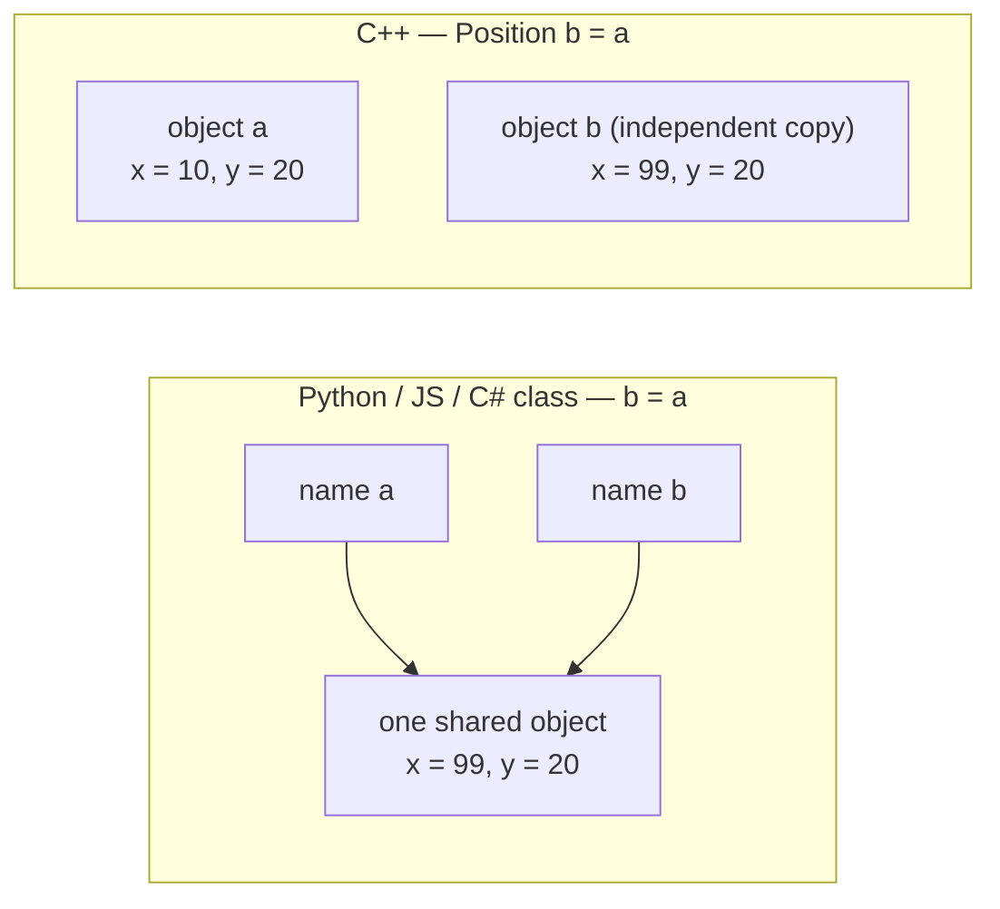

# Value semantics

## What it is

In Python, JS, and C# (classes), a variable is a reference to an object that lives somewhere else; `b = a` gives you two names for one object. In C++ a variable **is** the object — it lives at a known address — and `b = a` copies the object into a second, independent one; for types that own heap memory, the copy includes their contents. That is value semantics, and it applies uniformly: to `int`, to `std::string`, to `std::vector`, and to every component struct in the engine.

```cpp
#include <iostream>

struct Position { float x{}, y{}; };

int main() {
    Position a{10.0f, 20.0f};
    Position b = a;   // copy: b is a brand-new object
    b.x = 99.0f;
    std::cout << a.x << '\n'; // prints 10 — a is untouched
}
```

In Python that final line would print 99. In C++ it prints 10, because there is no shared object — there never was.

## Why you care

There are two reasons: one for correctness, one for the tick budget.

| Concern | Why it bites |
| --- | --- |
| **Correctness** | Every assignment, every function argument, every `return`, every plain `auto` variable is potentially a copy. Coming from a reference-semantics language, you will mutate a copy, watch the original stay unchanged, and burn an afternoon before this becomes reflex. |
| **Cost** | Copying `Position` is eight bytes — effectively free, done in registers. Copying an `Inventory` that holds a `std::vector` of item ids means a heap allocation plus copying every element. One accidental copy like that per entity, per system, per tick — at 60 Hz, across thousands of entities — is the difference between a comfortable tick and a blown one. |

Value semantics also has an upside the engine leans on: snapshotting a component for the server's authoritative state is literally `Position saved = pos;`.

## Quick start

Engine systems follow Core Guidelines rule F.16 for parameters. Three signatures cover almost everything:

| Intent | Signature | Engine example |
| --- | --- | --- |
| Read, cheap type (couple of machine words) | `T` | `Position p` |
| Read, anything bigger or unknown size | `const T&` | `const Inventory& inv` |
| Mutate the caller's object | `T&` | `Position& p` |

```cpp
#include <cstddef>
#include <cstdint>
#include <iostream>
#include <vector>

struct Position  { float x{}, y{}; };
struct Inventory { std::vector<std::uint32_t> item_ids; };

// F.16: cheap to copy — take it by value
bool on_map(Position p) { return p.x >= 0.0f && p.y >= 0.0f; }

// F.16: potentially expensive — read through const reference (no copy)
std::size_t item_count(const Inventory& inv) { return inv.item_ids.size(); }

// System mutates the caller's component: non-const reference
void apply_gravity(Position& p) { p.y -= 9.8f / 60.0f; }

int main() {
    Position pos{4.0f, 8.0f};
    Inventory inv{{101, 102, 103}};
    apply_gravity(pos);                 // pos itself changes
    std::cout << on_map(pos) << ' ' << item_count(inv) << '\n';
}
```

!!! tip
    Unsure whether a type is "cheap"? `const T&` is never wrong for a read-only parameter. Reserve plain `T` for small structs like `Position` and built-ins.

## How it works

Pass or assign by value and C++ invokes the type's copy constructor, which by default copies each member in turn. Members that own heap memory, like `std::vector`, copy their contents too — that is where the allocation cost comes from.

A reference (`T&`) is the opt-out: another name for an existing object. It is not a copy and not a nullable pointer — it must be bound to an object at creation and can never be re-pointed. `const T&` is the read-only flavor and the workhorse of every system signature in the codebase.



!!! warning
    `auto` without `&` copies. This is the single most common way the "my change didn't stick" bug appears in system code:

    ```cpp
    // fragment — does not compile alone
    auto inv = registry.get<Inventory>(entity);   // COPY: heap allocation, mid-tick
    inv.item_ids.push_back(loot_id);              // mutates the copy — entity unchanged
    auto& real = registry.get<Inventory>(entity); // reference: aliases the component
    real.item_ids.push_back(loot_id);             // sticks
    ```

## Pros / Cons

| Pros | Cons |
| --- | --- |
| Local reasoning: nobody aliases your object unless you handed out a reference | Copies are silent — expensive ones look identical to free ones at the call site |
| Objects sit contiguously in memory — the cache-friendliness EnTT's ECS storage is built on | You must pick a passing mode per parameter instead of getting one default |
| Copies are snapshots: rollback and server state capture are one assignment | References reintroduce shared mutation, so `T&` parameters deserve suspicion in review |

!!! info
    Compilers elide many copies — returning a local by value is typically free, and C++17 made elision mandatory in key cases. Take copies seriously in per-tick loops; do not contort code that runs once per session.

## What to expect

This page assumed every type magically knows how to copy and clean up after itself. That machinery — destructors and resource lifetime — is [RAII](raii.md), the next page in the spine. Types that should never be copied (an SDL3 window, a GPU texture) get owned via [smart pointers](ownership-smart-pointers.md). When a copy is correct but wasteful, [move semantics](move-semantics-usage.md) transfers the guts instead. And a reference can outlive the object it names — that bug class, dangling references, is dissected in [footguns from other languages](footguns-from-other-languages.md). The types you will pass by `const T&` most often are covered in [core containers](core-containers.md).

## Go deeper

- [RAII](raii.md) — read next; what copies and destruction actually invoke
- [Ownership with smart pointers](ownership-smart-pointers.md)
- [Move semantics in practice](move-semantics-usage.md)
- [Core containers](core-containers.md)
- [Footguns from other languages](footguns-from-other-languages.md)

**Sources**

- learncpp.com 12.3 — Lvalue references — <https://www.learncpp.com/cpp-tutorial/lvalue-references/> — accessed 2026-07-05
- learncpp.com 12.5 — Pass by lvalue reference — <https://www.learncpp.com/cpp-tutorial/pass-by-lvalue-reference/> — accessed 2026-07-05
- learncpp.com 14.14 — Introduction to the copy constructor — <https://www.learncpp.com/cpp-tutorial/introduction-to-the-copy-constructor/> — accessed 2026-07-05
- C++ Core Guidelines — F.16: For "in" parameters, pass cheaply-copied types by value and others by reference to const — <https://isocpp.github.io/CppCoreGuidelines/CppCoreGuidelines#rf-in> — accessed 2026-07-05

Video: Back to Basics: C++ Value Semantics — Klaus Iglberger — CppCon 2022 — <https://www.youtube.com/watch?v=G9MxNwUoSt0> — 48 min — watch after reading, once the F.16 table feels routine and you want the design philosophy behind preferring values.
