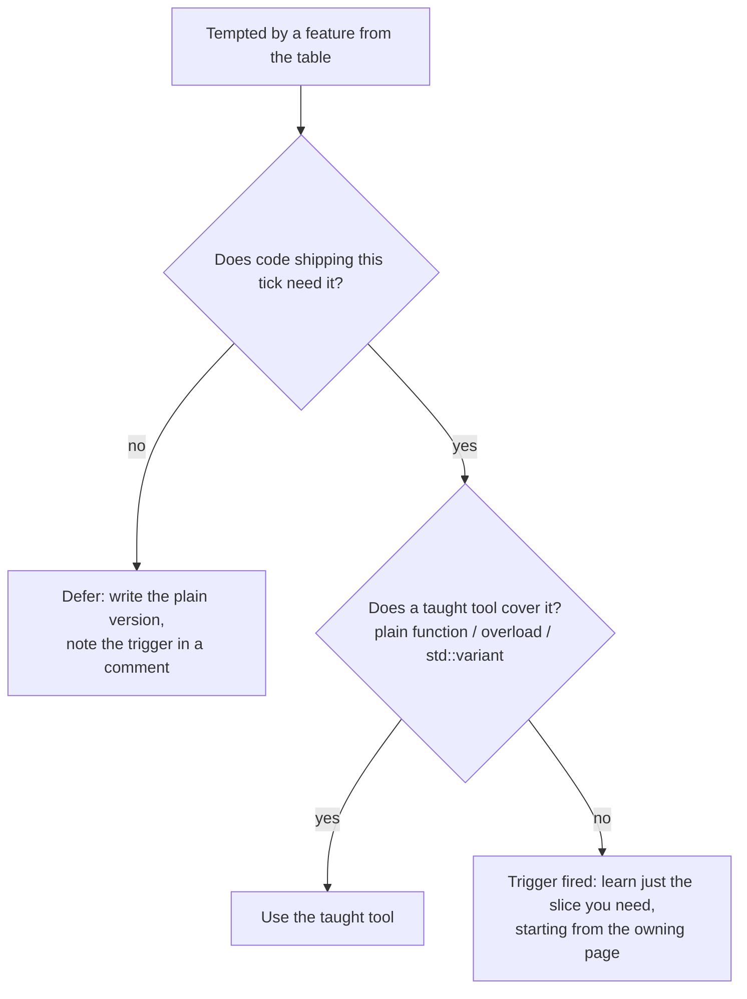

# What to defer

## What it is

A permission slip. This handbook teaches a deliberate C++ subset and stops. This page names eight features you **will** meet in blog posts, talks, and EnTT's source, and for each gives the concrete trigger that means it is time.

## Why you care

Coming from Python, JavaScript, or C#, the real risk is not a missing feature but the week-long rabbit hole of "I should understand perfect forwarding first". The engine ships on value types for components, RAII for resources, `std::vector` for storage, and lambdas over EnTT views (see [lambdas-auto-range-for](lambdas-auto-range-for.md)).

One distinction keeps the boundary honest: **consuming** templates is not **writing** them. You instantiate templates daily (`std::vector<Position>`, `registry.view<Position, Velocity>()`); only writing your own is deferred.

## Quick start

Each "not yet" is a decision, not a gap:

| Deferred feature | What it is | Why not yet | The trigger |
|---|---|---|---|
| Writing templates | Code parameterized on types, the machinery behind `std::vector<T>` and EnTT views. | Systems act on concrete components; a plain function per type is shorter and easier to debug. | A third copy of the same body, differing only by type. |
| Perfect forwarding | `template <typename T> void f(T&&)` plus `std::forward`: passing arguments through a generic wrapper without extra copies. | Only wrappers and factories need it; `emplace_back` and `registry.emplace` already forward for you. | Writing that generic wrapper — itself gated on the templates trigger above. |
| An exceptions policy | An engine-wide decision: what throws, what is `noexcept`, where anything is caught. | A fixed 60 Hz server loop has nowhere sensible to unwind mid-tick; assert in debug, return status values otherwise. | Integrating a throwing third-party library, or publishing a mod API that owes callers an error contract. |
| Coroutines | C++20 `co_await`/`co_yield`: functions that suspend and resume. Raw coroutines are library-author machinery. | Colonist AI is already a per-tick state machine — your suspendable function. | Async I/O (streaming saves, network snapshots) drowns in callbacks — adopt a vetted coroutine library, not raw `co_await`. |
| Modules | The C++20 replacement for `#include`: `import` with compiler-enforced boundaries. | EnTT (header-only) and SDL3 (compiled) still ship `#include` headers, not modules. | Your compiler, CMake, **and** every dependency support them cleanly — see the reality check below. |
| Custom allocators | Telling containers where to get memory: arenas, pools, per-frame scratch buffers. | The default allocator plus `reserve` holds up far longer than the internet claims. | The profiler shows allocation time in the tick even after hoisting per-tick allocations out of hot loops. |
| Multiple inheritance | One class with two or more base classes. | ECS already replaced the class hierarchy: a colonist is an entity plus components, not `Pawn : Renderable, Damageable`. | A third-party API forcing one class to implement two abstract interfaces. |
| CRTP | Curiously Recurring Template Pattern: `class Derived : Base<Derived>` — compile-time polymorphism. | EnTT uses it internally so call sites need zero knowledge of it. | The profiler blames virtual-call overhead in a per-entity loop inside the 60 Hz tick — measure first. |

!!! tip
    Template urge? Try in order: a plain function, a second overload, `std::variant` — one usually kills it.

## How it works

Every deferral follows one rule: a feature earns its way in through a **trigger you can observe**, never a feeling that real C++ programmers would do it differently. The Core Guidelines say templates should raise the level of abstraction ([T.1](https://isocpp.github.io/CppCoreGuidelines/CppCoreGuidelines#rt-raise)); without existing repetition, there is nothing to raise.



The version to write today:

```cpp
#include <cstdint>
#include <vector>

struct Stockpile {
    std::vector<std::uint32_t> item_ids;
};

// Tempting: template <typename Pile> void restock(Pile&, std::uint32_t)
// Actual need today: one pile type, one call site. Write the plain version.
void restock(Stockpile& pile, std::uint32_t item_id) {
    pile.item_ids.push_back(item_id);
}

int main() {
    Stockpile wood{};
    restock(wood, 42);
    return wood.item_ids.size() == 1 ? 0 : 1;
}
```

The trigger, when it fires:

```cpp
// fragment — does not compile alone
// The trigger: a third copy of the same body, differing only by type.
void draw(SpriteComponent const& c);
void draw(TileComponent const& c);
void draw(ParticleComponent const& c);  // third copy-paste — now consider a template
```

Until that third copy exists, `template <typename T>` is speculation.

!!! warning
    EnTT's internals — CRTP, perfect forwarding, template machinery — exist so **you** never need them at call sites; reading them "to understand what you use" is the classic rabbit hole. In a two-hundred-line template error, read the first and last lines; the middle is instantiation noise.

## What to expect

When a trigger fires, start at the owning page, not a search engine:

- Writing move special members → [move-semantics-usage](move-semantics-usage.md)
- `std::weak_ptr` and custom deleters → [ownership-smart-pointers](ownership-smart-pointers.md)
- Deeper `<algorithm>` and C++20 ranges → [core-containers](core-containers.md)
- Headers-to-modules migration → [headers-in-practice](headers-in-practice.md)
- ThreadSanitizer and fuzzing → [debugging-with-sanitizers](debugging-with-sanitizers.md)

Triggers fire slowly and unevenly. Writing templates likely fires first: serialization and save-game code breed type-only repetition. Coroutines and custom allocators may take a year; multiple inheritance may never fire. When one fires, learn only the slice it demands, not a metaprogramming book.

!!! info
    Years after C++20 standardized modules, compiler and build-system support remains uneven. Before trusting "modules are ready" posts, check the cppreference compiler-support table (Sources) against the exact compilers you build with.

## Go deeper

- [Footguns from other languages](footguns-from-other-languages.md) — habits to unlearn; this page lists those **not** to acquire.
- [Compilation model](compilation-model.md) — why templates live in headers and their errors sprawl.
- [Value semantics](value-semantics.md) — the ownership spine's start; reread when the deferred list tempts you.

Sources:

- C++ Core Guidelines (main document) — https://isocpp.github.io/CppCoreGuidelines/CppCoreGuidelines — accessed 2026-07-05
- cppreference — Compiler support for C++20/23 (modules reality check) — https://en.cppreference.com/w/cpp/compiler_support — accessed 2026-07-05
- cppreference — Modules — https://en.cppreference.com/w/cpp/language/modules — accessed 2026-07-05

Video: Stop Teaching C — Kate Gregory — CppCon 2015 — https://www.youtube.com/watch?v=YnWhqhNdYyk — 60 min — watch after finishing the track: it argues for this handbook's subset-first approach.
