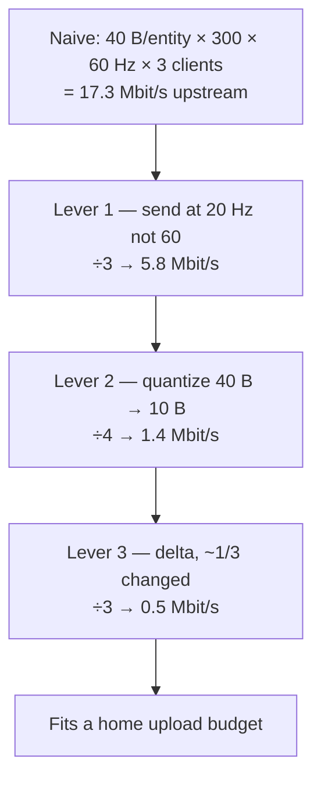

# Bandwidth Basics

## What it is

**Bandwidth basics is one multiplication you cannot dodge:** bytes-per-entity × entities × send rate × clients. That product is how many bytes per second the server pushes onto the wire, and nearly every decision on this track is a fight to keep it small. A colony sim makes the fight loud — hundreds of NPCs is a large number to sit in the "entities" slot.

The figure that bites is the **host's upload**. Single-player and co-op will both run as a listen server ([ADR-0003](../../engine/architecture/adr-0003-single-player-is-a-listen-server.md)): one player's machine is the server and sends the world to everyone else. Its upstream is the ceiling, and home upstream is stingy.

## Why you care

Home connections are asymmetric: a realistic upload budget is often 5–10 Mbit/s — a fraction of download — and you can't spend all of it (other apps, plus headroom for loss and retransmits). Run the naive sum against that and it vanishes. Glenn Fiedler's 901-object demo needed **17.37 Mbit/s** sending raw state at 60 Hz — for one stream. Multiply by three co-op friends and no home line survives. This arithmetic is exactly why the master plan caps NPC counts at what full-snapshot replication sustains until relevancy filtering lands ([master plan](../../design/master-plan.md), R3).

## Quick start

Compute your own ceiling before you write any netcode. This is the whole page in one function:

```cpp
#include <cassert>
#include <cstdio>

// Upstream a listen-server host must send, in megabits/second.
// It sends each remote client one snapshot per send.
double host_upload_mbit(int bytes_per_entity, int entities,
                        int send_hz, int players) {
    int remote = players - 1;  // the host doesn't send to itself
    long bytes_per_sec = static_cast<long>(bytes_per_entity)
                       * entities * send_hz * remote;
    return bytes_per_sec * 8.0 / 1'000'000.0;  // bytes/s -> Mbit/s
}

int main() {
    const int entities = 300;  // a modest colony's replicated NPCs
    const int players  = 4;    // co-op host + 3 friends

    // Naive: raw floats, full tick rate.
    double naive = host_upload_mbit(40, entities, 60, players);

    // Levers: 20 Hz send, quantized ~10 B/entity, ~1/3 changed (delta).
    double lean = host_upload_mbit(10, entities / 3, 20, players);

    std::printf("naive %.1f Mbit/s, lean %.2f Mbit/s\n", naive, lean);
    assert(naive > 17.0 && naive < 18.0);  // ~17.3 — blows a home upload
    assert(lean < 0.6);                    // fits, with room to spare
}
```

Naive full floats to four players blow ~17 Mbit/s; the same colony with three levers applied fits in half a megabit. Nothing exotic happened — three cuts, multiplied together.

## How it works

Three levers, in order of power. Each divides the product above.

**1. Send less often.** Snapshots will go out at a **snapshot send rate** of 20–30 Hz, decoupled from the 60 Hz tick ([ADR-0002](../../engine/architecture/adr-0002-fixed-60hz-tick.md)) — the split Source runs, a 66 Hz tick against a default 20 snapshots/sec. Clients that render ~100 ms behind smooth the gaps ([entity-interpolation](entity-interpolation.md)), so packets past ~30 Hz buy almost nothing. Dropping 60→20 is a free 3× before you touch a byte.

**2. Send fewer bits.** A position stored as three 32-bit floats is 96 bits; quantized to fixed-point inside known world bounds it drops to ~50 bits at ~2 mm resolution. A quaternion is 128 bits raw; the **smallest-three** trick — drop the largest component, send the other three at 9 bits each — reaches 29 bits. Fiedler's cube fell from 40 bytes to roughly 10. This packing will live in the engine bitstream ([ADR-0013](../../engine/architecture/adr-0013-json-authored-bitstream-wire.md)), not in hand-rolled code ([serialization-basics](../architecture/serialization-basics.md)).

**3. Send only changes.** Most colonists at any given send are asleep, hauling in a straight line, or standing at a workstation — unchanged since last snapshot. **Delta encoding** diffs against the **baseline** (the last snapshot this client acked) and puts only what moved on the wire; unchanged entities cost about a bit each. In an idle-heavy colony that is another large divisor. The ack machinery that keeps baselines safe under loss lives in [snapshots](snapshots.md) — not here.



## Pros / Cons

| Lever | Buys | Costs |
|---|---|---|
| Send less often (20–30 Hz) | ~3× for free; universal | remote view is stale — interpolation already hides it |
| Quantize (fixed-point, smallest-three) | ~4×; lives in the bitstream | precision loss; needs known world bounds |
| Delta vs baseline | huge for an idle colony | per-client baseline + acks ([snapshots](snapshots.md)) |

## What to expect

M3 will ship **full-state** snapshots — every entity, every send — so the naive number is the one the plan budgets against first ([master plan](../../design/master-plan.md)). The engine bitstream will handle quantization ([ADR-0013](../../engine/architecture/adr-0013-json-authored-bitstream-wire.md)); delta encoding against the last-acked baseline is part of the planned replication design ([designs-architecture](../../design/designs-architecture.md)) — both unscheduled. Only the lag/loss simulator has a fixed milestone: M5 ([master plan](../../design/master-plan.md), M5). Until R3 relevancy, NPC counts stay capped at what full snapshots sustain under simulated loss — a deliberate ceiling, not an oversight.

There is a fourth lever this page skips: **relevancy** — sending each client only the entities near it, so the ×entities term shrinks per player instead of globally. It is the biggest divisor of all, and it waits for R3 ([replication-basics](replication-basics.md) names it; deferred to R3). Levers 1–3 land first because they apply world-wide, always.

!!! tip
    Measure, don't guess. GNS exposes per-connection stats — bytes/sec and estimated bandwidth — so you watch the real number instead of trusting the spreadsheet. The loopback transport will carry a loss/latency simulator ([ADR-0014](../../engine/architecture/adr-0014-gns-transport.md)) so you can watch it under a bad connection too.

## Go deeper

- [snapshots](snapshots.md) — full-state vs delta, and the ack/baseline machinery deltas need
- [replication-basics](replication-basics.md) — the fourth lever, relevancy filtering (R3)
- [entity-interpolation](entity-interpolation.md) — why a 20 Hz stream still looks smooth
- [transport-reliability](transport-reliability.md) — why snapshots ride an unreliable channel
- [serialization-basics](../architecture/serialization-basics.md) — the bitstream that does the bit-packing
- [ADR-0013](../../engine/architecture/adr-0013-json-authored-bitstream-wire.md) — quantization lives in the wire format
- [ADR-0003](../../engine/architecture/adr-0003-single-player-is-a-listen-server.md) — why the host's upload is the ceiling
- [ADR-0014](../../engine/architecture/adr-0014-gns-transport.md) — GNS transport and its loss/bandwidth tooling
- [master plan](../../design/master-plan.md) — M3 full-state, M5 lag/loss simulator, R3 relevancy

**Sources**

- Snapshot Compression — Gaffer On Games, https://gafferongames.com/post/snapshot_compression/ — accessed 2026-07-06
- Source Multiplayer Networking — Valve Developer Community, https://developer.valvesoftware.com/wiki/Source_Multiplayer_Networking — accessed 2026-07-06
- GameNetworkingSockets — ValveSoftware (GitHub), https://github.com/ValveSoftware/GameNetworkingSockets — accessed 2026-07-06
