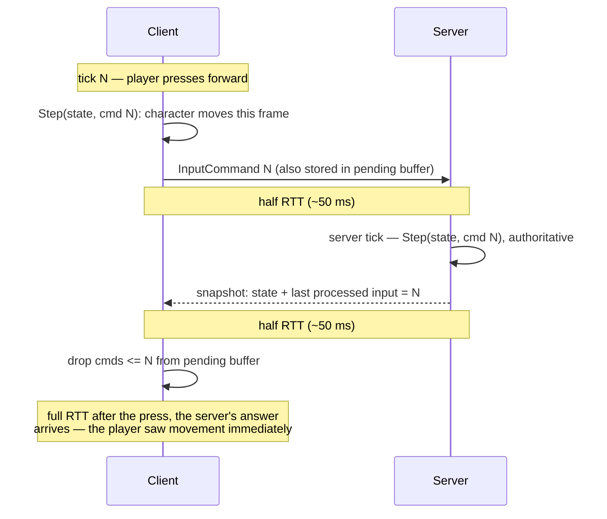

# Client-Side Prediction

## What it is

Client-side prediction means the client applies the **local player's** input the moment it happens — by running the exact same movement code the server will run — instead of waiting a round trip for the server's answer. The server stays authoritative ([Server Authority](./server-authority.md)); prediction is an optimistic local echo of what the server is about to compute anyway. In this engine's plan, only the local character will be predicted, in C++ configured by data ([ADR-0005](../../engine/architecture/adr-0005-predicted-movement-is-cpp.md)); M5 will build it ([master plan](../../design/master-plan.md)).

## Why you care

Without prediction you get Gambetta's **dumb client**: press forward, the `InputCommand` travels half an RTT to the server, the server simulates it, a snapshot travels half an RTT back — and only then does your character move. At 100 ms RTT that is six 60 Hz ticks of dead air on every keypress, and it feels broken even in a relaxed co-op colony sim. Prediction removes the wait for exactly one entity: you.

Everything else has different medicine. Remote players and NPCs are rendered ~100 ms in the past by [entity interpolation](./entity-interpolation.md); sub-tick visual smoothness is [render interpolation](../rendering/render-interpolation.md) — neither is prediction, don't conflate them.

## Quick start

A toy predicting client: apply each input immediately, then **keep it** until the server acknowledges it.

```cpp
#include <cassert>
#include <cstdint>
#include <cstdio>
#include <deque>

struct InputCommand {              // tick-stamped input (ADR-0002)
    std::uint32_t tick = 0;
    float move = 0.0f;             // -1..1
};

struct PlayerState { float x = 0.0f, vx = 0.0f; };

// Pure (state, input) -> state on a fixed tick. No clocks, no globals,
// no randomness: client and server run this exact function.
PlayerState Step(PlayerState s, const InputCommand& in) {
    constexpr float dt = 1.0f / 60.0f, accel = 40.0f, drag = 8.0f;
    s.vx += (in.move * accel - s.vx * drag) * dt;
    s.x  += s.vx * dt;
    return s;
}

int main() {
    PlayerState predicted{};           // what the local player sees
    std::deque<InputCommand> pending;  // sent but not yet acked

    for (std::uint32_t tick = 1; tick <= 10; ++tick) {
        InputCommand cmd{.tick = tick, .move = 1.0f};
        predicted = Step(predicted, cmd);  // apply NOW: zero perceived lag
        pending.push_back(cmd);            // ...and remember it (send too)
    }

    // Half an RTT later, a snapshot says "last input processed: tick 6".
    const std::uint32_t acked_tick = 6;
    while (!pending.empty() && pending.front().tick <= acked_tick)
        pending.pop_front();

    assert(pending.size() == 4 && pending.front().tick == 7);
    std::printf("predicted x=%.3f, %zu inputs still in flight\n",
                predicted.x, pending.size());
}
```

The `pending` buffer is the half people forget. Prediction alone only hides latency while client and server agree; the buffered inputs exist so the client can replay them when they disagree — the replay mechanism is [Reconciliation](./reconciliation.md), the next page.

## How it works

### The prediction timeline



Acks ride on snapshots, which will go out at the 20–30 Hz snapshot send rate — decoupled from the 60 Hz tick ([Snapshots](./snapshots.md)) — so several pending inputs typically retire at once.

### What makes it possible

Prediction only works because movement is a **pure function on a fixed tick**: given the same state and the same `InputCommand`, `Step` produces the same result on both machines. That rests on three prior decisions — the fixed 60 Hz tick ([Fixed Timestep](../architecture/fixed-timestep.md), [ADR-0002](../../engine/architecture/adr-0002-fixed-60hz-tick.md)), [input as data](../architecture/input-as-data.md), and commands flowing through one funnel ([Command Funnel](../architecture/command-funnel.md)). How exact "the same result" can really be is [Determinism Limits](../physics/determinism-limits.md)' problem.

!!! info
    This is why the character controller will be Jolt `CharacterVirtual` ([ADR-0011](../../engine/architecture/adr-0011-jolt-charactervirtual.md)): it owns no rigid body and moves by collision queries alone, so it can be stepped N times per frame in isolation — a dynamic body is welded to the whole solver and cannot be ([Character Controllers](../physics/character-controllers.md)).

### Why only the local character, why C++

Predicting more entities means predicting their inputs too — which you don't have. The plan predicts exactly one entity, the local character; props and NPCs replicate via snapshots plus interpolation ([ADR-0005](../../engine/architecture/adr-0005-predicted-movement-is-cpp.md)). And nothing scripted will run on the predicted path: a Luau call inside a function that must be re-runnable and bit-matching across machines breaks the contract, so predicted movement is C++ that mods configure through data, never through code.

!!! warning
    Predicted state is a **guess**, never authority. The server does not trust the client's position — it re-simulates from the client's inputs and its answer wins. If your predicted `x` and the snapshot's `x` disagree, that is a misprediction, and handling it is reconciliation — not lag compensation, which is the server rewinding **others** to validate hits.

## Pros / Cons

| Pros | Cons |
| --- | --- |
| Local movement feels instant at any RTT | Only works for entities whose inputs you have — the local character |
| Server stays fully authoritative; nothing is trusted | Requires pure, re-simulable movement — constrains the whole architecture |
| Cheap: one extra `Step` call per tick plus a small buffer | Mispredictions are inevitable; you must also build reconciliation |
| Pending-input buffer doubles as the reconciliation replay log | Predicted path is closed to Luau mods by design (ADR-0005) |

## What to expect

You will feel the dumb client before you fix it: M3 will ship server-authoritative replication with no prediction, and walking will visibly lag under the loopback transport's simulated latency ([master plan](../../design/master-plan.md)). M5 will add prediction plus reconciliation — lag/loss simulator first — with convergence tests at 100–300 ms and 5% loss. If that stalls, the pre-authorized K3 fallback is interpolation-only movement with ~100 ms input delay.

!!! tip
    Every scrap of state `Step` reads must live inside the predicted state it returns — velocity, coyote-time counters, all of it. Anything left outside will silently desync the moment inputs are replayed.

## Go deeper

- [Reconciliation](./reconciliation.md) — what happens when the server disagrees with your guess
- [Entity Interpolation](./entity-interpolation.md) — the remote-entity half of the story
- [Server Authority](./server-authority.md) / [Snapshots](./snapshots.md) — the model prediction sits on
- [Fixed Timestep](../architecture/fixed-timestep.md) / [Input as Data](../architecture/input-as-data.md) / [Command Funnel](../architecture/command-funnel.md) — the prerequisites
- [Character Controllers](../physics/character-controllers.md) / [Determinism Limits](../physics/determinism-limits.md) — the re-simulable controller and its float caveats
- [Render Interpolation](../rendering/render-interpolation.md) — sub-tick smoothing, a different tool
- [ADR-0005](../../engine/architecture/adr-0005-predicted-movement-is-cpp.md) / [ADR-0011](../../engine/architecture/adr-0011-jolt-charactervirtual.md) / [ADR-0002](../../engine/architecture/adr-0002-fixed-60hz-tick.md) / [Master plan](../../design/master-plan.md)

**Sources**

- Gabriel Gambetta — Fast-Paced Multiplayer (Part II): Client-Side Prediction and Server Reconciliation — https://www.gabrielgambetta.com/client-side-prediction-server-reconciliation.html — accessed 2026-07-06
- Gabriel Gambetta — Fast-Paced Multiplayer: Sample Code and Live Demo — https://www.gabrielgambetta.com/client-side-prediction-live-demo.html — accessed 2026-07-06
- Yahn Bernier (Valve) — Latency Compensating Methods in Client/Server In-game Protocol Design and Optimization — https://developer.valvesoftware.com/wiki/Latency_Compensating_Methods_in_Client/Server_In-game_Protocol_Design_and_Optimization — accessed 2026-07-06
