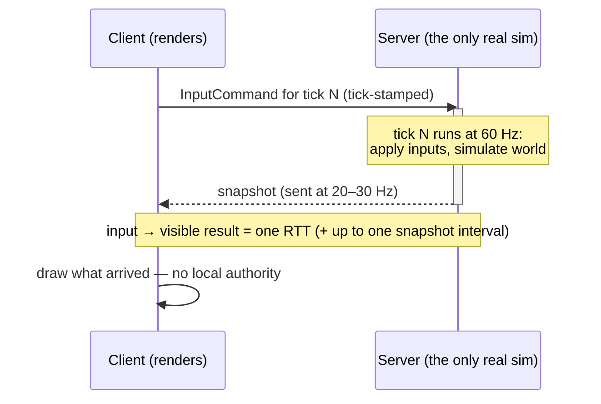

# The Client-Server Model

## What it is

A topology with one machine in charge. Every player runs a **client** that sends inputs; one **server** runs the only real simulation and broadcasts the results; clients draw what they are told. Gabriel Gambetta calls clients "privileged spectators" — they hold opinions about the world, never authority over it.

Mapped onto this engine (all planned — pre-M1, nothing beyond the toolchain exists yet): clients will send tick-stamped [InputCommands](../architecture/input-as-data.md) through the [command funnel](../architecture/command-funnel.md); the server will consume them inside its fixed [60 Hz tick](../architecture/fixed-timestep.md) ([ADR-0002](../../engine/architecture/adr-0002-fixed-60hz-tick.md)) and broadcast **snapshots** at a send rate below the tick — no ADR fixes the number yet, but the industry norm is ~20–30 Hz — decoupled from the tick. The wire will be GameNetworkingSockets behind a ~6-function transport ([ADR-0014](../../engine/architecture/adr-0014-gns-transport.md)), first used at M3 ([master plan](../../design/master-plan.md)).

## Why you care

This track's core repo fact: **single-player will be this exact topology.** [ADR-0003](../../engine/architecture/adr-0003-single-player-is-a-listen-server.md) commits solo play to a client plus an embedded server talking over a loopback transport — one sim code path for single-player, listen server, and dedicated server, with no `if (offline)` branch anywhere in gameplay code. Everything in this track therefore applies even offline.

The model's one structural cost is the round trip: your input travels to the server, gets simulated, and comes back as a snapshot before you see the result. Most of the rest of this track is techniques for paying or hiding that cost.

## Quick start

The whole topology in one file — a fake wire, an authoritative server, and clients that only render:

```cpp
#include <cstdint>
#include <cstdio>
#include <vector>

// A tick-stamped input: the ONLY thing a client may send upward.
struct InputCommand {
    std::uint64_t tick;
    float move_x;  // -1..1, "how hard am I pushing the stick"
};

// Authoritative state lives here and nowhere else.
struct Server {
    float x = 0.0f;
    std::uint64_t tick = 0;

    float Step(const std::vector<InputCommand>& inputs) {
        for (const auto& in : inputs) {
            if (in.tick == tick) x += in.move_x * (3.0f / 60.0f);  // 3 m/s
        }
        ++tick;
        return x;  // the "snapshot" broadcast to every client
    }
};

// Clients hold no authority: they draw whatever arrives.
struct Client {
    float shown_x = 0.0f;
    void Receive(float snapshot_x) { shown_x = snapshot_x; }
};

int main() {
    Server server;
    Client a, b;  // co-op: two players, one truth
    for (std::uint64_t t = 0; t < 5; ++t) {
        std::vector<InputCommand> wire = {{t, 1.0f}};  // A holds "right"
        float snapshot = server.Step(wire);
        a.Receive(snapshot);  // over loopback in single-player,
        b.Receive(snapshot);  // over the internet for a friend — same code
        std::printf("tick %llu: clients draw x=%.3f and %.3f\n",
                    static_cast<unsigned long long>(t), a.shown_x, b.shown_x);
    }
}
```

The point is the shape: inputs flow up, state flows down, and `Server` neither knows nor cares whether the wire is a loopback queue or the internet.

## How it works



Two rates, deliberately decoupled:

- **Tick (60 Hz)** — the server's simulation step. Inputs apply on the tick they are stamped with.
- **Snapshot send rate (20–30 Hz)** — how often state goes out. Fewer, larger updates beat per-tick spam; Valve's Source engine ships the same split, with servers ticking faster than the 20 updates per second clients receive by default. What actually goes into a snapshot is [replication-basics](./replication-basics.md).

### The roads not taken

- **Peer-to-peer lockstep** — no server; every machine runs the full sim and only inputs cross the wire. Requires bit-perfect [determinism across machines](../physics/determinism-limits.md), and every turn waits on the slowest peer.
- **Rollback** — predict remote inputs, rewind and re-simulate the whole game on a miss. Superb for fighting games with tiny state; re-simulating a colony full of NPCs on every misprediction is a non-starter.

Both are on this engine's never list — [ADR-0003](../../engine/architecture/adr-0003-single-player-is-a-listen-server.md) rejects them explicitly. [latency-tradeoffs](./latency-tradeoffs.md) treats the rollback-versus-delay tradeoff properly.

!!! info
    The loopback transport will support simulated latency and loss ([ADR-0014](../../engine/architecture/adr-0014-gns-transport.md)), so "works in single-player" will mean "works at 100 ms + 5% loss", not "works on localhost".

!!! tip
    Older articles use "tick rate" loosely for both rates. In this handbook **tick** always means the 60 Hz sim step and **snapshot send rate** always means the 20–30 Hz broadcast — keep them separate or the later pages will read wrong.

## Pros / Cons

| Pros | Cons |
| --- | --- |
| One authoritative truth — no drift between machines, no client dictating state (the full argument: [server-authority](./server-authority.md)) | Every action costs one round trip until hidden ([client-prediction](./client-prediction.md)) |
| Join and leave mid-game is easy: send the newcomer a snapshot | Server pays simulation plus bandwidth for everyone |
| No cross-machine determinism requirement, unlike lockstep | Server is a single point of failure |
| One code path covers solo, listen server, dedicated ([ADR-0003](../../engine/architecture/adr-0003-single-player-is-a-listen-server.md)) | Listen-server host plays at ~0 ms while guests eat the RTT |

## What to expect

M3 will pay for the client/server split "before it's expensive": a headless dedicated target, inputs serialized into commands, server-authoritative full-state replication, and single-player over loopback ([master plan](../../design/master-plan.md), row M3). Raw M3 netcode will feel laggy and steppy by design — M5 will add snapshot interpolation plus prediction and reconciliation, with K3's pre-authorized fallback (interpolation-only plus ~100 ms input delay) if prediction turns into a tar pit.

Expect the discipline to matter more than the code: every gameplay feature written after M3 has to survive "my input takes an RTT to come back". That is the entire reason ADR-0003 pays for the split on day one instead of retrofitting it later.

## Go deeper

- [Server authority](./server-authority.md) — why the server must own the truth (anti-cheat, consistency)
- [Replication basics](./replication-basics.md) — what data actually crosses the wire
- [Client prediction](./client-prediction.md) — how the round-trip cost gets hidden
- [Latency tradeoffs](./latency-tradeoffs.md) — rollback vs delay, in detail
- [Fixed timestep](../architecture/fixed-timestep.md) — the 60 Hz tick this topology hangs off
- [Input as data](../architecture/input-as-data.md) — how InputCommands get their tick stamps
- [Command funnel](../architecture/command-funnel.md) — the single doorway inputs enter through
- [ADR-0003](../../engine/architecture/adr-0003-single-player-is-a-listen-server.md) — single-player is a listen server over loopback
- [ADR-0014](../../engine/architecture/adr-0014-gns-transport.md) — GNS behind a minimal transport interface

**Sources**

- Gabriel Gambetta — Fast-Paced Multiplayer (Part I): Client-Server Game Architecture — https://www.gabrielgambetta.com/client-server-game-architecture.html — accessed 2026-07-06
- Glenn Fiedler — What Every Programmer Needs To Know About Game Networking — https://gafferongames.com/post/what_every_programmer_needs_to_know_about_game_networking/ — accessed 2026-07-06
- Valve Developer Community — Source Multiplayer Networking — https://developer.valvesoftware.com/wiki/Source_Multiplayer_Networking — accessed 2026-07-06
