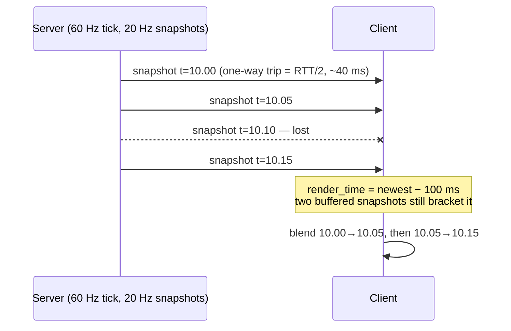

# Entity Interpolation

## What it is

Everything on your screen that you don't control — other players' characters, NPCs, props — is deliberately rendered about **100 ms in the past**. The client keeps a small buffer of incoming [snapshots](snapshots.md), computes a render time of "newest snapshot time minus the interpolation delay", finds the two buffered snapshots that bracket that time, and blends between them. Motion stays smooth even when a snapshot arrives late or never arrives at all.

The math is the same lerp as [render interpolation](../rendering/render-interpolation.md), but the timescale and purpose are entirely different. Render interpolation blends between two adjacent **60 Hz ticks** on the local machine — a sub-tick alpha smoothing out at most ~16.7 ms. Entity interpolation blends between two **network snapshots** that are 33–50 ms apart, on a timeline held ~100 ms behind the server. One hides frame/tick mismatch; the other hides the network.

## Why you care

The server will simulate at 60 Hz but send snapshots at only 20–30 Hz, decoupled from the tick ([ADR-0002](../../engine/architecture/adr-0002-fixed-60hz-tick.md)). Rendered raw, a remote colonist would hop forward 2–3 ticks' worth of distance every 33–50 ms, freeze whenever a packet is lost, and jitter with every wobble in delivery timing. Buffering two snapshots' worth of history converts that mess into continuous motion — you are trading **staleness for smoothness**, on purpose.

This engine's plan leans on it heavily: props and NPCs will always interpolate and never predict ([ADR-0005](../../engine/architecture/adr-0005-predicted-movement-is-cpp.md)), M5 will build snapshot interpolation before prediction ([master plan](../../design/master-plan.md)), and the pre-authorized K3 fallback is to ship interpolation-only if prediction stalls. Interpolation is the floor the whole netcode plan stands on.

## Quick start

A toy buffer for one entity. Snapshots carry server timestamps; the client samples the position at `render_time`.

```cpp
#include <cassert>
#include <cstddef>
#include <vector>

struct Vec3 { float x, y, z; };

struct Snapshot {
    double server_time;  // seconds, stamped by the sending server
    Vec3   position;     // one entity, for brevity
};

Vec3 lerp(Vec3 a, Vec3 b, float t) {
    return { a.x + (b.x - a.x) * t,
             a.y + (b.y - a.y) * t,
             a.z + (b.z - a.z) * t };
}

// Blend between the two snapshots that bracket render_time.
Vec3 sample(const std::vector<Snapshot>& buf, double render_time) {
    for (std::size_t i = 1; i < buf.size(); ++i) {
        if (buf[i].server_time >= render_time) {
            const Snapshot& a = buf[i - 1];
            const Snapshot& b = buf[i];
            float t = static_cast<float>((render_time - a.server_time)
                                       / (b.server_time - a.server_time));
            return lerp(a.position, b.position, t);
        }
    }
    return buf.back().position;  // buffer ran dry — see the warning below
}

int main() {
    std::vector<Snapshot> buf = {
        { 10.00, { 0.0f, 0.0f, 0.0f } },  // snapshots ~50 ms apart (20 Hz)
        { 10.05, { 0.5f, 0.0f, 0.0f } },
        { 10.10, { 1.0f, 0.0f, 0.0f } },
    };
    double render_time = 10.075;  // chosen to bracket the two newest snapshots; a real ~100 ms delay needs a deeper buffer
    Vec3 p = sample(buf, render_time);
    assert(p.x > 0.74f && p.x < 0.76f);
}
```

Note the timeline: `render_time` lives in **server time**, driven forward by the client's clock but anchored to snapshot timestamps — never raw client wall-clock.

## How it works



The delay is sized so the buffer survives trouble. At 20 Hz, snapshots land 50 ms apart; a 100 ms delay means two snapshots are normally in flight ahead of the render time. If one is lost (transport sends snapshots unreliably — [transport-reliability](transport-reliability.md)), the gap between its neighbors simply becomes one longer lerp segment, exactly what Source does with its default 100 ms `cl_interp`. Late or jittery arrivals are absorbed the same way.

The cost is that everyone you see is historical: roughly RTT/2 + interpolation delay behind the server's present. That has real gameplay consequences — covered in [latency-tradeoffs](latency-tradeoffs.md), not here. It is also why the **local** player can't use this technique: waiting 100 ms to see your own keypress is unacceptable, which is what [client-prediction](client-prediction.md) exists to solve.

!!! warning
    If the buffer runs dry — a burst of loss longer than the delay — you must either hold the last pose or extrapolate a guess and snap back when truth arrives. Both look bad; pick the delay so it's rare. That desperation mode gets its full treatment in [latency-tradeoffs](latency-tradeoffs.md).

## Pros / Cons

| Approach | Pro | Con |
|---|---|---|
| Interpolate (~100 ms behind) | smooth under loss/jitter; only ever shows real server states | everything remote is stale |
| Extrapolate from velocity | no added delay | wrong on every direction change — overshoot, then pop |
| Render newest snapshot raw | simplest | 20–30 Hz stutter; freezes on loss |

## What to expect

Per remote entity you hold a few snapshots (a small ring buffer) and pay one lerp per frame — trivial. The classic bugs: entities stutter every second or so (render clock drifting relative to server clock — nudge it toward the snapshot stream, don't hard-snap), rotations shearing (nlerp quaternions, as in [render interpolation](../rendering/render-interpolation.md)), and teleports smearing across the map (a spawn or door-warp must reset the buffer, not lerp through the wall).

!!! tip
    Interpolate in one place. Sample every remote entity at the same `render_time` each frame, or entities visibly desynchronize from each other — a cart drifting away from the colonist pushing it.

## Go deeper

- [snapshots](snapshots.md) — where the buffered stream comes from
- [client-prediction](client-prediction.md) — the local player, who cannot wait 100 ms
- [latency-tradeoffs](latency-tradeoffs.md) — consequences of everyone seeing the past
- [render-interpolation](../rendering/render-interpolation.md) — same lerp, sub-tick timescale
- [fixed-timestep](../architecture/fixed-timestep.md) — the tick/frame split underneath both
- [ADR-0005](../../engine/architecture/adr-0005-predicted-movement-is-cpp.md) — props/NPCs interpolate, never predict
- [master plan](../../design/master-plan.md) — M5 snapshot interpolation, K3 interpolation-only fallback

**Sources**

- Fast-Paced Multiplayer (Part III): Entity Interpolation — Gabriel Gambetta, https://www.gabrielgambetta.com/entity-interpolation.html — accessed 2026-07-06
- Source Multiplayer Networking — Valve Developer Community, https://developer.valvesoftware.com/wiki/Source_Multiplayer_Networking — accessed 2026-07-06
- Snapshot Interpolation — Gaffer On Games, https://gafferongames.com/post/snapshot_interpolation/ — accessed 2026-07-06
