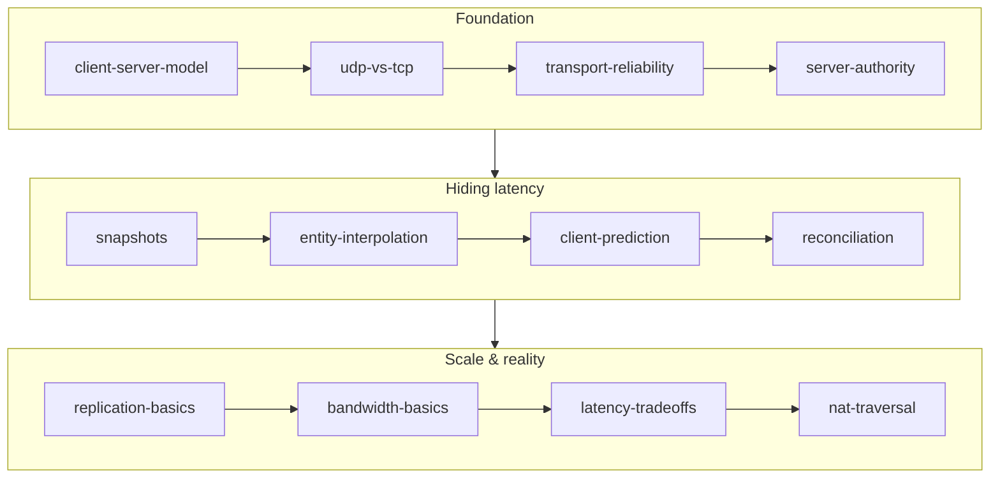

# Netcode

## What it is

This track is the multiplayer path for our co-op colony-sim engine: one authoritative server, clients that send inputs and render what they are told, and the handful of techniques that make that honest topology feel responsive over a real internet connection. It covers the wire (UDP, reliability channels, GameNetworkingSockets), the state (snapshots, replication, bandwidth), and the illusions that hide latency (interpolation, prediction, reconciliation) — all as planned engine work, since pre-M1 nothing beyond the toolchain exists yet.

## Why you care

The track's load-bearing fact: **single-player is this same topology.** [ADR-0003](../../engine/architecture/adr-0003-single-player-is-a-listen-server.md) commits solo play to a client plus an embedded server over a loopback transport — one simulation code path, no `if (offline)` branch. So everything here applies even when you never touch the network. The [master plan](../../design/master-plan.md) pays for the client/server split at M3 and layers prediction on at M5, which means every gameplay feature you write has to survive "my input takes a round trip to come back".

## How it works

Read in order. The first four pages build the honest, laggy foundation; the middle five hide the lag; the last four handle scale and the physical internet.

| Page | What you'll learn |
|---|---|
| [The Client-Server Model](client-server-model.md) | One authoritative server, clients as privileged spectators — and why single-player runs it too. |
| [UDP vs TCP](udp-vs-tcp.md) | Why in-order delivery is wrong for a 60 Hz game: head-of-line blocking and stale retransmits. |
| [Reliability on Top of UDP](transport-reliability.md) | Sequence numbers, ack bitfields, and which data belongs on the reliable vs unreliable channel. |
| [Server Authority](server-authority.md) | The server as sole source of truth; a client's state is only ever an opinion. |
| [Snapshots](snapshots.md) | Serialized world state at 20–30 Hz, delta-compressed against the client's last acked baseline. |
| [Entity Interpolation](entity-interpolation.md) | Rendering remote entities ~100 ms in the past so motion stays smooth — buying it with staleness. |
| [Client-Side Prediction](client-prediction.md) | Applying local input immediately by running the same movement code the server will. |
| [Server Reconciliation](reconciliation.md) | Rewind to the server's state, replay pending inputs — turning a misprediction into an invisible replay. |
| [Replication Basics](replication-basics.md) | What crosses the wire: network IDs, dirty-flagged component pools, one serialize function. |
| [Bandwidth Basics](bandwidth-basics.md) | The arithmetic of bytes × entities × rate × players, and the three levers that keep it affordable. |
| [Latency Tradeoffs](latency-tradeoffs.md) | Lag compensation vs extrapolation vs design — and why this co-op PvE sim picks design. |
| [NAT Traversal](nat-traversal.md) | Why two home routers can't just connect, and the STUN → hole-punch → relay escalation ladder. |

## What to expect

About an evening per page. By the end you can explain exactly what happens between a player pressing a key and every machine agreeing on the result — and why the engine will predict only your own character while everyone else stays interpolated ([ADR-0005](../../engine/architecture/adr-0005-predicted-movement-is-cpp.md)).

## Go deeper

Start with [The Client-Server Model](client-server-model.md). Before this track, finish [C++ for Game Devs](../cpp/index.md) and [Engine Architecture](../architecture/index.md); the interpolation and prediction pages lean on [Rendering](../rendering/index.md) and [Physics](../physics/index.md). Engine-specific claims trace to the [master plan](../../design/master-plan.md) and the [ADRs](../../engine/architecture/adr-0014-gns-transport.md).

Sources:

- Gabriel Gambetta — Fast-Paced Multiplayer — https://www.gabrielgambetta.com/client-server-game-architecture.html — accessed 2026-07-06
- Glenn Fiedler — What Every Programmer Needs To Know About Game Networking — https://gafferongames.com/post/what_every_programmer_needs_to_know_about_game_networking/ — accessed 2026-07-06
