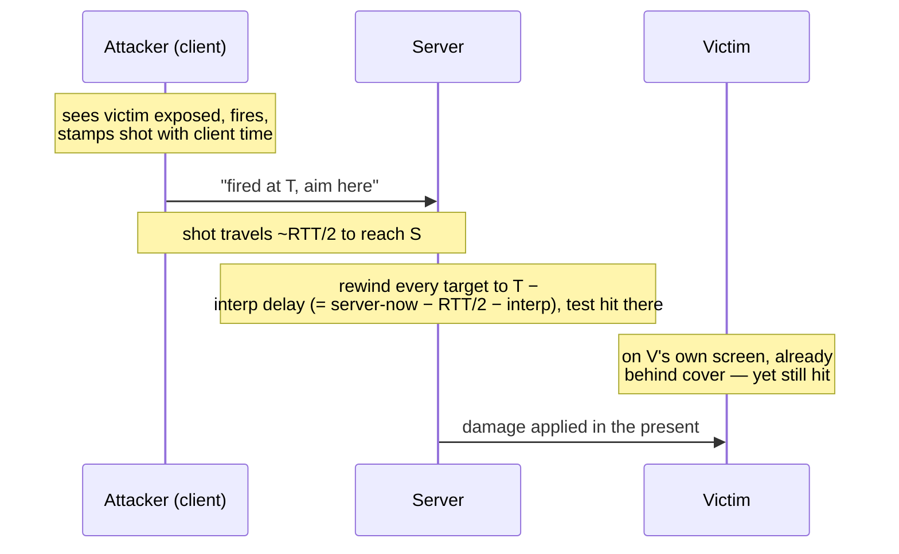

# Latency Tradeoffs

## What it is

[Client-side prediction](client-prediction.md) hides **your own** latency by moving your character the instant you press a key. [Entity interpolation](entity-interpolation.md) hides the network by rendering **everyone else** about 100 ms in the past. Both bend time, opposite ways — so when one player's action reaches another, the two machines disagree about where that player was. Something has to give. There are exactly three families of answer: **lag compensation**, **extrapolation**, or **designing outcomes so sub-100 ms timing never decides them**. This page is about choosing one, and about one confusion that has to die first.

!!! warning "Reconciliation is not lag compensation"
    Both get called "rewind"; they are opposites. [Reconciliation](reconciliation.md) is the **client** rewinding **itself** and replaying its own pending inputs. Lag compensation is the **server** rewinding **other** players back to the shooter's past view to judge a hit. Different machine, different subject, opposite direction — never conflate them.

## Why you care

A fast competitive shooter has to un-bend those two time-shifts at the exact instant of a hit, or aiming feels broken. A co-op PvE colony sim does not — a genuine simplification, not a corner cut. Which option you are on decides how much netcode you owe. This engine's abilities will stay server-authoritative with interpolation as the contract ([ADR-0005](../../engine/architecture/adr-0005-predicted-movement-is-cpp.md)), which quietly picks the cheapest of the three.

## Quick start

The plan is option three: **no lag-compensation rewind in v1**, generous melee hit windows, and rollback/lockstep on the master plan's explicit never list ([master plan](../../design/master-plan.md)). The server will judge a swing on its **own** tick against the interpolated target position; a forgiving window absorbs the staleness so timing slop never decides the outcome.

```cpp
#include <cassert>
#include <cmath>

struct Vec2 { float x, y; };

float dist(Vec2 a, Vec2 b) {
    float dx = a.x - b.x, dy = a.y - b.y;
    return std::sqrt(dx * dx + dy * dy);
}

// Server-authoritative melee check on the server's OWN tick — no rewind.
// `slack` is the generous window that absorbs interpolation staleness,
// so a ~100 ms-stale target position still resolves as the attacker expected.
bool connects(Vec2 attacker, Vec2 target, float reach, float slack) {
    return dist(attacker, target) <= reach + slack;
}

int main() {
    Vec2 swinger{0.0f, 0.0f};
    Vec2 foe{1.15f, 0.0f};                    // server sees the foe here, ~100 ms stale
    float reach = 1.0f;
    assert(!connects(swinger, foe, reach, 0.0f));  // tight window: the swing whiffs
    assert(connects(swinger, foe, reach, 0.5f));   // forgiving window: timing stops deciding
}
```

## How it works

Start with the option **not** taken. Lag compensation keeps a short history of every player's recent positions. When a shot arrives stamped with the shooter's client time, the server rewinds all targets to where they stood **in the shooter's view** — roughly RTT/2 plus the interpolation delay ago — tests the hit against that reconstructed past, then applies damage in the present. Valve calls this **favor the shooter**: the shot you clearly saw land, lands.



The bill lands on the victim: they can take damage a moment **after** reaching cover on their own screen — the infamous "died behind a wall." That is a deliberate value judgment, correct for a duel where two players dispute one instant, and pointless here — the things being hit are AI.

**Extrapolation** is option two: predict remote entities **forward** from their last velocity, erasing the interpolation delay. It overshoots on every direction change and pops when the truth arrives ([entity-interpolation](entity-interpolation.md) covers why) — a bad trade when nothing here needs frame-exact positions.

**Option three**, chosen here, makes outcomes insensitive to sub-100 ms timing at the source: generous reach, no twitch headshots, hit windows wide enough that a 100 ms-stale target still resolves as the attacker expected. The `slack` in the code above is that window.

## Pros / Cons

| Option | Pro | Con |
|---|---|---|
| Lag compensation (server rewinds targets) | the shooter's aim is always rewarded | victims "die behind cover"; needs a position-history buffer |
| Extrapolation | no interpolation delay | overshoots and pops on every direction change |
| Forgiving windows (this engine) | almost no extra netcode; PvE-appropriate | useless for precise competitive PvP |

## What to expect

M5 will ship prediction + reconciliation for your **own** character and interpolation for everyone else, with **no** lag-compensation rewind ([master plan](../../design/master-plan.md)). The melee loop that leans on generous windows arrives at M7; combat **design** itself is out of handbook scope. If prediction stalls, the pre-authorized K3 fallback is interpolation-only plus ~100 ms input delay ([ADR-0005](../../engine/architecture/adr-0005-predicted-movement-is-cpp.md)). Were this ever a PvP shooter you would owe a full position-history buffer and the rewind above; it is not, so you do not.

!!! info "On the never list"
    Rollback and lockstep netcode are explicitly ruled out for this project ([master plan](../../design/master-plan.md)). "Favor the shooter" is a competitive-FPS value; a co-op PvE colony sim inherits none of the fairness pressure that justifies its cost.

## Go deeper

- [client-prediction](client-prediction.md) — hides your own latency; one half of the tension
- [entity-interpolation](entity-interpolation.md) — puts everyone else ~100 ms in the past; the other half
- [reconciliation](reconciliation.md) — the client-side rewind this page is **not**
- [server-authority](server-authority.md) — why the server, not the shooter, has the final word
- [snapshots](snapshots.md) — the stream both interpolation and any rewind buffer would read
- [render-interpolation](../rendering/render-interpolation.md) — the sub-tick blend, unrelated to the network delay
- [fixed-timestep](../architecture/fixed-timestep.md) — the tick every server-side judgement runs on
- [character-controllers](../physics/character-controllers.md) — what a melee window actually tests against
- [ADR-0005](../../engine/architecture/adr-0005-predicted-movement-is-cpp.md) · [master plan](../../design/master-plan.md) — abilities server-authoritative; rollback/lockstep on the never list

**Sources**

- Fast-Paced Multiplayer (Part IV): Lag Compensation — Gabriel Gambetta — https://www.gabrielgambetta.com/lag-compensation.html — accessed 2026-07-06
- Lag Compensation — Valve Developer Community — https://developer.valvesoftware.com/wiki/Lag_Compensation — accessed 2026-07-06
- Latency Compensating Methods in Client/Server In-game Protocol Design and Optimization — Yahn Bernier (Valve) — https://developer.valvesoftware.com/wiki/Latency_Compensating_Methods_in_Client/Server_In-game_Protocol_Design_and_Optimization — accessed 2026-07-06

**Video**: I Shot You First: Networking the Gameplay of Halo: Reach (GDC 2011, David Aldridge) — https://www.youtube.com/watch?v=h47zZrqjgLc — 109 min. Watch after this page: the definitive tour of these tradeoffs shipping in a real title, including where Bungie chose not to rewind. Skim the middle third for just the latency-model reasoning.
