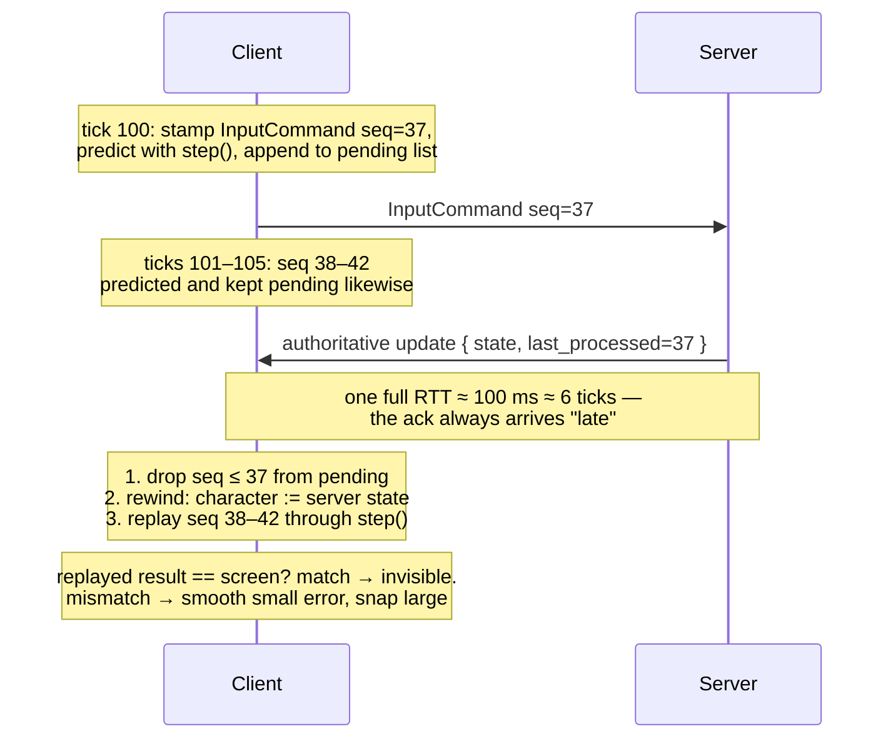

# Server Reconciliation

## What it is

Reconciliation is the client correcting **itself**. [Client-side prediction](client-prediction.md) already moves your character the instant you press a key; the server's authoritative verdict on that same tick arrives a full round trip later. Reconciliation is the bookkeeping that merges the two without a rubber-band: every **InputCommand** carries a **sequence number** and sits in a **pending list** until acknowledged; every authoritative update carries the last sequence number the server processed; the client discards the acked inputs, resets its character to the server's state, and re-applies every still-pending input through the same pure movement function. If the prediction was right, the replay lands exactly where the screen already shows, and nothing visible happens.

!!! warning
    Do not confuse this with **lag compensation**, where the server rewinds **other** players to validate hits. Reconciliation is the client rewinding **itself**. Same word "rewind", opposite direction — see [latency-tradeoffs](latency-tradeoffs.md).

## Why you care

Without reconciliation, an authoritative update can only be applied one way: snap to the server's state — where you were one RTT **ago**. At 100 ms round trip that is a six-tick backwards yank on every update. Ignoring the server instead reopens the cheating door that [server-authority](server-authority.md) closed. Reconciliation applies the correction **in the past**, then replays your unacked intent on top — a misprediction becomes an invisible replay, not a rubber-band. The engine will ship this at M5, for the local character only ([master plan](../../design/master-plan.md), [ADR-0005](../../engine/architecture/adr-0005-predicted-movement-is-cpp.md)).

## Quick start

The whole trick rests on one property: movement is a pure `(state, input) → state` function, callable as many times as needed. Prediction, the server's simulation, and the replay all call the same `step`.

```cpp
#include <cassert>
#include <cstdint>
#include <deque>

struct Input { std::uint32_t seq; float move; };  // tick-stamped InputCommand
struct State { float x; };

// Pure. The server runs this too — prediction and replay both reuse it.
State step(State s, Input in) { s.x += in.move * (1.0f / 60.0f); return s; }

State reconcile(State server_says, std::deque<Input>& pending,
                std::uint32_t last_processed_seq) {
    while (!pending.empty() && pending.front().seq <= last_processed_seq)
        pending.pop_front();                 // server already consumed these
    State s = server_says;                   // rewind: adopt authority
    for (const Input& in : pending)          // replay what it hasn't seen
        s = step(s, in);
    return s;
}

int main() {
    std::deque<Input> pending{{7, 1.f}, {8, 1.f}, {9, 1.f}, {10, 1.f}};
    // Server processed through seq 8 but disagrees: it saw us hit a wall at x=0.5.
    State corrected = reconcile({0.5f}, pending, 8);
    assert(pending.size() == 2);                        // 9 and 10 still pending
    assert(corrected.x > 0.53f && corrected.x < 0.54f); // authority + 2 replayed ticks
}
```

This is exactly why the engine's character will be Jolt `CharacterVirtual` — re-simulable N times per frame ([ADR-0011](../../engine/architecture/adr-0011-jolt-charactervirtual.md)) — and why the predicted path will be C++ only, never Luau ([ADR-0005](../../engine/architecture/adr-0005-predicted-movement-is-cpp.md)).

## How it works



Three details matter. **First**, updates arrive at the snapshot send rate (20–30 Hz, decoupled from the 60 Hz tick — [snapshots](snapshots.md)), so each acks several inputs and the replay covers roughly RTT-worth of ticks: ~12 `step` calls at 200 ms — cheap only because `step` is pure and isolated from the full physics world. Re-simulation also demands identical tick boundaries on both machines ([fixed-timestep](../architecture/fixed-timestep.md)).

**Second**, when the replay **disagrees** with the screen — you got shoved by something unpredictable, or float drift accumulated ([determinism-limits](../physics/determinism-limits.md)) — don't snap to the corrected pose. Keep the difference as an error offset and decay it to zero over ~100–200 ms; Source calls this prediction error smoothing. Snap only when the error is huge (a teleport). The **simulation** is corrected immediately; only the rendered pose is eased.

**Third**, sequence numbers make packet loss a non-event: the ack is cumulative, so a lost update just means the next one acks more inputs and the replay is a few ticks longer.

!!! tip
    The rewound state must include **everything** `step` reads — velocity, grounded flag, stamina. Forget one field and the replay diverges even when the server agreed with you: a bug that looks like "random jitter" and is actually missing state.

## Pros / Cons

| Approach | Pro | Con |
|---|---|---|
| Rewind + replay pending inputs | mispredictions self-heal invisibly | needs pure, re-simulable movement; ~RTT ticks of re-stepping per update |
| Snap to server state only | trivial to write | rubber-bands you backwards by RTT on every correction |
| Interpolation-only + ~100 ms input delay (K3) | no prediction code at all | every keypress feels late — a real fallback, not a strawman |

## What to expect

M5 will build the lag/loss simulator **first**, then run client and server in one process over a fake transport and assert convergence after an induced misprediction under 100–300 ms RTT + 5% loss ([master plan](../../design/master-plan.md)). If that stalls the project, the pre-authorized K3 fallback is the table's third row — acceptable for a colony sim, ruinous for a shooter.

Expect the classic bugs: an unbounded pending list on a stalled connection (cap it, then hold new input); the smoothing offset leaking into the simulation instead of staying presentation-only; and confusing this smoothing with [render interpolation](../rendering/render-interpolation.md), the unrelated sub-tick alpha blend every entity gets.

## Go deeper

- [client-prediction](client-prediction.md) — the guess this page corrects
- [snapshots](snapshots.md) — the authoritative update that carries the ack
- [server-authority](server-authority.md) — why the server's word is final
- [entity-interpolation](entity-interpolation.md) — remote entities never reconcile; they interpolate ~100 ms behind
- [latency-tradeoffs](latency-tradeoffs.md) — lag compensation, the server-side rewind this page is not
- [fixed-timestep](../architecture/fixed-timestep.md) — why re-simulation demands fixed ticks
- [input-as-data](../architecture/input-as-data.md) — InputCommand as a serializable struct
- [character-controllers](../physics/character-controllers.md) — the `CharacterVirtual` that gets rewound
- [ADR-0005](../../engine/architecture/adr-0005-predicted-movement-is-cpp.md) · [ADR-0011](../../engine/architecture/adr-0011-jolt-charactervirtual.md) — the engine commitments this mechanism drives

**Sources**

- Fast-Paced Multiplayer (Part II): Client-Side Prediction and Server Reconciliation — Gabriel Gambetta, https://www.gabrielgambetta.com/client-side-prediction-server-reconciliation.html — accessed 2026-07-06
- Fast-Paced Multiplayer: Sample Code and Live Demo — Gabriel Gambetta, https://www.gabrielgambetta.com/client-side-prediction-live-demo.html — accessed 2026-07-06
- Source Multiplayer Networking — Valve Developer Community, https://developer.valvesoftware.com/wiki/Source_Multiplayer_Networking — accessed 2026-07-06

**Video**: Overwatch Gameplay Architecture and Netcode (GDC 2017, Timothy Ford) — https://www.youtube.com/watch?v=W3aieHjyNvw — 64 min. Watch after this page and [client-prediction](client-prediction.md): it shows this exact pending-input replay loop shipping in a real engine, including what happens to the replay window under packet loss.
