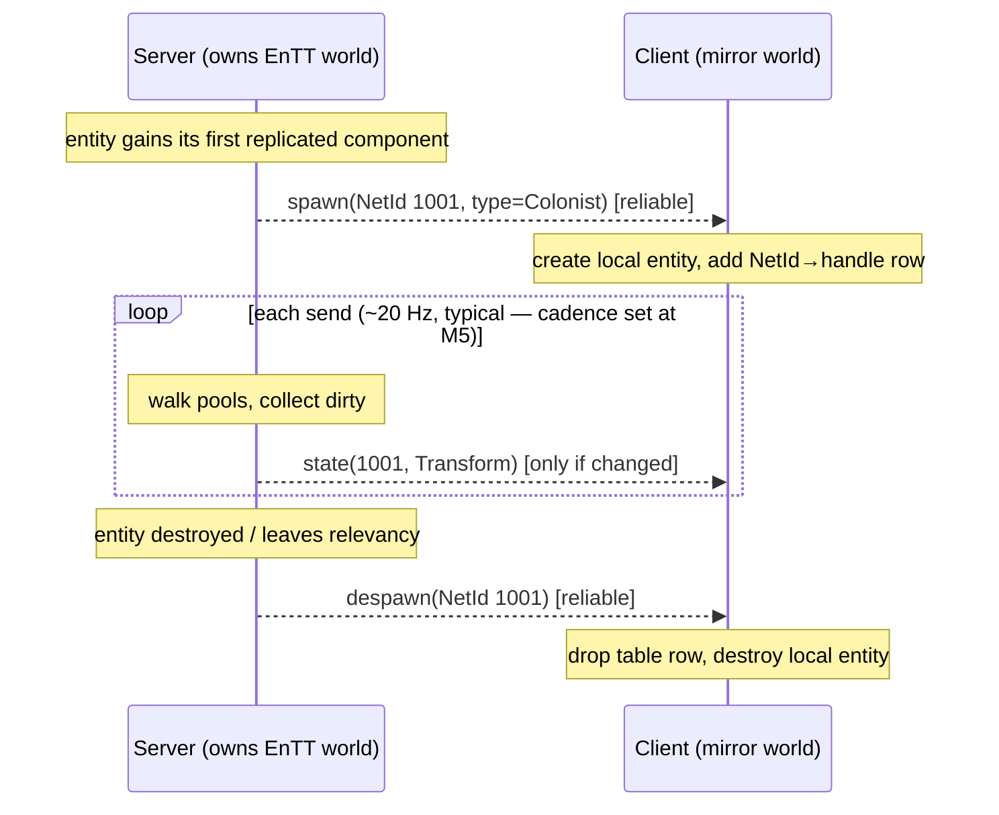

# Replication Basics

## What it is

Replication is the server deciding which slice of the live world to put on the wire, and which to keep private. Not every field of an entity travels: a colonist's **position** crosses to every client; its half-built GPU mesh does not. This page is about that decision — what qualifies as replicated, how each machine names the same entity, and how new arrivals and deaths get announced. It is the outbound half of [server authority](./server-authority.md): turning live ECS state into bytes clients can rebuild.

In this engine (all planned — pre-M1, nothing beyond the toolchain exists), M3 will ship server-authoritative **full-state replication** ([master plan](../../design/master-plan.md), row M3): every replicated entity, every send, no filtering yet.

## Why you care

An EnTT entity handle is a **local** index into one machine's world, and EnTT may recycle it. Send the raw handle and client A's colonist becomes client B's crate. So every replicated entity needs a stable **network ID** that both sides agree on, plus a small table mapping that ID to the local handle — maintained separately on the server and each client.

The deeper reason lands here: this is **why EnTT was chosen**. Its sparse-set component pools let replication iterate "what changed in this pool" directly — [ADR-0010](../../engine/architecture/adr-0010-entt-ecs.md) calls them "the natural replication substrate." Deciding what to send is not a bolt-on system; it falls out of the ECS memory layout.

## Quick start

A toy replicated pool: a network-ID table, a dirty flag per entity, and a walk that emits only what changed.

```cpp
#include <cassert>
#include <cstddef>
#include <cstdint>
#include <cstdio>
#include <utility>
#include <vector>

using NetId = std::uint32_t;   // stable across machines (EnTT handles are not)

struct Transform  { float x = 0, y = 0; };   // replicated
struct RenderMesh { int gpu_handle = 0; };   // client-only — never on the wire

// One replicated pool: parallel arrays, EnTT-sparse-set style.
struct TransformPool {
    std::vector<NetId>     ids;
    std::vector<Transform> data;
    std::vector<bool>      dirty;
    void set(NetId id, Transform t) {
        ids.push_back(id); data.push_back(t); dirty.push_back(true);
    }
};

// Stands in for the one bitstream Serialize(Stream&, T&) (ADR-0013).
struct Packet { std::vector<std::pair<NetId, Transform>> writes; };

// Replication = walk the pool, emit only the dirty, clear the flag.
Packet replicate(TransformPool& pool) {
    Packet p;
    for (std::size_t i = 0; i < pool.ids.size(); ++i) {
        if (!pool.dirty[i]) continue;
        p.writes.push_back({pool.ids[i], pool.data[i]});
        pool.dirty[i] = false;
    }
    return p;
}

int main() {
    TransformPool pool;
    pool.set(1001, {3.0f, 0.0f});          // a colonist
    pool.set(1002, {7.0f, 2.0f});          // a crate

    Packet first = replicate(pool);
    assert(first.writes.size() == 2);      // both new -> both sent
    Packet idle = replicate(pool);
    assert(idle.writes.empty());           // nothing moved -> nothing sent

    std::printf("first send %zu, idle send %zu\n",
                first.writes.size(), idle.writes.size());
}
```

The `RenderMesh` never enters `replicate`: client-only state costs zero wire bytes because it lives in a pool replication does not walk.

## How it works

Replication asks three questions per entity, in order.

**1 — Is it named?** Each replicated entity gets a `NetId`; a table maps `NetId` to the local EnTT handle on every machine. Handles stay home.

**2 — Which components qualify?** Replication walks only the pools of components you mark replicated — `Transform`, health, current job. Everything else is **client-only**: the `RenderMesh` handle, the animation blend cursor, particle state — all rebuilt locally from replicated state, never sent. Marking a component replicated is a deliberate choice, not the default.

**3 — Did it change?** Within each replicated pool, a dirty flag skips the unchanged. The survivors serialize through the single `Serialize(Stream&, T&)` per type — one definition for read and write, so no drift ([ADR-0013](../../engine/architecture/adr-0013-json-authored-bitstream-wire.md)). The ECS itself is [ecs-pattern](../architecture/ecs-pattern.md); the serializer is [serialization-basics](../architecture/serialization-basics.md).

Around the state stream sit two **lifecycle** messages. When an entity first becomes relevant, the server sends a **spawn** (NetId + type) so the client creates the local mirror; when it dies or leaves, a **despawn** tears it down. These must be reliable — a lost spawn orphans every later update — while state updates can ride an unreliable channel; GNS lanes let both share one connection without head-of-line blocking ([transport-reliability](./transport-reliability.md)).



## Pros / Cons

| Pros | Cons |
| --- | --- |
| ECS pools make "what changed" a direct walk ([ADR-0010](../../engine/architecture/adr-0010-entt-ecs.md)) | Full-state at M3 sends every replicated entity every send — caps NPC counts |
| One `Serialize` per type, read and write ([ADR-0013](../../engine/architecture/adr-0013-json-authored-bitstream-wire.md)) — no drift | The `NetId`↔handle table must stay correct on both sides |
| Client-only components stay off the wire for free | Replicated-vs-client-only is a manual call, per component |

## What to expect

M3's full-state replication is deliberately unfiltered — it sends the whole replicated world to every client, which is why NPC counts stay capped at what full snapshots sustain under the loss simulator ([master plan](../../design/master-plan.md)).

The lever that lifts that cap is **interest management**, named here and honestly deferred: R3 will add replication **relevancy** — per-client region + radius filtering, so a client receives only entities near it. Source's engine does the same with a PVS-based relevancy check. Until R3, the cap stands.

!!! warning
    A `NetId` is not an EnTT handle and an EnTT handle is not a `NetId`. Handles are local and recycled; only the `NetId` is safe on the wire. Cross the streams and entities swap identities across machines.

!!! info
    Two neighbours own the rest of "what a packet costs": [snapshots](./snapshots.md) covers delta-encoding against a baseline (sending only changes since the last acked send), and [bandwidth-basics](./bandwidth-basics.md) covers quantization and the per-second byte budget. This page decides only which entities and components qualify at all.

## Go deeper

- [snapshots](./snapshots.md) — delta-against-baseline, the next question after "what qualifies"
- [bandwidth-basics](./bandwidth-basics.md) — quantization and the per-second budget
- [server-authority](./server-authority.md) — why the server owns the truth this stream carries
- [entity-interpolation](./entity-interpolation.md) — how clients rebuild motion from sparse state
- [client-server-model](./client-server-model.md) — the topology replication runs on
- [ecs-pattern](../architecture/ecs-pattern.md) / [serialization-basics](../architecture/serialization-basics.md) — the pools and the `Serialize` this page reuses
- [ADR-0010](../../engine/architecture/adr-0010-entt-ecs.md) — EnTT as the natural replication substrate
- [ADR-0013](../../engine/architecture/adr-0013-json-authored-bitstream-wire.md) — one bitstream `Serialize` per type
- [master plan](../../design/master-plan.md) — M3 full-state, R3 relevancy filtering

**Sources**

- State Synchronization — Glenn Fiedler — https://gafferongames.com/post/state_synchronization/ — accessed 2026-07-06
- Source Multiplayer Networking — Valve Developer Community — https://developer.valvesoftware.com/wiki/Source_Multiplayer_Networking — accessed 2026-07-06
- GameNetworkingSockets (README — lanes, bandwidth sharing) — ValveSoftware — https://github.com/ValveSoftware/GameNetworkingSockets — accessed 2026-07-06
