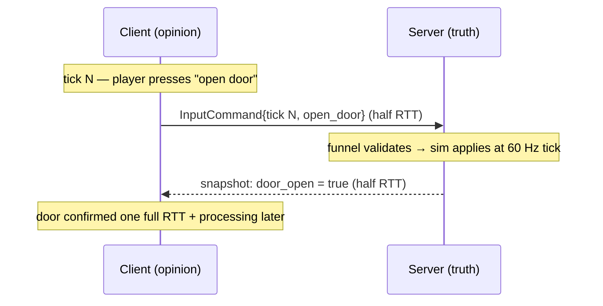

# Server Authority

## What it is

Under server authority, exactly one simulation — the server's — owns the game state. Clients never send facts ("my character is at x=40"); they send tick-stamped [InputCommands](../architecture/input-as-data.md) ("I pressed forward during tick 4812") through the one [command funnel](../architecture/command-funnel.md), and the server validates, simulates, and replicates the results back. Whatever a client holds locally — positions, health, door-open flags — is only ever an **opinion**: good enough to draw the next frame, overwritten the moment the server disagrees.

This engine will be server-authoritative from its first networked milestone: every game, single-player included, will run as a client plus a server over loopback ([ADR-0003](../../engine/architecture/adr-0003-single-player-is-a-listen-server.md)), all outside mutation will enter through the funnel ([ADR-0004](../../engine/architecture/adr-0004-one-command-funnel.md)), carried by GNS behind a ~6-function transport ([ADR-0014](../../engine/architecture/adr-0014-gns-transport.md)).

## Why you care

Three things fall out of one rule:

- **Cheating is capped at the input level.** A hacked client can lie about which buttons it pressed, but a legal input is the strongest lie it can tell. Teleport, duplication, and god-mode hacks all need a channel that carries state claims — and no such channel will exist. (What remains, bots that press buttons superhumanly well, is not solvable by architecture.)
- **No divergence.** With one sim there is nothing to drift out of sync. A lagging client sees old truth, never alternate truth.
- **One place to reason about rules.** Validation, game logic, persistence: all server-side, all testable headlessly, no per-client special cases.

For modding, this decides who scripts what: Luau mods will script authoritative server logic and presentation, never the predicted movement path ([ADR-0005](../../engine/architecture/adr-0005-predicted-movement-is-cpp.md)). Mod authors get real power over the sim without ever touching the hardest problem in netcode.

## Quick start

The whole idea fits in one struct: the server accepts inputs, applies its own rules, and no client claim can push state further than the rules allow.

```cpp
#include <cassert>
#include <cstdint>

// The only thing a client may send: an input claim, never a state claim.
struct InputCommand { std::uint64_t tick{}; std::int8_t move{}; };  // move: -1, 0, +1

struct AuthoritativeCharacter {
    float x = 0.0f;
    void apply(const InputCommand& in) {
        std::int8_t m = in.move;
        if (m < -1) m = -1;  // validate at the trust boundary
        if (m > 1)  m = 1;
        x += static_cast<float>(m) * 4.0f * (1.0f / 60.0f);  // the server's speed, not the client's
    }
};

int main() {
    AuthoritativeCharacter server;
    server.apply({100, 1});
    server.apply({101, 127});  // "speed hack": the wildest claim still buys one legal step
    assert(server.x > 0.13f && server.x < 0.14f);  // exactly two ticks of legal movement
}
```

There is no setter for `x`. That absence — not any clever check — is what server authority means.

## How it works



The client will stamp each input with its [tick](../architecture/fixed-timestep.md) ([ADR-0002](../../engine/architecture/adr-0002-fixed-60hz-tick.md)) and send it. The server will apply validated commands at the top of the matching tick, then broadcast snapshots at a 20–30 Hz send rate — deliberately decoupled from the 60 Hz tick, because not every tick needs to go on the wire.

Read the diagram's cost carefully: nothing a player does is confirmed faster than one full round trip plus server processing. At 60 ms RTT that is four to five ticks between keypress and authoritative result — raw authority feels like playing over remote desktop. Hiding that delay is deliberately out of scope here; it is the job of the next pages: your own character via [client prediction](./client-prediction.md), everyone else via [entity interpolation](./entity-interpolation.md), and whether the server should ever trust client timing claims via [latency trade-offs](./latency-tradeoffs.md).

!!! info
    Latency costs freshness, never correctness: a laggy client sees stale truth, not wrong truth. That asymmetry is why every fix in the following pages is a client-side illusion — the server never bends.

## Pros / Cons

**Pros**: cheats limited to what legal inputs can express; one sim means zero divergence by construction; one trust boundary to validate, fuzz, and test; mods sandboxed by construction; a headless dedicated server comes almost free.

**Cons**: every action pays a full RTT before confirmation; the server pays CPU plus bandwidth for everything, so hosting costs scale with players; the server is a single point of failure; input-level cheating (aimbots, macros) is untouched.

## What to expect

Nothing here exists yet — the engine is pre-M1. Per the [master plan](../../design/master-plan.md): M3 will build the client/server split (headless dedicated target, input → serialized commands, server-authoritative full-state replication, single-player as loopback); M5 will add snapshot interpolation plus prediction and reconciliation for the local character only, loss simulator first; R3 will add replication relevancy (per-client region-plus-radius filtering). If prediction stalls, the pre-authorized K3 fallback is interpolation-only with ~100 ms input delay — authority survives every fallback, because it is the layer the fallbacks fall back to.

!!! warning
    Authority is easy to state and easy to leak. Any debug command, mod hook, or "temporary" client-side shortcut that mutates state without a round trip through the funnel is a divergence-and-cheat channel. The rule has no exceptions — that is what makes it a rule.

## Go deeper

- [Client-server model](./client-server-model.md) — the topology this page assumes.
- [Snapshots](./snapshots.md) — how the server's truth travels back to clients.
- [Client prediction](./client-prediction.md) and [reconciliation](./reconciliation.md) — hiding the RTT for your own character.
- [Entity interpolation](./entity-interpolation.md) — displaying other players despite the delay.
- [The command funnel](../architecture/command-funnel.md) and [input as data](../architecture/input-as-data.md) — the gate every InputCommand passes through.
- ADRs [0003](../../engine/architecture/adr-0003-single-player-is-a-listen-server.md), [0004](../../engine/architecture/adr-0004-one-command-funnel.md), [0005](../../engine/architecture/adr-0005-predicted-movement-is-cpp.md), [0014](../../engine/architecture/adr-0014-gns-transport.md) — the engine's authority decisions.

**Sources**

- Gabriel Gambetta — Fast-Paced Multiplayer (Part I): Client-Server Game Architecture — <https://www.gabrielgambetta.com/client-server-game-architecture.html> — accessed 2026-07-06
- Valve Developer Community — Source Multiplayer Networking — <https://developer.valvesoftware.com/wiki/Source_Multiplayer_Networking> — accessed 2026-07-06
- Yahn Bernier (Valve) — Latency Compensating Methods in Client/Server In-game Protocol Design and Optimization — <https://developer.valvesoftware.com/wiki/Latency_Compensating_Methods_in_Client/Server_In-game_Protocol_Design_and_Optimization> — accessed 2026-07-06

No video for this page — the track's two videos live on the [reconciliation](./reconciliation.md) and [latency trade-offs](./latency-tradeoffs.md) pages.
