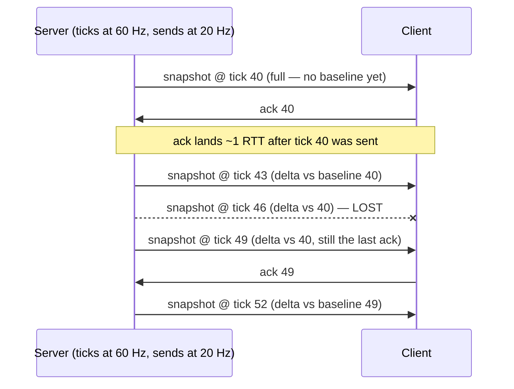

# Snapshots

## What it is

A **snapshot** is the server's serialized picture of the replicated world at one tick: every networked entity's position, orientation, health — whatever clients need to present the game — stamped with the tick it was captured on. Clients never simulate the colony themselves; under server authority ([server-authority](server-authority.md)), the snapshot stream **is** the world as far as they're concerned.

Two rates are in play, deliberately decoupled. The engine's simulation will run at a fixed 60 Hz tick ([ADR-0002](../../engine/architecture/adr-0002-fixed-60hz-tick.md)), but snapshots will go out at a **snapshot send rate** of 20–30 Hz. Source engine games work the same way: the server ticks at 66 Hz while the default client update rate is 20 snapshots per second.

## Why you care

Sending at full tick rate wastes bandwidth for almost no benefit. Glenn Fiedler's 900-cube demo needed 17.37 megabits per second at naive 60 Hz — and clients smooth between snapshots anyway ([entity-interpolation](entity-interpolation.md)), so packets past ~30 Hz buy little. Decoupling the two rates is the first bandwidth lever you pull, before quantization ([bandwidth-basics](bandwidth-basics.md)) or filtering which entities are sent at all ([replication-basics](replication-basics.md)).

The engine plan ([master plan](../../design/master-plan.md)): M3 will ship **full-state** snapshots — the entire replicated world, every send — over the [ADR-0013](../../engine/architecture/adr-0013-json-authored-bitstream-wire.md) bitstream. Delta compression is the planned next step — design intent, not yet pinned to a milestone ([designs-architecture](../../design/designs-architecture.md)). Full-state first is deliberate: it is the simple path that always works, and deltas are an optimization layered on top of it.

## Quick start

Delta compression in one toy: diff the current snapshot against a **baseline** — the last snapshot this client acknowledged — and put only the changes on the wire.

```cpp
#include <cassert>
#include <cstdint>
#include <vector>

struct EntityState {
    std::uint32_t id;
    float x, y, z;
    bool operator==(const EntityState&) const = default;
};

using Snapshot = std::vector<EntityState>;  // index = entity slot

struct Change { std::uint32_t slot; EntityState state; };

std::vector<Change> encode(const Snapshot& baseline, const Snapshot& current) {
    std::vector<Change> delta;
    for (std::uint32_t i = 0; i < current.size(); ++i)
        if (current[i] != baseline[i]) delta.push_back({i, current[i]});
    return delta;
}

Snapshot decode(Snapshot baseline, const std::vector<Change>& delta) {
    for (const Change& c : delta) baseline[c.slot] = c.state;
    return baseline;
}

int main() {
    Snapshot baseline{{1, 0.f, 0.f, 0.f}, {2, 4.f, 0.f, 9.f}, {3, 7.f, 0.f, 2.f}};
    Snapshot current = baseline;
    current[1].x = 4.1f;  // one colonist walked east; the other two slept

    auto delta = encode(baseline, current);
    assert(delta.size() == 1);                   // 1 of 3 entities on the wire
    assert(decode(baseline, delta) == current);  // client rebuilds it exactly
}
```

The real wire format will be the [ADR-0013](../../engine/architecture/adr-0013-json-authored-bitstream-wire.md) bitstream — bit-packed fields, not whole structs — but the shape is exactly this: baseline in, changes out ([serialization-basics](../architecture/serialization-basics.md)).

## How it works

Full snapshots need no bookkeeping: serialize everything, send, client overwrites. Deltas do. The server keeps, **per client**, the newest snapshot that client has acked — its baseline. Each send says "snapshot N, encoded relative to baseline M": entities identical to the baseline cost about one bit ("unchanged"); only the rest carry data. The client applies the delta onto its stored copy of M, then acks N, and the server advances that client's baseline. In steady state the baseline trails roughly one round trip behind.



Follow the lost packet: the server never found out, never cared. Snapshot 49 is still encoded against baseline 40 — the last state the client provably has — so it simply carries three sends' worth of change instead of one. **Packet loss degrades to a bigger delta, never a desync.** That property only holds if the server encodes strictly against acked baselines; encode against a snapshot the client never received and the client decodes garbage silently.

A client that just joined has acked nothing, so its first snapshot is a full **keyframe** — same encoding M3 will already ship. Some engines also resend keyframes after long loss streaks, when the delta would outgrow a full snapshot anyway.

!!! warning
    Never send snapshots over a reliable channel ([transport-reliability](transport-reliability.md)). A retransmitted snapshot arrives stale — the world has moved on. Stamp each one with its tick, drop any that arrive out of order, and let the baseline machinery absorb the loss.

## Pros / Cons

| Choice | Pro | Con |
|---|---|---|
| Full-state every send (M3) | trivially robust; loss costs nothing | bandwidth grows with world size |
| Delta vs acked baseline (planned) | order-of-magnitude smaller packets | per-client baseline storage; needs acks |
| Delta vs assumed-latest (no acks) | no ack traffic | one lost packet desyncs the client |

## What to expect

Costs are concrete: the server stores one baseline snapshot per client (a few copies of the replicated state), plus an ack sequence number each. The classic bug is encoding against an unacked baseline — it manifests as entities teleporting or ghosting only on lossy connections, exactly the class of failure the M5 lag/loss simulator (which lands **first** in that milestone, [master plan](../../design/master-plan.md)) exists to surface.

!!! info
    Full-state snapshots cap how many entities the engine can afford to replicate; the master plan holds NPC counts to what full snapshots sustain until R3 adds per-client relevancy filtering.

How the client turns this 20 Hz stream into 144 Hz smoothness is the next page — [entity-interpolation](entity-interpolation.md).

## Go deeper

- [server-authority](server-authority.md) — why the server's snapshot outranks anything the client computed
- [entity-interpolation](entity-interpolation.md) — buffering ~100 ms of snapshots to render smoothly between them
- [replication-basics](replication-basics.md) — choosing which entities/components enter a snapshot
- [bandwidth-basics](bandwidth-basics.md) — quantization; the bytes-per-second arithmetic
- [transport-reliability](transport-reliability.md) — acks without retransmission
- [serialization-basics](../architecture/serialization-basics.md) — structs to bytes, portably
- [fixed-timestep](../architecture/fixed-timestep.md) — the 60 Hz side of the decoupling
- [ADR-0013](../../engine/architecture/adr-0013-json-authored-bitstream-wire.md) — the bitstream snapshots will ride on
- [ADR-0002](../../engine/architecture/adr-0002-fixed-60hz-tick.md) — the fixed tick itself
- [master plan](../../design/master-plan.md) — M3 full-state, M5 lag/loss sim, R3 relevancy

**Sources**

- Snapshot Interpolation — Gaffer On Games, https://gafferongames.com/post/snapshot_interpolation/ — accessed 2026-07-06
- Snapshot Compression — Gaffer On Games, https://gafferongames.com/post/snapshot_compression/ — accessed 2026-07-06
- Source Multiplayer Networking — Valve Developer Community, https://developer.valvesoftware.com/wiki/Source_Multiplayer_Networking — accessed 2026-07-06
