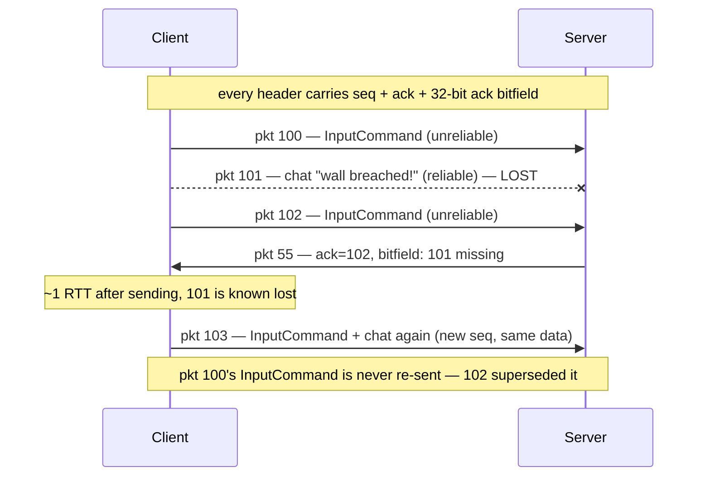

# Reliability on Top of UDP

## What it is

UDP hands you bare datagrams that can arrive late, duplicated, reordered, or never ([udp-vs-tcp](udp-vs-tcp.md) covers why games accept that trade). A reliability layer is thin bookkeeping on top: number every outgoing packet, tell the peer which numbers arrived, and re-send **data** — never packets — that mattered and got lost. The payoff is two channels over one socket: a **reliable** channel for must-arrive messages and an **unreliable** channel for state that the very next message supersedes.

## Why you care

Every message you send needs a channel decision. The rule is short: if a newer message makes the old one worthless, send it unreliable — snapshots (20–30 Hz send rate, decoupled from the 60 Hz tick) and tick-stamped **InputCommands** both qualify, because resending a stale one wastes a round trip delivering history. If losing the message changes the story — a chat line, a join or leave event — send it reliable.

The engine will not hand-roll any of this. GameNetworkingSockets will supply reliable **and** unreliable message types, fragmentation of messages larger than the MTU, and AES-GCM-256 encryption, hidden behind a ~6-function transport interface — Connect/Listen, Send (reliable | unreliable), Poll, Stats — with Loopback, GNS, and Steam Sockets implementations ([ADR-0014](../../engine/architecture/adr-0014-gns-transport.md)); first real use is M3 ([master plan](../../design/master-plan.md)). Hand-rolled reliability sits on the K5 never-hand-roll list. You still learn the mechanism here so GNS is a tool, not a black box.

## Quick start

The whole scheme rests on one question the receiver keeps answering: **did packet N arrive?** Each incoming packet carries the newest remote sequence it has seen (`ack`) plus a 32-bit bitfield where bit `i` means `ack - (i + 1)` also arrived.

```cpp
#include <cassert>
#include <cstdint>

bool was_acked(std::uint16_t seq, std::uint16_t ack, std::uint32_t ack_bits) {
    if (seq == ack) return true;
    std::uint16_t distance = static_cast<std::uint16_t>(ack - seq); // wrap-safe
    return distance <= 32 && ((ack_bits >> (distance - 1)) & 1u) != 0;
}

int main() {
    // Peer's newest received packet is 103; 101 was lost in transit.
    std::uint32_t bits = 0b101u;        // bit0: 102 arrived, bit1: 101 no, bit2: 100 yes
    assert(was_acked(103, 103, bits));
    assert(was_acked(102, 103, bits));
    assert(!was_acked(101, 103, bits)); // lost -> re-queue its DATA if it was reliable
    assert(was_acked(100, 103, bits));
    assert(!was_acked(60, 103, bits));  // fell off the 32-bit window: treat as lost
}
```

At the API level the whole decision collapses into one flag per send call:

```cpp
// fragment — does not compile alone
m_interface->SendMessageToConnection(conn, chat.data(), chat.size(),
                                     k_nSteamNetworkingSend_Reliable, nullptr);
m_interface->SendMessageToConnection(conn, snap.data(), snap.size(),
                                     k_nSteamNetworkingSend_Unreliable, nullptr);
```

## How it works

Three header fields ride on every packet: **sequence** (my packet counter), **ack** (the newest of your packets I saw), and the **ack bitfield** (the 32 before it). Because both sides send steadily, acks come for free — no dedicated ack packets.



The crucial divergence from TCP: packet 101 itself is **never** retransmitted. The sender moves on to 102, 103, … and when the bitfield reveals 101 as lost (about one RTT later), the application decides per payload. Unreliable payloads: do nothing — the next snapshot or InputCommand already says something newer. Reliable payloads: re-queue the bytes into the next outgoing packet under a fresh sequence number.

GNS will implement a sharper version of the same idea — the ack-vector model from DCCP and QUIC — remembering which message segments went into which packet, so only the lost segments get re-sent.

## Pros / Cons

| Choice | Pro | Con |
|---|---|---|
| Two channels over UDP | time-sensitive data never queues behind a lost packet | you must classify every message correctly |
| Everything reliable (TCP-like stream) | simplest mental model | one lost packet stalls all newer data behind it |
| Everything unreliable | zero bookkeeping | chat lines, join events silently vanish at 5% loss |

## What to expect

Reliable delivery under loss costs at least one extra RTT — a lost chat line on a 100 ms link shows up ~200 ms late, which is fine for chat and disastrous for movement. The reliable channel still has head-of-line blocking **inside itself**; GNS offers prioritized lanes if that ever bites. The engine's loopback transport will simulate 100 ms + 5% loss so every net milestone gets tested under real conditions, not just localhost ([ADR-0014](../../engine/architecture/adr-0014-gns-transport.md)).

!!! warning
    When something misbehaves under loss, the reflexive fix is flipping more traffic to reliable. Resist it — a reliable snapshot arriving late describes a world that no longer exists, and it delays the fresh one behind it. Fix the data design, not the channel.

!!! info
    These acks pull double duty later: the last client-acked snapshot becomes the **baseline** for delta compression — that story lives in [snapshots](snapshots.md). How many bytes each channel may spend per tick is [bandwidth-basics](bandwidth-basics.md).

## Go deeper

- [udp-vs-tcp](udp-vs-tcp.md) — why datagrams instead of a stream in the first place
- [snapshots](snapshots.md) — acked packets as delta-compression baselines
- [bandwidth-basics](bandwidth-basics.md) — send budgets on top of these channels
- [client-server-model](client-server-model.md) — who is sending all these packets to whom
- [serialization-basics](../architecture/serialization-basics.md) — the bytes inside each message ([ADR-0013](../../engine/architecture/adr-0013-json-authored-bitstream-wire.md) bitstream wire)
- [input-as-data](../architecture/input-as-data.md) — the InputCommand these packets carry
- [ADR-0014](../../engine/architecture/adr-0014-gns-transport.md) — GNS behind the transport seam, Loopback/GNS/Steam Sockets

**Sources**

- Reliability and Congestion Avoidance over UDP — Gaffer On Games, https://gafferongames.com/post/reliability_ordering_and_congestion_avoidance_over_udp/ — accessed 2026-07-06
- GameNetworkingSockets README (reliable/unreliable messages, fragmentation, AES-GCM) — ValveSoftware, https://github.com/ValveSoftware/GameNetworkingSockets — accessed 2026-07-06
