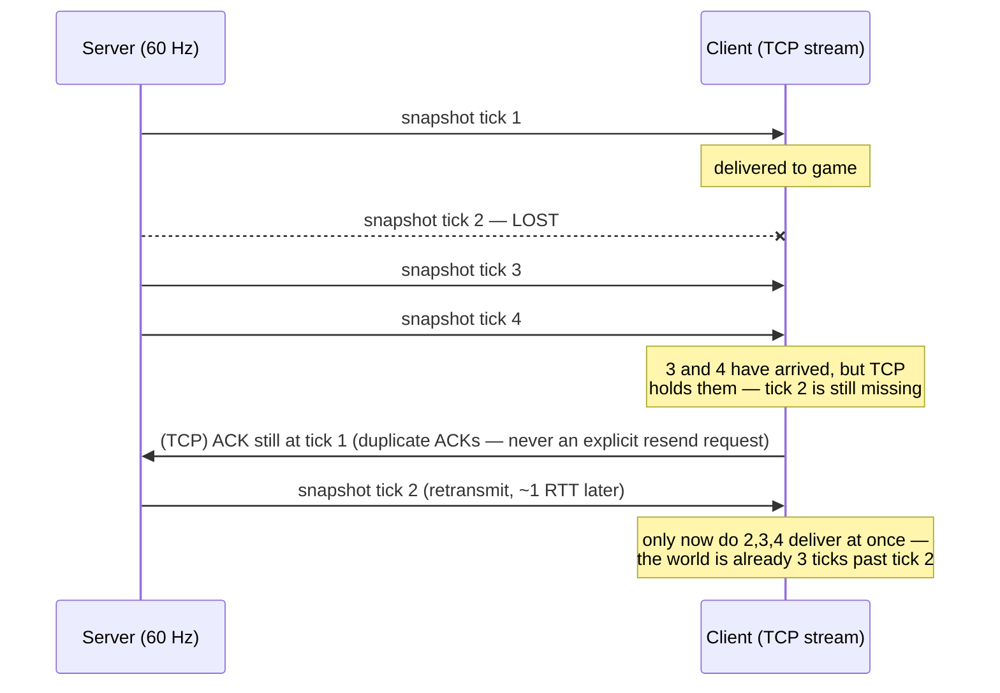

# UDP vs TCP

## What it is

Two transport protocols riding on IP. **TCP** gives you a reliable, ordered byte stream: everything you send arrives, exactly once, in the order you sent it — the protocol behind web pages and downloads. **UDP** gives you bare datagrams: fire-and-forget packets that may arrive late, out of order, duplicated, or never, with no acknowledgement and no queue.

The counterintuitive part for a 60 Hz game: TCP's guarantees are the **wrong** guarantees. A reliable, ordered stream is exactly what time-sensitive world state does not want.

## Why you care

Every snapshot the server sends describes the world at one tick. If tick 2's packet is lost, you do not want it back — tick 3 already superseded it. TCP cannot know that. It treats your snapshots as one ordered stream, so a single lost packet **stalls every packet behind it** until the missing one is retransmitted. That is head-of-line blocking, and Glenn Fiedler puts it bluntly: newer data "gets put in a queue, and you cannot access it until that lost packet has been retransmitted." When the resend finally lands, "you receive this stale, out of date information that you don't even care about."

That is the whole case. A retransmitted world state is already obsolete on arrival — you paid a round trip to learn history. UDP's "defects" (drops, reordering) are precisely the behaviour you want: independent datagrams you can discard the instant something fresher arrives.

The engine will never talk raw sockets. Its wire will be GameNetworkingSockets over UDP, behind a ~6-function transport ([ADR-0014](../../engine/architecture/adr-0014-gns-transport.md)), first used at M3 ([master plan](../../design/master-plan.md)). This page is why GNS chose UDP for you.

## Quick start

The UDP mindset in one consumer: keep the newest, drop anything older, never block on a gap.

```cpp
#include <cassert>
#include <cstdint>
#include <vector>

// A world-state update, tagged with the tick it describes.
struct Snapshot {
    std::uint64_t tick;
    float world_x;
};

// UDP-style consumer: datagrams are independent. Keep only the freshest;
// an older one that arrives late is worthless, so throw it away.
struct LatestState {
    std::uint64_t newest_tick = 0;
    float world_x = 0.0f;

    void receive(const Snapshot& s) {
        if (s.tick <= newest_tick) return;  // stale or reordered -> discard
        newest_tick = s.tick;
        world_x = s.world_x;
    }
};

int main() {
    LatestState state;
    // Datagrams arrive reordered, with tick 2 "lost" entirely.
    std::vector<Snapshot> wire = {{1, 10.0f}, {3, 30.0f}, {2, 20.0f}, {4, 40.0f}};
    for (const auto& s : wire) state.receive(s);

    // The late tick-2 datagram never stalls tick 3 or 4 behind it.
    assert(state.newest_tick == 4);
    assert(state.world_x == 40.0f);
}
```

Reordering and the lost tick cost nothing here. A stream would have frozen ticks 3 and 4 behind the gap.

## How it works

TCP's retransmission timeline is where the cost hides:



TCP is doing its job perfectly — it just has the wrong job. It cannot hand tick 3 to your game while tick 2 is missing, because "in order" is a promise it made at connect time. And you cannot switch that promise off: reliability and ordering are baked into the protocol, not knobs. Want some messages reliable and some not? TCP makes the whole stream reliable or nothing.

Fiedler also warns against mixing TCP and UDP on the same link: both ride on IP, and "TCP tends to induce packet loss in UDP packets." The conclusion — his and the industry's — is UDP only, then rebuild exactly the reliability you need and no more. GNS does that: unreliable messages for state, a reliable channel for must-arrive events, multiplexed over one UDP socket ([transport-reliability](transport-reliability.md) is how).

!!! warning
    "TCP is reliable, so it must be safer" is the trap. On a lossy link, reliable-and-ordered means slow-and-stale for game state. Reach for TCP-style delivery only for messages where losing one changes the story — never for the per-tick world.

!!! info
    UDP does not fix everything. Rebuilding acks and reliable channels on top is [transport-reliability](transport-reliability.md); why a datagram can't reach a friend behind a router is [nat-traversal](nat-traversal.md); how many bytes fit in one is [bandwidth-basics](bandwidth-basics.md).

## Pros / Cons

| For 60 Hz world state | TCP (stream) | UDP (datagrams) |
|---|---|---|
| Lost packet | stalls all newer data (head-of-line block) | ignored — next update supersedes it |
| Data on arrival | can be stale after a resend | always the freshest that made it |
| Reliability | all-or-nothing, not selectable | build only what you need on top |
| Must-arrive messages (chat, join) | handled for free | you add a reliable channel |

## What to expect

M3 will bring the first real wire: inputs and full-state snapshots over GNS, with single-player running the same path over a loopback transport ([master plan](../../design/master-plan.md), row M3). You will not choose UDP by hand — GNS will run over it, quarantined inside `engine/net/` ([ADR-0014](../../engine/architecture/adr-0014-gns-transport.md)). What you inherit is the mindset above: treat each snapshot as disposable, and never wait on a packet the next one already replaced.

## Go deeper

- [Transport reliability](transport-reliability.md) — rebuilding acks and reliable channels on top of UDP
- [Client-server model](client-server-model.md) — who is sending these datagrams to whom
- [Snapshots](snapshots.md) — the disposable state that rides UDP unreliable
- [Bandwidth basics](bandwidth-basics.md) — how much fits in one datagram
- [NAT traversal](nat-traversal.md) — why a UDP packet can't reach a home-router friend unaided
- [Serialization basics](../architecture/serialization-basics.md) — the bytes inside a datagram ([ADR-0013](../../engine/architecture/adr-0013-json-authored-bitstream-wire.md) bitstream wire)
- [ADR-0014](../../engine/architecture/adr-0014-gns-transport.md) — GNS over UDP, behind the transport seam

**Sources**

- Glenn Fiedler — UDP vs. TCP — https://gafferongames.com/post/udp_vs_tcp/ — accessed 2026-07-06
- ValveSoftware/GameNetworkingSockets — README (reliable & unreliable messages over UDP) — https://github.com/ValveSoftware/GameNetworkingSockets — accessed 2026-07-06
