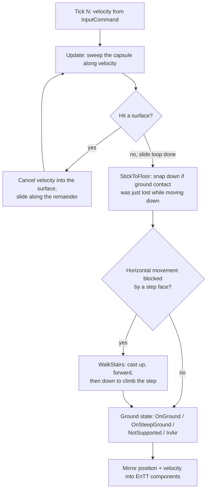

# Character Controllers

## What it is

A character controller turns "stick pushed forward" into a position that respects walls, floors, stairs, and slopes — **without** being a simulated rigid body. This engine's player controller is Jolt's `CharacterVirtual`: kinematic, re-simulable N times per frame, and it owns **no body at all** — it moves by collision queries alone ([ADR-0011](../../engine/architecture/adr-0011-jolt-charactervirtual.md)). The motion-type taxonomy underneath belongs to [Kinematic vs Dynamic](./kinematic-vs-dynamic.md); Jolt setup and layers to [Jolt Overview](./jolt-overview.md).

## Why you care

The obvious design — make the player a dynamic body and push it with forces — produces a character that trips on stair lips, slides down gentle slopes, gets shoved by every falling crate, and tips over. Worse for this engine: a dynamic body is stepped by the whole solver, so it cannot be re-simulated in isolation. Client prediction ([ADR-0005](../../engine/architecture/adr-0005-predicted-movement-is-cpp.md)) needs movement as a pure `(state, input) → state` function that reconciliation can re-run for ticks N..M when a server correction arrives. `CharacterVirtual` is exactly that function; a dynamic body never can be.

The other half of the job is **feel**: the avatar must stop instantly, forgive a jump pressed a few ticks early, and never eat an input. Those tricks are cheap and decades old — and here they are data-tuned C++, never Luau, because nothing scripted runs on the predicted path (ADR-0005).

## Quick start

Jolt types never leave `engine/physics/` — the quarantine rule (master-plan rule 6); the sim sees position and velocity only as EnTT components mirrored out after each tick.

```cpp
// fragment — does not compile alone
// engine/physics/character.cpp — Jolt stays inside this module.
#include <Jolt/Physics/Character/CharacterVirtual.h>
#include <Jolt/Physics/Collision/Shape/CapsuleShape.h>

JPH::Ref<JPH::CharacterVirtual> MakePlayer(JPH::PhysicsSystem& physics) {
    JPH::CharacterVirtualSettings settings;
    settings.mShape         = new JPH::CapsuleShape(0.9f, 0.35f); // half height, radius
    settings.mMaxSlopeAngle = JPH::DegreesToRadians(45.0f);       // steeper = wall
    return new JPH::CharacterVirtual(&settings, JPH::RVec3::sZero(),
                                     JPH::Quat::sIdentity(), &physics);
}

// Called once per tick — and again for every re-simulated tick when a
// server correction arrives. No body steps; this is collision queries only.
void StepPlayer(JPH::CharacterVirtual& ch, JPH::Vec3 velocity,
                JPH::PhysicsSystem& physics, JPH::TempAllocator& alloc) {
    ch.SetLinearVelocity(velocity);                    // gravity already folded in
    JPH::CharacterVirtual::ExtendedUpdateSettings update;
    ch.ExtendedUpdate(1.0f / 60.0f, -ch.GetUp() * physics.GetGravity().Length(),
                      update, physics.GetDefaultBroadPhaseLayerFilter(Layers::MOVING),
                      physics.GetDefaultLayerFilter(Layers::MOVING), {}, {}, alloc);
    // Then mirror ch.GetPosition()/GetLinearVelocity() into EnTT components.
}
```

`Ref<>` is Jolt's intrusive smart pointer — same job as `shared_ptr` in [Ownership](../cpp/ownership-smart-pointers.md). The capsule is the standard character shape (see [Collision Shapes](./collision-shapes.md)): no edges to snag on geometry seams.

!!! info
    `CharacterVirtual` is **not tracked by the PhysicsSystem** — you call its update yourself, each tick, and it affects dynamic bodies only by applying impulses during that call. That independence is the entire ADR-0011 bet: prediction re-runs it without touching the world.

## How it works

### Collide-and-slide

`ExtendedUpdate` bundles the classic pipeline:



The slide loop is why you glide along a wall instead of sticking to it: the velocity component **into** the surface is discarded, the rest is retried. `mMaxSlopeAngle` draws the floor/wall line — below it you stand (`OnGround`), above it you slide (`OnSteepGround`). Stairs need the explicit up-forward-down cast because a vertical step face is a wall to the slide loop.

### The feel toolbox

Celeste's movement is hand-rolled AABB code, not a physics engine, precisely because feel is **authored, not simulated** (Maddy Thorson). Three staples, all tiny counters over the ground state, all tuned in data:

```cpp
#include <cassert>
#include <cstdio>

// Feel numbers are data (hot-reloadable); the code reading them is C++
// on the predicted path, never Luau (ADR-0005).
struct MoveTuning {
    float gravity_up   = -50.0f; // m/s^2 while rising with jump held
    float gravity_down = -90.0f; // fall faster than you rise (Pittman, GDC 2016)
    float jump_speed   = 14.0f;  // m/s at takeoff
    int   coyote_ticks = 6;      // 100 ms grace after walking off a ledge
    int   buffer_ticks = 5;      // press jump early, it still counts
};

struct MoveState {
    float y = 0.0f, vy = 0.0f;
    bool  on_ground = true;
    int   since_grounded = 0, since_jump_pressed = 999;
};

struct Input { bool jump_pressed = false, jump_held = false; };

// Pure (state, input) -> state: reconciliation can re-run this freely.
MoveState Step(MoveState s, Input in, const MoveTuning& t) {
    constexpr float dt = 1.0f / 60.0f;                     // one tick
    s.since_grounded     = s.on_ground     ? 0 : s.since_grounded + 1;
    s.since_jump_pressed = in.jump_pressed ? 0 : s.since_jump_pressed + 1;

    if (s.since_grounded <= t.coyote_ticks &&              // coyote time
        s.since_jump_pressed <= t.buffer_ticks) {          // jump buffering
        s.vy = t.jump_speed;
        s.on_ground = false;
        s.since_grounded = s.since_jump_pressed = 999;     // consume the jump
    }
    // Variable jump height: full gravity only after the button is released.
    const float g = (s.vy > 0.0f && in.jump_held) ? t.gravity_up : t.gravity_down;
    if (!s.on_ground) s.vy += g * dt;
    s.y += s.vy * dt;
    if (s.y <= 0.0f) { s.y = 0.0f; s.vy = 0.0f; s.on_ground = true; }
    return s;
}

int main() {
    const MoveTuning t{};
    MoveState s{.y = 2.0f, .vy = 0.0f, .on_ground = false,
                .since_grounded = 0, .since_jump_pressed = 999};
    for (int i = 0; i < 4; ++i) s = Step(s, {}, t);        // 4 ticks off the ledge
    s = Step(s, {.jump_pressed = true, .jump_held = true}, t);
    assert(s.vy > 0.0f && "coyote time: late jump still fires");

    auto peak = [&t](int held_ticks) {
        MoveState p{};
        float best = 0.0f;
        for (int i = 0; i < 120; ++i) {
            p = Step(p, {.jump_pressed = i == 0, .jump_held = i < held_ticks}, t);
            if (p.y > best) best = p.y;
        }
        return best;
    };
    assert(peak(60) > peak(3) + 0.4f && "holding jump rises higher");
    std::printf("tap peak %.2f m, hold peak %.2f m\n", peak(3), peak(60));
}
```

!!! warning
    The counters (`since_grounded`, `since_jump_pressed`) are **sim state**. Store them in the same predicted component as position, or reconciliation rolls back your feet but not your coyote window — a desync that only appears under packet loss.

## Pros / Cons

| Pros | Cons |
| --- | --- |
| Owns no body; re-simulable N times per frame — prediction works | Not tracked by the PhysicsSystem: you own its update call, order, lifetime |
| No tipping, no slope creep, exact stops — authored feel | Pushing dynamic bodies is hand-tuned (impulses, `mMaxStrength`) |
| Stairs, slopes, ground sticking built into `ExtendedUpdate` | Costs several shape sweeps per tick, more than one rigid body step |
| Feel constants are plain data: retune without recompiling | Two movement codepaths: characters here, everything else in the solver |

## What to expect

Do not write this from scratch. Copy Jolt's character sample, get walking on the greybox map, then tune **one parameter at a time** — the ADR-0011 integration practice; if feel stalls, the pre-authorized fallback is to ship the sample configuration as-is. The master plan (M4) schedules real calendar time for this. Feel tuning never announces it is done; the monthly feel-check clip is what keeps it honest. Whether re-running `Step` is actually bit-exact — and where floats betray you — is [Determinism Limits](./determinism-limits.md)' problem; how the update slots into the accumulator loop is [Physics on a Fixed Tick](./physics-on-a-fixed-tick.md).

!!! tip
    Express every feel constant in ticks, never milliseconds. "6-tick coyote window" is exact and replayable because the tick is fixed at 60 Hz (ADR-0002); a wall-clock window is neither.

## Go deeper

- [Kinematic vs Dynamic](./kinematic-vs-dynamic.md) — the motion-type taxonomy this controller sits on
- [Jolt Overview](./jolt-overview.md) — PhysicsSystem, layers, `BodyInterface` setup
- [Collision Shapes](./collision-shapes.md) — why the capsule
- [Physics on a Fixed Tick](./physics-on-a-fixed-tick.md) — where `StepPlayer` runs in the loop
- [Determinism Limits](./determinism-limits.md) — when re-simulation is bit-exact
- [Value semantics](../cpp/value-semantics.md) — `(state, input) → state` purity as copies
- [Ownership](../cpp/ownership-smart-pointers.md) — Jolt's `Ref<>` vs `shared_ptr`
- [ADR-0011](../../engine/architecture/adr-0011-jolt-charactervirtual.md) / [ADR-0005](../../engine/architecture/adr-0005-predicted-movement-is-cpp.md) / [Master plan](../../design/master-plan.md)

**Sources**

- Jolt Physics — CharacterVirtual class reference — https://jrouwe.github.io/JoltPhysics/class_character_virtual.html — accessed 2026-07-06
- Jolt Physics Architecture — Character Controllers — https://jrouwe.github.io/JoltPhysics/#character-controllers — accessed 2026-07-06
- Maddy Thorson — Celeste & TowerFall Physics — https://maddymakesgames.com/articles/celeste_and_towerfall_physics/index.html — accessed 2026-07-06
- GDC 2016: Math for Game Programmers: Building a Better Jump (Kyle Pittman) — https://www.gdcvault.com/play/1023559/Math-for-Game-Programmers-Building — accessed 2026-07-06

**Video**: Why Does Celeste Feel So Good to Play? (Game Maker's Toolkit) — https://www.youtube.com/watch?v=yorTG9at90g — 18 min. Watch when you start tuning the feel constants, to see what each one buys.
