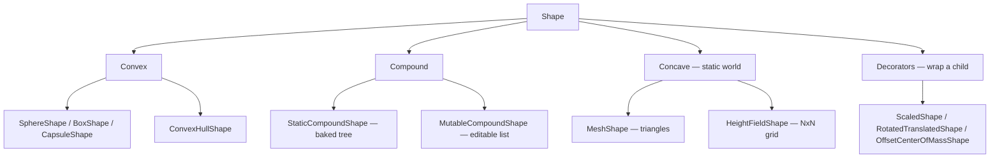

# Collision Shapes

## What it is

A **shape** is the geometry a **body** collides with — in Jolt they are separate objects, never interchangeable. The body owns position, velocity, and a motion type ("static", "kinematic", or "dynamic"); the shape is immutable, refcounted geometry that any number of bodies can share (`MutableCompoundShape` is the one deliberate exception). The menu, roughly cheap to expensive: `SphereShape`, `BoxShape`, `CapsuleShape` (convex primitives), `ConvexHullShape` (a convex wrap around a point cloud), compound shapes (a container of convex children), `MeshShape` (raw triangles), and `HeightFieldShape` (an N×N grid for terrain). Decorator wrappers — `ScaledShape`, `RotatedTranslatedShape`, `OffsetCenterOfMassShape` — modify a child shape without copying its data.

## Why you care

Every pair the [broad phase](./physics-in-game-engines.md) hands to the narrow phase costs time proportional to shape complexity, and a colony sim generates pairs constantly: colonists brushing walls, crates dropped in stockpiles — all resolved inside the 60 Hz tick budget. Shape choice is the biggest single lever on that cost and on behavior (jitter, tunneling, catching on edges). The rule every engine converges on: **convex primitives for anything that moves; mesh or heightfield only for static world geometry**.

| Thing in the world | Shape | Why |
| --- | --- | --- |
| Colonist / player | Capsule (via `CharacterVirtual`) | Slides along walls, no edge catching |
| Hauled item, prop | Box, sphere, or convex hull | Cheap dynamic contacts, real mass |
| Table, furniture | Compound of boxes, or convex hull | Concave movers built from convex parts |
| Built walls, floors | Static boxes on the grid | Exact fit, near-free |
| Terrain chunk | `HeightFieldShape` (static) | One shape covers the whole chunk |
| Cave, sculpted rock | `MeshShape` (static) | Only option for true concave detail |

## Quick start

```cpp
// fragment — does not compile alone
#include <Jolt/Jolt.h>
#include <Jolt/Physics/Collision/Shape/CapsuleShape.h>
#include <Jolt/Physics/Collision/Shape/ScaledShape.h>

// engine/physics/ only — Jolt types never leave this module (quarantine rule,
// master-plan rule 6). The sim sees positions/velocities as EnTT components.

// Total height 1.8 m: cylinder half-height 0.6 + cap radius 0.3 at each end.
JPH::RefConst<JPH::Shape> MakeColonistCapsule() {
    return new JPH::CapsuleShape(0.6f, 0.3f);
}

// One canonical crate hull, resized per item without duplicating geometry.
JPH::RefConst<JPH::Shape> MakeCrate(JPH::RefConst<JPH::Shape> hull, float s) {
    return new JPH::ScaledShape(hull, JPH::Vec3::sReplicate(s));
}
```

`RefConst<Shape>` is Jolt's intrusive refcount — same ownership idea as `shared_ptr` ([Ownership — smart pointers](../cpp/ownership-smart-pointers.md)).

!!! tip
    Build each distinct shape **once** and share it: every colonist body points at the same capsule. Shapes are refcounted and immutable — sharing is free.

## How it works

**Convex** means any straight line between two points inside the shape stays inside it. That property is what fast narrow phase algorithms (GJK, separating-axis — Ericson's book is the bible) rely on: one well-defined contact manifold and a real interior to compute mass from. **Concave** shapes have neither — a `MeshShape` is a bag of infinitely thin triangles with no inside, so collision is per-triangle and mass properties cannot be derived.

That is why **dynamic mesh bodies are a trap**.

!!! warning
    Jolt allows a dynamic `MeshShape`, but you must supply mass **manually** (`EOverrideMassProperties::MassAndInertiaProvided`), it may never touch another mesh or heightfield (Jolt asserts and **ignores the collision**), and thin triangles invite tunneling. A concave mover — a table — should be a compound of convex parts instead.

Compound shapes are the legal way to build concave movers: `StaticCompoundShape` bakes its children into a small tree for fast queries but cannot change afterwards; `MutableCompoundShape` keeps an editable flat list, trading query speed for mutability. Decorators wrap any of this without copying: `ScaledShape` resizes, `RotatedTranslatedShape` reposes, `OffsetCenterOfMassShape` shifts balance.



## Pros / Cons

Trade-offs of the primitives-for-movers policy:

| Pros | Cons |
| --- | --- |
| Narrow phase per pair is cheap and robust — hundreds of movers fit the tick | Collision geometry ≠ render geometry; every asset needs an approximation chosen |
| Stable stacking, automatic mass from real volume | Convex hulls cannot be hollow — a crate is solid to physics |
| Shapes shared by refcount: memory stays flat as the colony grows | Concave movers need compound assembly (more authoring) |
| Decorators reuse one canonical shape at many sizes/poses | `ScaledShape` adds a small per-query cost over baking the size in |

## What to expect

Collision geometry is deliberately crude, and nobody notices. The instinct from other engines — "just use the render mesh" — is the one to unlearn: a bookshelf is a box, a colonist is a capsule, and gameplay is indistinguishable. Terrain streams in as one static `HeightFieldShape` per chunk; player-built walls are static boxes snapped to the build grid — near-free for the broad phase.

!!! info
    Industry consensus, not a Jolt quirk: Godot's docs give the same orders — primitives for movers, concave trimesh only in static bodies, several convex shapes for mid-complexity objects.

What this page does **not** decide: which bodies move and who moves them ([Kinematic vs dynamic](./kinematic-vs-dynamic.md)), casting rays against these shapes ([Spatial queries](./spatial-queries.md)), and the colonist capsule's sizing/slope tuning ([Character controllers](./character-controllers.md) — the player is `CharacterVirtual`: kinematic, re-simulable N times per frame per [ADR-0011](../../engine/architecture/adr-0011-jolt-charactervirtual.md)).

## Go deeper

- [Physics in game engines](./physics-in-game-engines.md) — broad phase / narrow phase, where shape cost lands
- [Kinematic vs dynamic](./kinematic-vs-dynamic.md) — motion types for the bodies these shapes attach to
- [Jolt overview](./jolt-overview.md) — the library these classes live in
- [Ownership — smart pointers](../cpp/ownership-smart-pointers.md) — refcounting, and why `RefConst<Shape>` feels like `shared_ptr`
- [Master plan](../../design/master-plan.md) — rule 6: the quarantine rule this page's code obeys

**Sources**

- Jolt Physics Architecture — Shapes — https://jrouwe.github.io/JoltPhysics/#shapes — accessed 2026-07-06
- Godot Docs — Collision shapes (3D) — https://docs.godotengine.org/en/stable/tutorials/physics/collision_shapes_3d.html — accessed 2026-07-06
- Real-Time Collision Detection (Christer Ericson) — companion site — https://realtimecollisiondetection.net/ — accessed 2026-07-06
