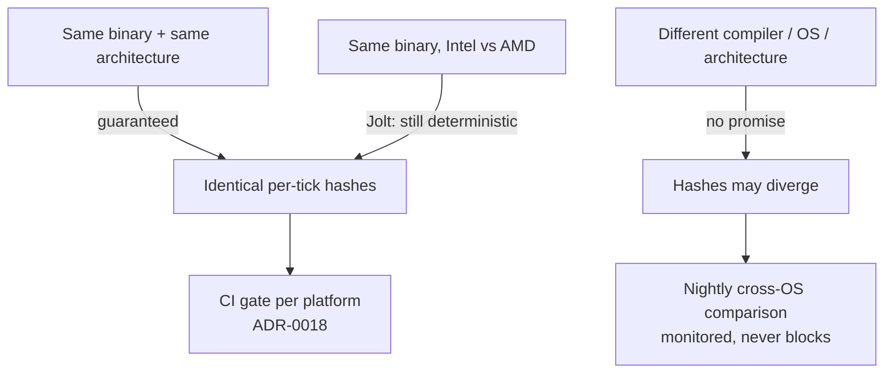

# Determinism Limits

## What it is

Deterministic means: same starting state plus the same input stream produces bit-identical results, every run. This engine's sim aims for exactly that on every 60 Hz tick — but the promise has a boundary, and the boundary is floating point. IEEE 754 fixes the results of `+ - * /` and `sqrt`, yet compilers choose intermediate precision and instruction selection (fused multiply-add), and every math library rounds `sin`/`cos` its own way — all of it standards-conformant.

So the honest promise is narrower: **same binary on the same CPU architecture gives identical results**. That is Jolt's documented stance, and this engine cashes in exactly that — no more.

## Why you care

Three engine decisions rest on this scoped promise:

- The **determinism/replay harness** (ADR-0018): replaying a recorded command stream must reproduce identical per-tick state hashes — the engine's cheapest regression net.
- **Prediction** (ADR-0005/ADR-0011): the client re-simulates only the local `CharacterVirtual`; the server stays authoritative, so no gameplay depends on two machines computing identical floats.
- **Desync debugging**: because per-binary determinism holds, a hash mismatch on one platform is a real bug, never float noise.

If you come from Java or C#, recalibrate: the JVM fought this war with `strictfp`; C++ compilers have far more float latitude by default.

## Quick start

Watch floats refuse to behave like real numbers — deterministically:

```cpp
// Deterministic on THIS binary: two runs print identical bytes.
// A different compiler, -ffast-math, or another architecture may not.
#include <cmath>
#include <cstdio>

int main() {
    float sum = 0.0f;
    for (int i = 0; i < 10; ++i) sum += 0.1f;  // 0.1 has no exact binary form
    std::printf("ten 0.1f = %.9g (== 1.0f? %d)\n", double{sum}, int{sum == 1.0f});

    float a = 1e8f, b = -1e8f, c = 1.0f;
    std::printf("(a+b)+c  = %.9g\n", double{(a + b) + c});  // 1: cancel, then add
    std::printf("a+(b+c)  = %.9g\n", double{a + (b + c)});  // 0: c drowns inside b
    std::printf("sin 0.5f = %.9g\n", double{std::sin(0.5f)});  // libm's call, not IEEE's
}
```

Run it twice: identical output. That is per-binary determinism. Rebuild with another compiler or architecture and the middle lines may legally swap answers, because the standard lets intermediates carry extra precision (historic x87 evaluates in 80 bits, so `a+(b+c)` becomes 1, not 0) — and fast-math additionally lets the compiler re-associate.

## How it works

Three layers can each change results while staying IEEE-conformant:

| Layer | What varies | Example |
|---|---|---|
| Compiler | Intermediate precision, reordering, FMA contraction | `(a+b)+c` vs `a+(b+c)` under fast-math |
| CPU | Which instructions exist (FMA; historically x87 vs SSE) | FMA keeps full precision mid-multiply |
| Math library | `sin`, `cos`, `pow` are **not** defined by IEEE 754 | libm implementations disagree in the last bit |

### Jolt's stance

Jolt documents the same boundary: the simulation is deterministic when the APIs that modify it are called in exactly the same order, and the same binary runs — on Windows it does not matter whether the CPU is Intel or AMD. Crossing compilers, OSes, or architectures requires building with `CROSS_PLATFORM_DETERMINISTIC`, roughly 8% slower — and even then query result ordering and multi-threaded callback ordering stay non-deterministic.

!!! info
    This engine does **not** build Jolt with `CROSS_PLATFORM_DETERMINISTIC`. Nothing in the architecture needs cross-machine bit-equality, so the 8% tax buys nothing — the master plan's never-list rules out rollback/lockstep netcode and cross-OS determinism as a gate.

### What this engine cashes in



Per ADR-0018, same-inputs-twice ⇒ identical per-tick hashes **gates CI per platform**, while cross-OS hash comparison is a **monitored non-gating nightly**. Per ADR-0011/0005, only the local `CharacterVirtual` — kinematic, re-simulable N times per frame — is predicted; everything else replicates from the authoritative server, which corrects any divergence (reconciliation is the netcode track's story; see ADR-0005 meanwhile).

The hash covers EnTT components mirrored out of Jolt each tick — never Jolt internals. Jolt types never leave `engine/physics/` (quarantine rule — master-plan rule 6).

```cpp
// fragment — does not compile alone
// Inside engine/physics/ only (quarantine rule): mirror body positions into
// plain EnTT components; the harness hashes the components, not Jolt state.
void mirror_positions(JPH::BodyInterface& bodies, entt::registry& world) {
    for (auto [entity, handle, tf] : world.view<BodyHandle, Transform>().each()) {
        const JPH::RVec3 p = bodies.GetPosition(handle.id);
        tf.position = {p.GetX(), p.GetY(), p.GetZ()};  // hash reads tf, not p
    }
}
```

## Pros / Cons

Settling for per-binary determinism:

- **Pro**: the replay harness and golden replays work with zero float heroics.
- **Pro**: no 8% Jolt tax, no restricted instruction sets.
- **Pro**: Luau mods never need bit-identical execution across machines — ADR-0005 keeps mods off the predicted path entirely.
- **Con**: lockstep/rollback netcode is permanently off the table; snapshot replication is the contract.
- **Con**: a replay recorded on Windows may not verify on macOS; the nightly watches that drift instead of blocking on it.

## What to expect

!!! warning
    Never compile `engine/sim` or `engine/physics` with `-ffast-math` (MSVC `/fp:fast`). A fast-math binary still runs deterministically — the damage is elsewhere: any recompile or inlining change legally shifts results everywhere, so replay hashes and golden replays rot; `-ffinite-math-only` deletes NaN/`isnan` handling outright; and GCC's `-ffast-math` links `crtfastmath.o`, flipping FTZ/DAZ **process-wide** — changing float behavior even in code built without the flag.

- Debug and release are different binaries: record and verify replays per build configuration.
- A per-platform hash mismatch is a genuine nondeterminism bug. Usual suspects, in order: unordered container iteration, uninitialized memory, cross-thread ordering — floats come last.

!!! tip
    When a hash flips, bisect by system, not by tick: hash each system's output separately for one tick and diff. [Debugging With Sanitizers](../cpp/debugging-with-sanitizers.md) catches the uninitialized-memory class outright.

## Go deeper

- [Physics on a Fixed Tick](./physics-on-a-fixed-tick.md) — the fixed-dt precondition everything here assumes.
- [Character Controllers](./character-controllers.md) — why `CharacterVirtual` is the only predicted mover.
- [Jolt Overview](./jolt-overview.md) — the library whose stance this page adopts.
- [Value Semantics](../cpp/value-semantics.md) — the `(state, input) → state` purity prediction relies on.
- [ADR-0018: Testing in three lanes](../../engine/architecture/adr-0018-testing-three-lanes.md) — the hash-gate decision; harness mechanics belong to the tooling track.
- [ADR-0011: Jolt; CharacterVirtual](../../engine/architecture/adr-0011-jolt-charactervirtual.md) and [ADR-0005: Predicted movement is C++](../../engine/architecture/adr-0005-predicted-movement-is-cpp.md) — the prediction contract.
- [Master plan](../../design/master-plan.md) — quarantine rule 6; cross-OS-determinism-as-a-gate on the never-list.

**Sources**

- Gaffer On Games — Floating Point Determinism — https://gafferongames.com/post/floating_point_determinism/ — accessed 2026-07-06
- Jolt Physics Architecture — Deterministic Simulation — https://jrouwe.github.io/JoltPhysics/#deterministic-simulation — accessed 2026-07-06
- Bruce Dawson (Random ASCII) — Floating-Point Determinism — https://randomascii.wordpress.com/2013/07/16/floating-point-determinism/ — accessed 2026-07-06
