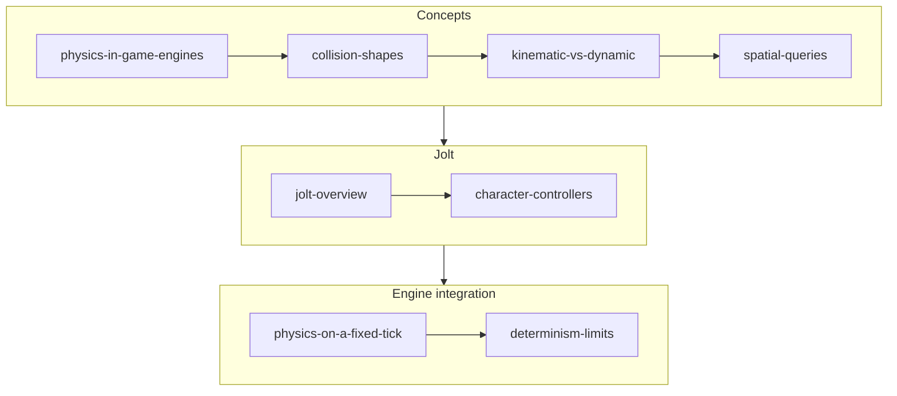

# Physics

## What it is

This track is rigid-body physics as this engine actually uses it: the integrate → collide → solve pipeline that runs once per 60 Hz tick, the collision-shape menu, the static/kinematic/dynamic split, spatial queries, and then Jolt specifically — how it is quarantined in `engine/physics/`, mirrored into EnTT components, and stepped inside the fixed-tick accumulator loop. It ends where every networked physics discussion must: what determinism really promises, and what ADR-0018 does about it.

## Why you care

You are an experienced programmer new to game dev, and physics is where three of this engine's core bets meet: the fixed 60 Hz tick (ADR-0002), server authority, and client-side prediction of a kinematic character (ADR-0011). Get the concepts wrong and you get tunneling crates, characters that stutter on stairs, or a "deterministic" sim that desyncs across machines. Every page grounds its topic in the colony sim: hauled props, colonist controllers, mouse picking from the tactical camera.

!!! tip
    If you only skim, read **Kinematic vs Dynamic Bodies** and **Physics on a Fixed Tick** in full — they explain the two decisions the rest of the engine leans on hardest.

## How it works

Read in order. The first four pages are engine-agnostic concepts, the next two are Jolt itself, and the last two wire physics into this engine's tick and networking model.

| Page | What you'll learn |
|---|---|
| [Physics in Game Engines](physics-in-game-engines.md) | The per-tick pipeline — integrate, broad phase, narrow phase, solve — and where it sits in this engine's 60 Hz tick. |
| [Collision Shapes](collision-shapes.md) | Sphere to heightfield: cost/behavior trade-offs, convex vs concave, and why dynamic mesh bodies are a trap. |
| [Kinematic vs Dynamic Bodies](kinematic-vs-dynamic.md) | The three motion types, and why the player character is kinematic so movement stays a pure (state, input) → state function. |
| [Spatial Queries](spatial-queries.md) | Raycasts, shape casts, overlaps — mouse picking, NPC line of sight, and server-side reach validation without stepping the world. |
| [Jolt Physics Overview](jolt-overview.md) | `PhysicsSystem`, `BodyInterface`, layers, Ref-counted shapes — and how Jolt stays quarantined behind `engine/physics/`. |
| [Character Controllers](character-controllers.md) | Collide-and-slide with `CharacterVirtual`, re-simulation for prediction, plus the Celeste feel toolbox: coyote time, jump buffering. |
| [Physics on a Fixed Tick](physics-on-a-fixed-tick.md) | Jolt inside the accumulator loop: constant dt, the ~250 ms clamp, and render interpolation between sim states. |
| [Determinism Limits](determinism-limits.md) | Why same-inputs-twice only holds per binary/architecture, and how per-tick state hashes gate CI (ADR-0018). |

## What to expect

About an evening per page. By the end you can add a physics-backed component, choose its shape and motion type, query the world safely from sim code, and explain why the character controller is not a dynamic body. You will not derive a constraint solver — Jolt owns that, deliberately.

## Go deeper

Start with [Physics in Game Engines](physics-in-game-engines.md). The tick-loop half of this track builds on [Fixed timestep](../architecture/fixed-timestep.md) and [Render interpolation](../rendering/render-interpolation.md); Jolt's `Ref` shapes will make more sense after [Ownership with smart pointers](../cpp/ownership-smart-pointers.md). Engine-specific claims trace to [the master plan](../../design/master-plan.md) and [hardening principles](../../design/hardening-principles.md).

Sources:

- Jolt Physics — documentation and architecture notes — https://jrouwe.github.io/JoltPhysics/ — accessed 2026-07-06
- Gaffer On Games — "Fix Your Timestep!" — https://gafferongames.com/post/fix_your_timestep/ — accessed 2026-07-06
- Video: "Architecting Jolt Physics for 'Horizon Forbidden West'" (GDC 2022, Jorrit Rouwé) — ~50 min — watch after **Jolt Physics Overview** for the why behind the library's design.
