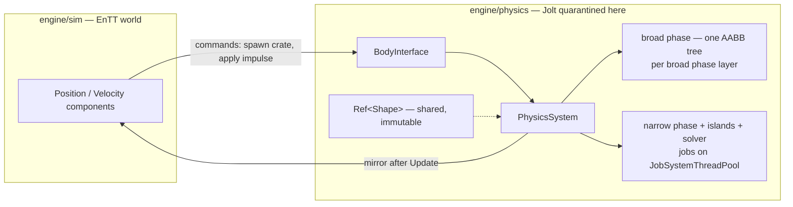

# Jolt Physics Overview

## What it is

Jolt is the engine's rigid-body physics library: "a multi core friendly rigid body physics and collision detection library", MIT-licensed, and shipped in **Horizon Forbidden West** and **Death Stranding 2**. The previous pages covered the concepts — [Collision shapes](./collision-shapes.md), [Kinematic vs dynamic](./kinematic-vs-dynamic.md), [Spatial queries](./spatial-queries.md). This page is the library's object model: **PhysicsSystem** as the world, **BodyInterface** as the one mutation funnel, two-level collision layers, Ref-counted shapes, and a job-system-driven update.

## Why you care

[ADR-0011](../../engine/architecture/adr-0011-jolt-charactervirtual.md) locked Jolt in over PhysX (integration heft, licensing gravity) and Bullet (maintenance has moved on): it is Horizon-proven, MIT like the engine itself, and ships first-class character samples — the player controller is `CharacterVirtual`, kinematic and re-simulable N times per frame. The **quarantine rule** applies everywhere on this page: Jolt types never leave `engine/physics/` ([master plan](../../design/master-plan.md) rule 6, [hardening principle 6](../../design/hardening-principles.md)); the sim sees positions and velocities only as EnTT components mirrored out after each tick.

## Quick start

Jolt lands in `vcpkg.json` at M4 as the `joltphysics` vcpkg port (see [CMake minimum](../cpp/cmake-minimum.md)). It demands a one-time global setup before anything else:

```cpp
// fragment — does not compile alone
#include <Jolt/Jolt.h>
#include <Jolt/RegisterTypes.h>

// Startup, inside engine/physics/ only — quarantine rule.
JPH::RegisterDefaultAllocator();
JPH::Factory::sInstance = new JPH::Factory();
JPH::RegisterTypes();                         // registers all shape types

JPH::TempAllocatorImpl scratch(10 * 1024 * 1024);   // per-update scratch memory
JPH::JobSystemThreadPool jobs(JPH::cMaxPhysicsJobs, JPH::cMaxPhysicsBarriers,
                              std::thread::hardware_concurrency() - 1);

JPH::PhysicsSystem physics;
physics.Init(kMaxBodies, 0, kMaxBodyPairs, kMaxContactConstraints,
             broadPhaseLayerMap, objectVsBroadPhaseFilter, objectPairFilter);
```

Every body after that goes through **BodyInterface** — create, add, move, remove:

```cpp
// fragment — does not compile alone
JPH::BodyInterface& bodies = physics.GetBodyInterface();

JPH::BodyCreationSettings crate(
    new JPH::BoxShape(JPH::Vec3(0.5f, 0.5f, 0.5f)),      // shape: the geometry
    JPH::RVec3(0.0, 10.0, 0.0), JPH::Quat::sIdentity(),
    JPH::EMotionType::Dynamic, Layers::MOVING);           // body: the simulated thing
JPH::BodyID crateId = bodies.CreateAndAddBody(crate, JPH::EActivation::Activate);

// Once per tick — cadence and stepping rules live in ./physics-on-a-fixed-tick.md:
physics.Update(1.0f / 60.0f, 1, &scratch, &jobs);
```

!!! tip
    ADR-0011's pre-authorized fallback is also the integration practice: copy Jolt's **HelloWorld** and character samples, then tune one parameter at a time. The samples are the ground truth.

## How it works

Everything above the module boundary speaks EnTT; everything below speaks Jolt:



**Handles, not pointers.** Bodies live inside PhysicsSystem; you keep a `BodyID` — an index plus a sequence number so a recycled slot is never mistaken for the old body — and hand it to BodyInterface for every read or write. BodyInterface locks the body for you, which is what makes background loading and parallel queries safe.

**Two-level layers.** Each **broad phase layer** is its own AABB tree; the standard split is one for static bodies (terrain, walls — rarely rebuilt) and one for everything moving (colonists, crates). **Object layers** are the fine-grained tags on each body; a `BroadPhaseLayerInterface` maps object layer to broad phase layer, and an `ObjectLayerPairFilter` decides which pairs collide — how colonist ragdolls ignore debris but not walls.

**Shapes are shared values.** A shape is immutable and intrusively reference-counted: hold it as `JPH::Ref<JPH::Shape>` and a thousand identical crates share one `BoxShape` — Jolt's own take on [Ownership: smart pointers](../cpp/ownership-smart-pointers.md).

**The update is a job graph.** `Update()` fans broad phase, narrow phase, island building, and constraint solving out across the thread pool; the GDC talk's lock-free broad phase and island building are why Guerrilla "were able to double our simulation frequency while using less CPU time".

!!! warning
    A `Body*` is only valid while the scoped `BodyLockRead`/`BodyLockWrite` guard that produced it is alive. Store `BodyID` in components, never `Body*` — a stale pointer after a body dies is a crash [debugging with sanitizers](../cpp/debugging-with-sanitizers.md) exists for.

## Pros / Cons

| Pros | Cons |
|---|---|
| Proven at AAA scale (Horizon, Death Stranding 2); actively maintained | Smaller tutorial ecosystem than PhysX or Bullet |
| MIT — matches the engine's own license (ADR-0020) | Mandatory global init: allocator, Factory, `RegisterTypes()` before first use |
| Multi-core by design: lock-free broad phase, lock-free island building | Layer/filter interfaces are up-front boilerplate you must get right |
| First-class character samples back the `CharacterVirtual` decision | Deterministic only under strict conditions — see below |

## What to expect

- The player controller — `CharacterVirtual`, its tuning, and why it is not a dynamic body: [Character controllers](./character-controllers.md).
- Exactly how and when `Update()` runs each tick, and the component mirror step: [Physics on a fixed tick](./physics-on-a-fixed-tick.md).
- Wrap the init/shutdown pair (`RegisterTypes()`/`UnregisterTypes()`, Factory teardown) in one RAII object at the module edge: [RAII](../cpp/raii.md).

!!! info
    Jolt advertises that "the simulation runs deterministically" — true per binary, per platform, under conditions. What that buys the server-authoritative netcode, and where it stops, is [Determinism limits](./determinism-limits.md)' whole job.

## Go deeper

- [Physics in game engines](./physics-in-game-engines.md) — the pipeline this library implements.
- [Collision shapes](./collision-shapes.md) — the geometry behind `Ref<Shape>`.
- [Spatial queries](./spatial-queries.md) — raycasts against those broad phase trees.
- [ADR-0011](../../engine/architecture/adr-0011-jolt-charactervirtual.md) — the decision record, rejections, and fallback.

**Sources**

- Jolt Physics Architecture Overview (official docs) — https://jrouwe.github.io/JoltPhysics/#shapes — accessed 2026-07-06
- Jolt Physics — GitHub repository README — https://github.com/jrouwe/JoltPhysics — accessed 2026-07-06
- Architecting Jolt Physics for 'Horizon Forbidden West' — GDC 2022 slides plus speaker notes (Jorrit Rouwé) — http://jrouwe.nl/architectingjolt/ — accessed 2026-07-06
