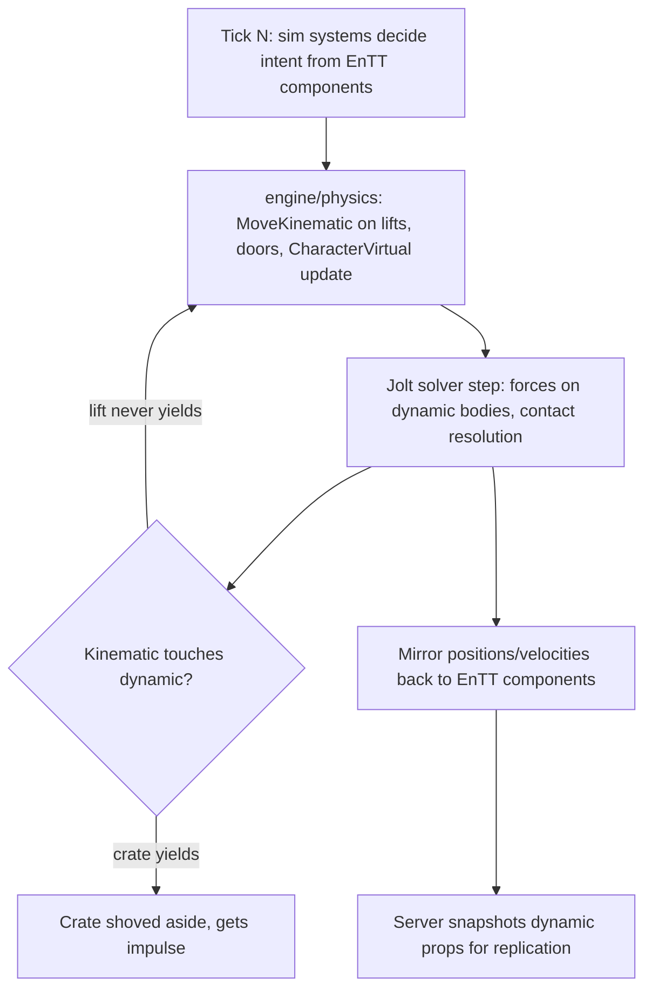

# Kinematic vs Dynamic Bodies

## What it is

Every Jolt body carries a motion type — `EMotionType` — that answers one question: **who owns this body's transform?** There are exactly three answers:

- **static** — nobody. It never moves. Terrain, walls, the colony's stone floors. Jolt doesn't even allocate motion state for it.
- **dynamic** — the **solver**. Per Jolt's docs, dynamic bodies are "moved by forces": gravity, impulses, contacts. You may push one (apply a force); you never write its position directly.
- **kinematic** — **your code**. Kinematic bodies are "moved by velocities only": you set a velocity each tick and they go exactly there, ignoring gravity and every contact. They push dynamic bodies out of the way but are **never pushed back**.

The motion type belongs to the **body**, not its **shape** — the same crate geometry ([Collision Shapes](./collision-shapes.md)) can back any of the three.

## Why you care

This split is the load-bearing wall of the engine's netcode stance:

- **Dynamic props** — crates, thrown rocks, collapsing scaffolds — are simulated **on the server only** and replicated to clients ([ADR-0011](../../engine/architecture/adr-0011-jolt-charactervirtual.md)). A dynamic body's motion emerges from the whole solver step, every contact included, so it cannot be recomputed in isolation.
- **The player character is kinematic** — Jolt's `CharacterVirtual`, "a kinematic controller that is re-simulable N times per frame" ([ADR-0011](../../engine/architecture/adr-0011-jolt-charactervirtual.md)). Kinematic in the **ownership** sense only: it is not a Jolt body and has no `EMotionType` ([Character Controllers](./character-controllers.md)). Because the solver never feeds back into it, its movement stays a pure `(state, input) → state` function ([Value semantics](../cpp/value-semantics.md)) that client prediction can re-run during reconciliation ([ADR-0005](../../engine/architecture/adr-0005-predicted-movement-is-cpp.md)).

!!! warning
    The classic footgun is making the player dynamic because it "feels physical for free". The moment the solver owns your character, movement depends on every other body in the step, re-simulation becomes impossible, and prediction is dead. You pay for kinematic freedom by writing gravity and sliding yourself — that's [Character Controllers](./character-controllers.md).

## Quick start

Creating one of each in `engine/physics/` — and only there: Jolt types never leave that module (quarantine rule, [master-plan](../../design/master-plan.md) rule 6); the sim sees positions and velocities as EnTT components mirrored out.

```cpp
// fragment — does not compile alone
#include <Jolt/Jolt.h>
#include <Jolt/Physics/Body/BodyCreationSettings.h>

JPH::BodyInterface& bodies = physics_system.GetBodyInterface();

// Crate: the solver owns its transform. Server-simulated, replicated.
JPH::BodyCreationSettings crate(crate_shape, spawn_pos, JPH::Quat::sIdentity(),
                                JPH::EMotionType::Dynamic, Layers::MOVING);
JPH::BodyID crate_id = bodies.CreateAndAddBody(crate, JPH::EActivation::Activate);

// Mine lift: our code owns its transform. Pushes crates, never yields.
JPH::BodyCreationSettings lift(lift_shape, lift_pos, JPH::Quat::sIdentity(),
                               JPH::EMotionType::Kinematic, Layers::MOVING);
JPH::BodyID lift_id = bodies.CreateAndAddBody(lift, JPH::EActivation::Activate);

// Each tick: set the velocity that reaches the target in one tick (1/60 s).
bodies.MoveKinematic(lift_id, target_pos, JPH::Quat::sIdentity(), 1.0f / 60.0f);
```

!!! tip
    Move kinematic bodies with `MoveKinematic`, not `SetPosition`. It computes the velocity that arrives at the target within the given time, so dynamic bodies in the way receive a real push. `SetPosition` teleports — crates clip through or launch violently.

## How it works

Both motion types integrate velocity into position each tick; they differ only in **where the velocity comes from**. Dynamic: the solver integrates force → velocity → position (Gaffer's rigid-body pipeline). Kinematic: your code writes the velocity, integration just obeys.

```cpp
#include <cassert>
#include <cstdio>

struct Body { double y = 0.0, vy = 0.0; };

// Dynamic: the solver derives velocity from forces, then integrates.
Body StepDynamic(Body b, double dt) {
    b.vy += -9.81 * dt;             // gravity, applied by the solver
    b.y  += b.vy * dt;
    return b;
}

// Kinematic: your code writes the velocity. This is what MoveKinematic does.
Body StepKinematic(Body b, double target_y, double dt) {
    b.vy = (target_y - b.y) / dt;   // whatever reaches the target this tick
    b.y += b.vy * dt;
    return b;
}

int main() {
    Body crate, lift;
    for (int tick = 0; tick < 60; ++tick) {           // one simulated second
        crate = StepDynamic(crate, 1.0 / 60.0);
        lift  = StepKinematic(lift, 2.0, 1.0 / 60.0); // lift ordered to y = 2
    }
    assert(crate.y < 0.0);    // fell — nobody asked, the solver decided
    assert(lift.y > 1.999);   // arrived — it goes exactly where told
    std::printf("crate y=%.2f  lift y=%.2f\n", crate.y, lift.y);
}
```

Inside one 60 Hz tick, ownership flows one way:



"Never pushed back" cuts both ways: a kinematic lift driven into a crate resting on static floor will crush it or force it through the geometry, because the solver has no permission to move the lift. Broad phase still tracks kinematic bodies and narrow phase still reports their contacts — you get the information; acting on it is your job.

## Pros / Cons

| | Kinematic | Dynamic |
| --- | --- | --- |
| Transform owner | Your code | The solver |
| Re-simulable in isolation | **Yes** — basis of prediction | No — coupled to the whole step |
| Gravity, friction, bounces | You write them | Free |
| Pushed by other bodies | Never | Yes |
| In this engine | `CharacterVirtual` (by ownership — not a Jolt body), lifts, doors | Server-side props, replicated |

## What to expect

You'll type `EMotionType` once per body and then forget it — the decision, not the API, is the work. Expect the "never pushed back" rule to surprise you first: platforms shoving crates into walls, a door sweeping a colonist's dropped tools into the floor. Expect also to miss free physics on the character until the controller pages earn it back.

!!! info
    Every engine has this trichotomy under different names — Godot calls them StaticBody, CharacterBody, and RigidBody; Unity has a kinematic flag on Rigidbody. The ownership question transfers unchanged; only the vocabulary moves.

## Go deeper

- [Physics in Game Engines](./physics-in-game-engines.md) — where the solver step sits in the tick
- [Collision Shapes](./collision-shapes.md) — the geometry a body carries
- [Character Controllers](./character-controllers.md) — collide-and-slide built on kinematic movement
- [Determinism Limits](./determinism-limits.md) — what same-inputs-twice re-simulation actually guarantees
- [Physics on a Fixed Tick](./physics-on-a-fixed-tick.md) — how Jolt meets the 60 Hz tick
- [Value semantics](../cpp/value-semantics.md) — why `(state, input) → state` purity matters
- [ADR-0011](../../engine/architecture/adr-0011-jolt-charactervirtual.md) — the CharacterVirtual decision; [ADR-0005](../../engine/architecture/adr-0005-predicted-movement-is-cpp.md) — prediction and prop replication

**Sources**

- Jolt Physics Architecture — Bodies — https://jrouwe.github.io/JoltPhysics/#bodies — accessed 2026-07-06
- Godot Docs — Physics introduction — https://docs.godotengine.org/en/stable/tutorials/physics/physics_introduction.html — accessed 2026-07-06
- Gaffer On Games — Physics in 3D — https://gafferongames.com/post/physics_in_3d/ — accessed 2026-07-06
