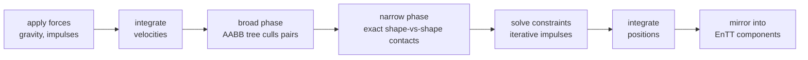

# Physics in Game Engines

## What it is

A rigid-body physics engine is a loop that runs once per **tick**: for every **body** (a rigid body with mass, velocity, and a collision **shape**), integrate velocities forward, find which bodies touch (broad phase, then narrow phase), solve the resulting contacts so nothing interpenetrates, integrate positions, repeat. That is the whole job. Ours is Jolt ([ADR-0011](../../engine/architecture/adr-0011-jolt-charactervirtual.md)), executed as one deterministic step inside the fixed 60 Hz tick ([ADR-0002](../../engine/architecture/adr-0002-fixed-60hz-tick.md)) — never per render frame.

## Why you care

Crates toppling off a cart, colonists standing on floors instead of falling through them, a raider shoved by an explosion — all of it is this one loop. Because the engine is server-authoritative, the step runs inside the server's tick and the rest of the sim never touches Jolt: positions and velocities are **mirrored out into EnTT components** after each step, and Jolt types never leave `engine/physics/` (the **quarantine rule**, [master plan](../../design/master-plan.md) rule 6 / hardening principle 6).

Even so, the pipeline vocabulary — broad phase, narrow phase, solver, island — will show up in every Tracy capture and every "why did the crate explode" bug. This page defines those words; the rest of the track reuses them.

## Quick start

The core of any physics engine is embarrassingly small — semi-implicit Euler integration, which is what most commercial engines use (Gaffer On Games):

```cpp
#include <cstdio>

struct Body {
    float y;   // position (m)
    float vy;  // velocity (m/s)
};

int main() {
    constexpr float dt = 1.0f / 60.0f;  // one tick (ADR-0002)
    constexpr float g  = -9.81f;
    Body ball{10.0f, 0.0f};
    for (int tick = 0; tick < 60; ++tick) {  // one simulated second
        ball.vy += g * dt;        // integrate velocity first...
        ball.y  += ball.vy * dt;  // ...then position with the NEW velocity
    }
    std::printf("after 60 ticks: y = %.2f (analytic: %.3f)\n",
                double(ball.y), 10.0 + 0.5 * -9.81);
}
```

!!! tip
    The ordering is the trick. Velocity-then-position ("semi-implicit" Euler) is stable and approximately energy-conserving (symplectic); flip the two lines ("explicit" Euler) and springy systems gain energy every tick until they explode.

Everything else a physics engine does exists because bodies must not pass through each other.

## How it works

One tick of the pipeline, in the order Jolt runs it:



**Broad phase** answers "which pairs could possibly touch?" cheaply: every body gets an axis-aligned bounding box, and a tree (a quad tree in Jolt) rejects the vast majority of the N² pairs. **Narrow phase** takes the survivors and computes exact contact points between their shapes (GJK/EPA in Jolt — the shapes themselves are [Collision shapes](./collision-shapes.md)'s topic). The **solver** then turns contacts and joints into corrective impulses, iterating a few times per tick because solving everything simultaneously is too expensive — and groups touching dynamic bodies into **islands** so resting piles can be put to sleep.

Only **dynamic** bodies get integrated; **static** and **kinematic** ones don't participate the same way — that split is [Kinematic vs dynamic](./kinematic-vs-dynamic.md). Notably, the player is not a dynamic body at all: it is `CharacterVirtual`, kinematic and re-simulable N times per frame for prediction ([ADR-0011](../../engine/architecture/adr-0011-jolt-charactervirtual.md)).

After the step, `engine/physics/` copies results out — restated: Jolt types never leave `engine/physics/`:

```cpp
// fragment — does not compile alone
// engine/physics/ mirror-out. The sim sees only plain components.
void MirrorBodies(JPH::BodyInterface& bodies, entt::registry& reg) {
    for (auto [entity, phys, tf] : reg.view<PhysicsBody, Transform>().each()) {
        JPH::RVec3 p = bodies.GetPosition(phys.id);
        tf.position  = {p.GetX(), p.GetY(), p.GetZ()};  // GLM, not Jolt
    }
}
```

## Pros / Cons

| Using a physics engine buys | It costs |
|---|---|
| Contacts, friction, restitution, stable stacking — decades of solver research for free | A black box: you feed shapes and impulses, then trust the solver |
| A multithreaded broad phase/narrow phase/solve pipeline (Jolt's job system) | Iterative solving is approximate (tall stacks jitter); discrete ticks let fast bodies tunnel (mitigated by CCD) |
| One vocabulary shared with every profiler and bug report | Floating-point results vary across compilers/platforms — see [Determinism limits](./determinism-limits.md) |

## What to expect

!!! info
    Integration is the easy 10%. Real engines are 90% collision detection plus constraint solving — which is why the Catto talk below is about constraints, not Euler.

The pipeline is deterministic in the sense the engine needs: same binary, same tick sequence, same inputs, same results — which is what the replay/state-hash harness ([ADR-0018](../../engine/architecture/adr-0018-testing-three-lanes.md)) checks, and what the netcode track builds on. How the step meets the accumulator and render interpolation is [Physics on a fixed tick](./physics-on-a-fixed-tick.md); the float caveats live in [Determinism limits](./determinism-limits.md) and [Footguns from other languages](../cpp/footguns-from-other-languages.md).

!!! warning
    Never "move" a dynamic body by writing its position — you teleport it into other bodies and the solver responds with a huge corrective impulse (the exploding-crate bug). Apply velocities or impulses to dynamic bodies; direct movement is what kinematic bodies are for.

## Go deeper

- [Collision shapes](./collision-shapes.md) — what the narrow phase actually tests
- [Kinematic vs dynamic](./kinematic-vs-dynamic.md) — who gets integrated, who gets moved
- [Spatial queries](./spatial-queries.md) — reusing the broad phase for raycasts
- [Jolt overview](./jolt-overview.md) — the library itself and the `engine/physics/` layout
- [Physics on a fixed tick](./physics-on-a-fixed-tick.md) — accumulator, clamping, render interpolation
- [Value semantics](../cpp/value-semantics.md) — the (state, input) → state purity prediction relies on
- [ADR-0002](../../engine/architecture/adr-0002-fixed-60hz-tick.md), [ADR-0011](../../engine/architecture/adr-0011-jolt-charactervirtual.md), [master plan](../../design/master-plan.md)

**Sources**

- Jolt Physics Architecture Overview (broad phase) — <https://jrouwe.github.io/JoltPhysics/#broad-phase> — accessed 2026-07-06
- Integration Basics — Gaffer On Games — <https://gafferongames.com/post/integration_basics/> — accessed 2026-07-06
- Physics in 3D — Gaffer On Games — <https://gafferongames.com/post/physics_in_3d/> — accessed 2026-07-06
- Video: Physics for Game Programmers: Understanding Constraints — Erin Catto, GDC 2014, 57 min — <https://archive.org/details/GDC2014Catto> — watch after finishing this track's concept pages, when "solve constraints" in the diagram above feels like a magic box
