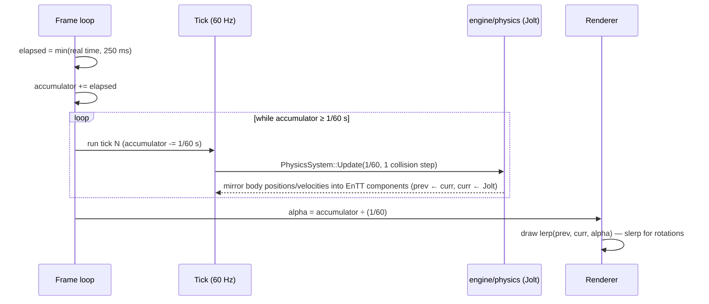

# Physics on a Fixed Tick

## What it is

The wiring between Jolt and the engine's game loop. [ADR-0002](../../engine/architecture/adr-0002-fixed-60hz-tick.md) fixes the simulation at a 60 Hz **tick**, driven by an accumulator; this page covers the physics side of that contract: `PhysicsSystem::Update` runs exactly once per tick with a constant dt of 1/60 s, elapsed time is clamped at ~250 ms so a hitch cannot spiral, and the renderer interpolates between the last two mirrored sim states. What happens **inside** one step belongs to [Physics in game engines](./physics-in-game-engines.md).

## Why you care

Jolt is an iterative solver: it refines contact and constraint guesses a fixed number of times per step. That process is stable and tunable when dt never changes, and springy, jittery, frame-rate-dependent when it does — Jolt's own docs recommend a fixed 60 Hz step for stability. Feed it the render frame's dt and a stack of crates behaves differently on a 144 Hz monitor than on the Steam Deck, and the replay harness (same inputs twice ⇒ identical per-tick hashes, [ADR-0018](../../engine/architecture/adr-0018-testing-three-lanes.md)) fails on machine one. Constant dt is also what makes [Determinism limits](./determinism-limits.md) a discussion instead of a lost cause.

## Quick start

One call per tick, dt hard-coded, results mirrored out. **Quarantine rule**: Jolt types never leave `engine/physics/` — the sim sees positions and velocities only as EnTT components (master-plan rule 6).

```cpp
// fragment — does not compile alone
// Called once per 60 Hz tick by the sim loop — never per render frame.
void PhysicsWorld::Step() {
    constexpr float kDt = 1.0f / 60.0f;
    constexpr int kCollisionSteps = 1;  // 1 per 1/60 s of dt; ours is always exactly that
    physics_system_.Update(kDt, kCollisionSteps, &temp_allocator_, &job_system_);

    // Mirror out: Jolt types stop here; the sim and renderer see components.
    for (auto [entity, body, xf] : registry_.view<PhysicsBodyId, Transform>().each()) {
        xf.prev = xf.curr;  // snapshot for render interpolation
        JPH::RVec3 pos = body_interface_.GetPosition(body.id);
        JPH::Quat rot = body_interface_.GetRotation(body.id);
        xf.curr = {ToGlm(pos), ToGlm(rot)};
    }
}
```

`inCollisionSteps` exists for engines whose dt varies: Jolt subdivides a large dt into more collision steps to stay stable. Ours never varies, so it stays at **1** — catching up after a hitch means more whole ticks, not a bigger step, because each tick must consume its own tick-stamped `InputCommand`s ([ADR-0004](../../engine/architecture/adr-0004-one-command-funnel.md) — their replication is the netcode track's story).

## How it works



**The clamp kills the spiral of death.** If simulating a tick costs more real time than 1/60 s, every frame adds more tick debt than it pays off — the loop never exits. Clamping elapsed time at 250 ms caps the debt at 15 ticks per frame; under sustained overload the world runs slower than real time. The arithmetic, standalone:

```cpp
#include <algorithm>
#include <cassert>
#include <cstdio>

int TicksThisFrame(double frameSeconds, double& accumulator) {
    constexpr double kDt = 1.0 / 60.0;
    accumulator += std::min(frameSeconds, 0.25);  // the ~250 ms clamp (ADR-0002)
    int ticks = 0;
    while (accumulator >= kDt) { accumulator -= kDt; ++ticks; }
    return ticks;
}

int main() {
    double acc = 0.0;
    int healthy = TicksThisFrame(1.0 / 60.0, acc);
    assert(healthy == 1);   // healthy frame: one tick
    int paused = TicksThisFrame(30.0, acc);
    assert(paused == 15);   // debugger pause: 15 ticks, not 1800
    std::printf("clamp holds; leftover %.6f s\n", acc);
}
```

**Interpolation makes 60 Hz look like the display rate.** After draining whole ticks the accumulator holds a fraction of a tick; `alpha` is that fraction. The renderer blends `prev` and `curr` **components** — it never touches a Jolt body, so the quarantine rule holds. Gaffer on Games interpolates between the last two states; deWiTTERS extrapolates ahead using velocity. ADR-0002 picks interpolation: one tick (~16.7 ms) of visual latency, zero mispredicted overshoot.

One resident is deliberately outside `PhysicsSystem::Update`: the player's `CharacterVirtual` is kinematic, re-simulable N times per frame ([ADR-0011](../../engine/architecture/adr-0011-jolt-charactervirtual.md)), stepped by its own update call inside the same tick — see [Character controllers](./character-controllers.md).

!!! warning
    Never pass the render frame's elapsed time into `PhysicsSystem::Update`. The dt argument is a constant, not a measurement — the accumulator already absorbed real time. Passing frame dt silently reintroduces every variable-timestep bug the tick exists to prevent.

!!! tip
    Snapshot `prev` in the mirror-out loop, as above. It costs one component copy per moving body per tick and the renderer gets interpolation for free — no second bookkeeping pass.

## Pros / Cons

| Pros | Cons |
| --- | --- |
| Jolt sees one dt forever: stable stacks, tuning that holds on every machine | Visuals lag the sim by up to one tick (~16.7 ms) |
| Clamp bounds worst-case catch-up at 15 ticks per frame | Under sustained overload, game time runs slower than wall time |
| Renderer reads only components — quarantine rule survives | Two transform snapshots (`prev`/`curr`) per moving body |
| Hitches cannot desync physics from the tick timeline | `alpha` blending is extra render-side code (lerp + slerp) |

## What to expect

On a 144 Hz display most frames run **zero** ticks and just re-render with a fresh `alpha`; a slow 30 Hz frame drains two ticks back to back. Both are correct — watch the tick counter, not the frame rate. When motion looks "swimmy", suspect the mirror-out or `alpha` math before Jolt: log `alpha` and confirm it sweeps 0→1 between ticks. The whole scheme assumes a tick simulates in well under 16.7 ms — the master plan's frame ledger tracks that from M4.

!!! info
    A 250 ms clamp means a 30 s debugger pause resumes as 15 catch-up ticks. Without it the loop would owe 1800 ticks — more debt per frame than it can pay: the spiral.

## Go deeper

- [Physics in game engines](./physics-in-game-engines.md) — what one `Update` call actually does (broad phase, narrow phase, solve)
- [Determinism limits](./determinism-limits.md) — what constant dt buys for replay and prediction, and what it does not
- [Jolt overview](./jolt-overview.md) — where `PhysicsSystem`, the temp allocator, and the job system come from
- [Character controllers](./character-controllers.md) — why `CharacterVirtual` steps outside `PhysicsSystem::Update`
- [Fixed Timestep at 60 Hz](../architecture/fixed-timestep.md) — the engine-wide accumulator loop this page plugs Jolt into
- [Value semantics](../cpp/value-semantics.md) — why `prev = curr` component snapshots are cheap copies

**Sources**

- Gaffer On Games — Fix Your Timestep! — https://gafferongames.com/post/fix_your_timestep/ — accessed 2026-07-06
- Jolt Physics Architecture — The Simulation Step — https://jrouwe.github.io/JoltPhysics/#the-simulation-step — accessed 2026-07-06
- deWiTTERS Game Loop (Koen Witters) — https://dewitters.com/dewitters-gameloop/ — accessed 2026-07-06
- ADR-0002: Fixed 60 Hz simulation tick — [../../engine/architecture/adr-0002-fixed-60hz-tick.md](../../engine/architecture/adr-0002-fixed-60hz-tick.md) — accessed 2026-07-06
