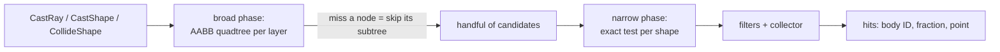

# Spatial Queries

## What it is

A spatial query asks the physics world a question without stepping it: a **raycast** ("what does this line hit first?"), a **shape cast** ("if I swept this volume along that line, what would it touch?"), or an **overlap test** ("what is inside this region right now?"). Queries are read-only — no forces, no integration, no tick consumed.

Jolt exposes them through two interfaces on `PhysicsSystem`: `BroadPhaseQuery` (coarse — tests only bounding boxes, returns body IDs) and `NarrowPhaseQuery` (exact — tests the real shapes). This page covers the read side only; the broad phase's role inside the simulation step belongs to [Physics in Game Engines](./physics-in-game-engines.md).

## Why you care

Three systems in this engine are pure query consumers:

- **Mouse picking.** The zoomable tactical camera unprojects the cursor into a world ray; a raycast finds the colonist or wall under it. Client-side, per rendered frame, never touches the tick.
- **NPC line-of-sight.** Staggered think ticks raycast from eye to target; hitting anything else first means "can't see". A shape cast is the thick version — "would my body fit through that doorway?"
- **Interaction reach.** The engine is server-authoritative ([master plan](../../design/master-plan.md)): when a client claims "colonist opens door", the server overlap-tests a reach sphere against the door before believing it.

## Quick start

Picking, at the wall between Jolt and the rest of the engine:

```cpp
// fragment — does not compile alone
// engine/physics/ — quarantine rule: Jolt types never leave this module
// (master-plan rule 6); we hand back EnTT + GLM only.
std::optional<PickHit> PhysicsWorld::pick(glm::vec3 origin, glm::vec3 dir, float range) {
    JPH::RRayCast ray{ToJolt(origin), ToJolt(dir) * range};
    JPH::RayCastResult hit;  // closest-hit overload
    if (!system_.GetNarrowPhaseQuery().CastRay(ray, hit)) return std::nullopt;
    return PickHit{
        .entity   = entityFor(hit.mBodyID),                     // EnTT handle out
        .position = FromJolt(ray.GetPointOnRay(hit.mFraction)), // GLM out
    };
}
```

`CastRay` has two overloads: the boolean one above (first hit only) and a collector-based one that visits every hit — that is the line-of-sight variant, where you stop early on the first blocker.

!!! tip
    When body IDs are enough — "which bodies are near this explosion?" — use `BroadPhaseQuery` instead. It never fetches a shape, so it skips the narrow phase entirely.

## How it works

| Query | Question | Jolt call |
|---|---|---|
| Raycast | first/all hits along a line | `NarrowPhaseQuery::CastRay` |
| Shape cast | sweep a shape along a line | `NarrowPhaseQuery::CastShape` |
| Overlap | what touches this shape/point | `CollideShape` / `CollidePoint` |

Testing every body would be O(n) per query. The broad phase makes it roughly O(log n): each **broad phase layer** (one for static bodies, one for dynamic — see [Kinematic vs Dynamic](./kinematic-vs-dynamic.md)) keeps its bodies' AABBs in a four-wide tree — the BVH/quadtree family from the Spatial Partition pattern. Every node stores the box enclosing its whole subtree, so one miss discards thousands of bodies.



The primitive the tree spams at every node is ray-vs-box, and it is cheap:

```cpp
// The "slab" test: clip the ray against the box's extents on each axis.
#include <algorithm>
#include <cassert>

struct AABB { float min[3], max[3]; };

bool rayHitsBox(const float o[3], const float d[3], const AABB& b) {
    float tmin = 0.0f, tmax = 1e30f;
    for (int i = 0; i < 3; ++i) {
        float t1 = (b.min[i] - o[i]) / d[i];   // d==0 gives ±inf — fine, unless the origin
                                               // sits exactly on a slab plane (0/0 = NaN);
                                               // real engines special-case that
        float t2 = (b.max[i] - o[i]) / d[i];
        tmin = std::max(tmin, std::min(t1, t2));
        tmax = std::min(tmax, std::max(t1, t2));
    }
    return tmin <= tmax;
}

int main() {
    AABB crate{{1, 0, 0}, {2, 1, 1}};
    float eye[3]{0, 0.5f, 0.5f}, right[3]{1, 0, 0}, up[3]{0, 1, 0};
    assert(rayHitsBox(eye, right, crate));  // aims at the crate
    assert(!rayHitsBox(eye, up, crate));    // misses above it
}
```

Survivors reach the narrow phase, which runs the exact math against each body's shape (what those shapes cost is [Collision Shapes](./collision-shapes.md)' business). Every query also takes optional **filters** — `BroadPhaseLayerFilter`, `ObjectLayerFilter`, `BodyFilter` — applied in that order, cheapest first, so wrong-layer bodies are rejected before any shape is even fetched. The server's reach check is one overlap plus a filter:

```cpp
// fragment — does not compile alone
// Server-side validation: does the colonist's reach sphere touch the door?
JPH::SphereShape reach{1.5f};
JPH::AllHitCollisionCollector<JPH::CollideShapeCollector> hits;
system_.GetNarrowPhaseQuery().CollideShape(
    &reach, JPH::Vec3::sOne(), JPH::RMat44::sTranslation(ToJolt(colonist_pos)),
    JPH::CollideShapeSettings{}, JPH::RVec3::sZero(), hits);
// accept the command only if some hit's mBodyID2 maps to the door entity
```

!!! warning
    An NPC's line-of-sight ray starts inside the NPC's own body, so the first hit is **itself** — and every colonist reports blind. Pass a `BodyFilter` (e.g. `IgnoreSingleBodyFilter`) to exclude the caster. Same footgun for reach tests.

## Pros / Cons

| Pros | Cons |
|---|---|
| Read-only: no step, no side effects, callable outside the tick | Answers describe the last completed tick, not "now" |
| O(log n) via broad phase pruning | Each narrow phase hit takes a body lock; thousands per tick add up |
| Filters reject early, before shapes load | Long shape casts through a dense colony visit many nodes |
| Same calls serve client picking, server validation | Results arrive as Jolt types — every call site sits behind the quarantine wall |

## What to expect

The sim sees positions and velocities as EnTT components mirrored out of Jolt after each tick, and queries answer from that same last-completed state. At 60 Hz the staleness is at most one tick (~16.7 ms) — irrelevant for picking, worth remembering when validating fast movers.

Expect to budget line-of-sight: 200 colonists querying every tick is waste; the staggered think-tick scheduler exists precisely so each NPC re-checks every few ticks. And expect **not** to write the character's ground probes yourself — `CharacterVirtual` (kinematic, re-simulable N times per frame, per [ADR-0011](../../engine/architecture/adr-0011-jolt-charactervirtual.md)) runs its own queries, covered in [Character Controllers](./character-controllers.md).

!!! info
    Queries hold body locks internally, so casual multithreading "works" — but Jolt forbids touching bodies while `PhysicsSystem::Update` runs: a racing query is a data race, not a stale read. In this engine, queries run outside the tick's physics step, full stop.

## Go deeper

- [Physics in Game Engines](./physics-in-game-engines.md) — the broad phase's job inside the step itself
- [Collision Shapes](./collision-shapes.md) — what the narrow phase actually tests, and each shape's price
- [Jolt Overview](./jolt-overview.md) — layers, filters, the whole library map
- [Character Controllers](./character-controllers.md) — the ground-probe queries this page skipped
- [Ownership: Smart Pointers](../cpp/ownership-smart-pointers.md) — the ownership vocabulary behind Jolt's ref-counted shapes
- [Master Plan](../../design/master-plan.md) — rule 6, the quarantine rule this page keeps restating

Sources:

- Jolt Physics Architecture — Collision Detection — https://jrouwe.github.io/JoltPhysics/#collision-detection — accessed 2026-07-06
- Jolt Physics — NarrowPhaseQuery class reference — https://jrouwe.github.io/JoltPhysics/class_narrow_phase_query.html — accessed 2026-07-06
- Game Programming Patterns — Spatial Partition — https://gameprogrammingpatterns.com/spatial-partition.html — accessed 2026-07-06
- Real-Time Collision Detection (Christer Ericson) — companion site — https://realtimecollisiondetection.net/ — accessed 2026-07-06
