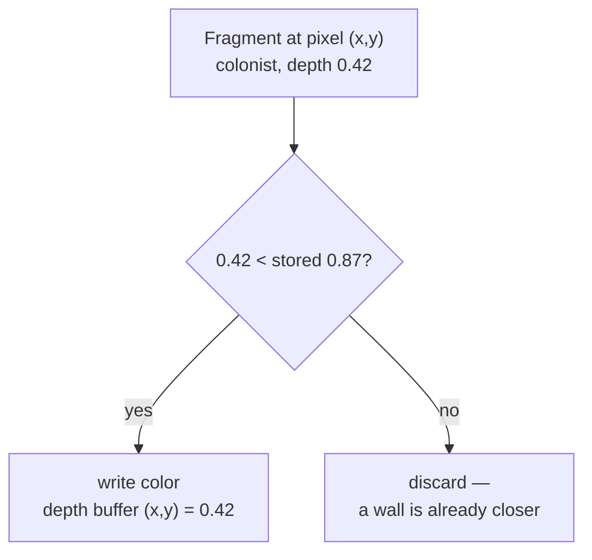

# The Depth Buffer

## What it is

The depth buffer is a screen-sized texture that stores, for every pixel, how close the nearest surface drawn so far is to the camera. In the output-merge stage of the [render pipeline](render-pipeline.md), every incoming fragment's depth is compared against the stored value — the **depth test**. Closer wins and overwrites; farther is discarded. That one per-pixel comparison is what lets you draw a 3D scene in any order and still get the right image.

## Why you care

A 2D colony sim sorts sprites back-to-front and paints over. In 3D that painter's algorithm collapses: a colonist in a doorway is in front of one wall cube and behind another **within the same mesh**, and two intersecting roof planes have no valid order at all. Sorting every triangle each frame would also burn CPU the simulation owns — and the renderer is strictly frame-side; the 60 Hz tick never touches it. The depth buffer moves the whole problem onto the GPU: submit colonists, walls, and terrain in whatever order the EnTT view yields them, correct image out.

It is also the first thing that silently breaks. Forget it and distant mountains draw over nearby colonists; misconfigure it and the map flickers.

## Quick start

Three pieces, all SDL_GPU: a depth texture, depth state baked into the pipeline, and the target attached to each render pass.

```cpp
// fragment — does not compile alone
// 1) A depth texture matching the swapchain — recreate on window resize.
//    Size via SDL_GetWindowSizeInPixels (Retina: pixels != window units).
SDL_GPUTextureCreateInfo depth_info{};
depth_info.type   = SDL_GPU_TEXTURETYPE_2D;
depth_info.format = SDL_GPU_TEXTUREFORMAT_D32_FLOAT; // check SDL_GPUTextureSupportsFormat first
depth_info.usage  = SDL_GPU_TEXTUREUSAGE_DEPTH_STENCIL_TARGET;
depth_info.width  = swapchain_w;
depth_info.height = swapchain_h;
depth_info.layer_count_or_depth = 1;
depth_info.num_levels = 1;
SDL_GPUTexture* depth = SDL_CreateGPUTexture(device, &depth_info);

// 2) Enable test + write in the graphics pipeline (immutable state).
SDL_GPUGraphicsPipelineCreateInfo pipe{};
pipe.depth_stencil_state.enable_depth_test  = true;
pipe.depth_stencil_state.enable_depth_write = true;
pipe.depth_stencil_state.compare_op = SDL_GPU_COMPAREOP_LESS;
pipe.target_info.has_depth_stencil_target = true;
pipe.target_info.depth_stencil_format = SDL_GPU_TEXTUREFORMAT_D32_FLOAT;
// ...shaders, vertex layout, color target as in sdl-gpu-api...

// 3) Every frame: attach it, cleared to "farthest possible".
SDL_GPUDepthStencilTargetInfo depth_target{};
depth_target.texture     = depth;
depth_target.clear_depth = 1.0f;                     // far plane
depth_target.load_op     = SDL_GPU_LOADOP_CLEAR;
depth_target.store_op    = SDL_GPU_STOREOP_DONT_CARE; // nothing reads it later
SDL_GPURenderPass* pass =
    SDL_BeginGPURenderPass(cmd, &color_target, 1, &depth_target);
```

The depth values themselves come out of the projection matrix, which is [Cameras](cameras.md)' job. This engine locks `GLM_FORCE_DEPTH_ZERO_TO_ONE` in `test_conventions.cpp` ([master plan](../../design/master-plan.md)), so depth runs 0 at the near plane to 1 at the far plane. As everywhere in this track, examples use column-vector math like LearnOpenGL; HLSL `mul()` order is where that convention bites.

## How it works



The GPU runs this for every fragment, usually **before** the fragment shader ("early-Z"), so hidden fragments cost almost nothing to reject. The catch is what those stored values look like: depth is proportional to **1/z**, not z, because 1/z is what interpolates linearly across a perspective-projected triangle.

```cpp
#include <cassert>

// Where a view-space distance z lands in the 0..1 depth buffer.
float stored_depth(float z, float n, float f) {
    return (1.0f / n - 1.0f / z) / (1.0f / n - 1.0f / f);
}

int main() {
    const float near = 0.1f, far = 1000.0f;
    // A colonist 1 m from the camera already uses 90% of the range...
    assert(stored_depth(1.0f, near, far) > 0.90f);
    // ...so 100 m and 500 m differ by less than 0.001.
    assert(stored_depth(500.0f, near, far) -
           stored_depth(100.0f, near, far) < 0.001f);
}
```

That starved far end is where **z-fighting** lives: two nearly coplanar surfaces — a floor decal on terrain, doubled wall faces across the map — quantize to the same depth value, and which one wins flips per pixel, per frame, as shimmer. Levers, strongest first: push the **near plane out** (0.1 → 0.5 reshapes the whole curve; shrinking the far plane barely helps), and separate coplanar geometry by a small offset. Under standard-Z, switching to `D32_FLOAT` changes almost nothing — its value is unlocking reversed-Z.

!!! tip
    The real fix is **reversed-Z** (it needs `D32_FLOAT`): clear depth to 0, use `SDL_GPU_COMPAREOP_GREATER`, and flip near/far in the projection. Float values are dense near 0, which cancels the 1/z lopsidedness — near-uniform precision across a 1 km map.

!!! warning
    Never "fix" near-camera clipping by dropping the near plane to 0.001. Precision scales with 1/near, so that one line quietly manufactures z-fighting at the far end of the map weeks later.

## Pros / Cons

| Decision | Option | Pro | Con |
|---|---|---|---|
| Format | `D32_FLOAT` | best precision, reversed-Z ready | 4 B/pixel, no stencil bits |
| Format | `D24_UNORM_S8_UINT` | stencil included | fixed-point; cannot benefit from reversed-Z |
| Compare | `LESS`, clear 1.0 | matches every tutorial | precision wasted near camera |
| Compare | `GREATER`, clear 0.0 | uniform precision (reversed-Z) | projection + comparisons must flip together |

Format support is backend-dependent — SDL guarantees D24 **or** D32, not both, so check `SDL_GPUTextureSupportsFormat` before creating the texture (Metal typically lacks `D24_UNORM_S8_UINT`).

## What to expect

First-week symptoms map to causes cleanly: geometry overdrawing in submission order means the pipeline has depth state but the pass got no depth target (or the formats disagree — validation layers catch this); a completely empty frame means you cleared to 0.0 while comparing with `LESS`, so every fragment fails; shimmer on distant walls is z-fighting — reach for the levers above; a crash after resizing the window means the depth texture no longer matches the swapchain — recreate it, and let [RAII](../cpp/raii.md) release the old one.

!!! info
    Reading depth back for effects (soft particles, SSAO) and the stencil half of the target are not in v1 — the K1 budget stops at one shadow cascade plus tonemap.

## Go deeper

- [Render pipeline](render-pipeline.md) — where output merge sits among the stages
- [Cameras](cameras.md) — the projection matrix that produces these depth values
- [SDL_GPU API](sdl-gpu-api.md) — pipelines, render passes, submission
- [Textures](textures.md) — general texture creation mechanics
- [Lighting basics](lighting-basics.md) — the K1 shadow cascade renders a depth map from the sun's point of view
- [RAII](../cpp/raii.md) — owning the depth texture across window resizes

**Sources**

- Depth testing — LearnOpenGL, https://learnopengl.com/Advanced-OpenGL/Depth-testing — accessed 2026-07-06
- Depth Precision Visualized — Nathan Reed, https://www.reedbeta.com/blog/depth-precision-visualized/ — accessed 2026-07-06
