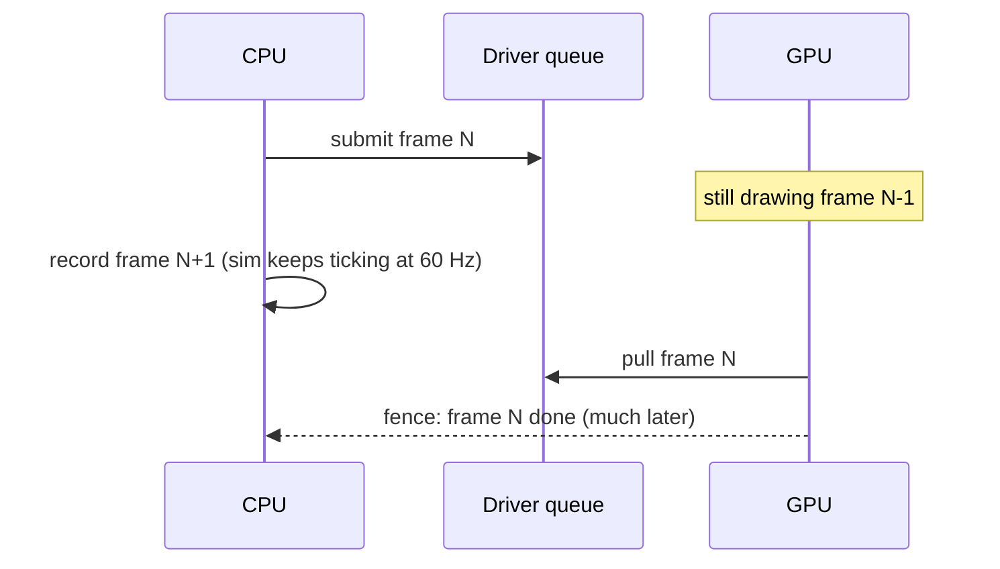

# The GPU Mental Model

## What it is

A GPU is a second computer inside your machine: thousands of small cores, its own memory, its own scheduler, on the far side of a bus. You never call it like a function. You **record commands into a buffer, submit the buffer, and move on** — the GPU executes them later, on its own timeline. SDL_GPU (our sole renderer per [ADR-0009](../../engine/architecture/adr-0009-sdl-gpu-renderer.md)) is a remote-control protocol for that second computer, and every later page in this track assumes you hold this model.

Nothing draws when you call a "draw" function. It appends an instruction to a command buffer, the same way you might append to a `std::vector<Command>` — execution comes later, elsewhere.

## Why you care

Coming from CPU-land your reflex is: call function, work happens, function returns. The GPU breaks every part of that. The engine already decouples the fixed 60 Hz simulation **tick** from the variable-rate rendered **frame** (see [render interpolation](render-interpolation.md)); this page adds a second decoupling **inside** the renderer: the CPU recording a frame and the GPU drawing one are typically one or two frames apart.

Holding this model explains three things you will hit in week one of the K1 renderer: why a colonist mesh must be **uploaded** before it can be drawn, why a crash stack points at submit instead of the bad call you recorded earlier, and why "just read that pixel back" halves your frame rate.

## Quick start

The entire per-frame contract, in the GPU API's shape:

```cpp
// fragment — does not compile alone
SDL_GPUCommandBuffer* cmd = SDL_AcquireGPUCommandBuffer(device);
// record: begin render pass, bind pipeline, draw colonist meshes, end pass
SDL_SubmitGPUCommandBuffer(cmd);  // returns immediately — nothing is drawn yet
```

If you have used `std::async`, you already know this pattern:

```cpp
#include <cstdio>
#include <future>

int main() {
    auto result = std::async(std::launch::async, [] { return 6 * 7; });
    std::puts("submitted; this thread keeps working");
    std::printf("%d\n", result.get());  // sync point: block until the worker is done
}
```

Submitting a command buffer is launching the task; waiting on a GPU fence is `result.get()`. The craft of a renderer is arranging the frame so you almost never call `get()`.

## How it works

Three consequences follow from "separate computer, far side of a bus".

**1. All data is uploaded, explicitly.** The GPU cannot chase pointers into your `std::vector`. A wall-cube mesh or a terrain texture must be copied into GPU memory before any draw references it: you map a CPU-visible **transfer buffer**, `memcpy` into it, then record a copy command — and that copy also runs later, on the GPU timeline, not when you record it. [Meshes on the GPU](meshes-on-the-gpu.md) walks through it concretely.

**2. The GPU runs frames behind.** While the GPU draws frame N, the CPU is already recording frame N+1. The driver queues whole command buffers so both processors stay busy instead of taking turns:



**3. Sync points stall both.** Anything that forces the timelines to meet — waiting on a fence, reading rendered results back, overwriting a buffer the GPU is still reading — drains that queue. The CPU idles until the GPU catches up, then the GPU idles while the CPU refills the queue.

!!! warning
    The classic trap: picking the colonist under the mouse by reading back the frame you just submitted. That read must wait for the whole GPU queue to drain — a millisecond-scale stall, every frame. Prefer CPU-side raycasts (Jolt) or accept results a few frames late.

!!! tip
    "CPU wants to write a buffer the GPU is still reading" is so common that the GPU API automates the fix: the **cycle** flag silently swaps in a fresh internal buffer. Details in [SDL_GPU API](sdl-gpu-api.md).

## Pros / Cons

| The async model buys | It costs |
|---|---|
| Throughput: thousands of wall cubes and skinned colonists per frame | Latency: what's on screen is 1–2 frames old |
| CPU and GPU work concurrently, neither waits by default | Errors surface at submit time, far from the call that caused them |
| Uploads overlap with drawing | Nothing is implicit: every byte is staged, copied, and its lifetime managed |

## What to expect

Debugging feels dislocated at first: the bad bind you recorded and the crash it causes are separated in both time and stack trace, so you lean on validation layers and GPU capture tools (PIX, Xcode) rather than the debugger. Profiling means reading **two** timelines — a fast CPU with an idle GPU is still a slow frame. And GPU resources are handles you must release, which is why they get RAII wrappers ([RAII](../cpp/raii.md)) like every other resource in the engine.

!!! info
    On unified-memory hardware (Apple Silicon, Steam Deck) the two processors share physical RAM, but the API still requires transfer buffers — the problem uploads solve is **when** (separate timelines), not only **where** (separate memory).

## Go deeper

- [Render pipeline](render-pipeline.md) — next page: what actually happens inside a draw
- [SDL_GPU API](sdl-gpu-api.md) — the concrete objects and frame skeleton
- [Meshes on the GPU](meshes-on-the-gpu.md) — uploads in practice
- [Render interpolation](render-interpolation.md) — how variable-rate frames sit on the fixed 60 Hz tick
- [ADR-0009](../../engine/architecture/adr-0009-sdl-gpu-renderer.md) — why SDL_GPU is the sole v1 renderer

**Sources**

- A trip through the Graphics Pipeline 2011: Index — Fabian Giesen — <https://fgiesen.wordpress.com/2011/07/09/a-trip-through-the-graphics-pipeline-2011-index/> — accessed 2026-07-06
- SDL3 GPU API (CategoryGPU) — SDL Wiki — <https://wiki.libsdl.org/SDL3/CategoryGPU> — accessed 2026-07-06
- SDL GPU API Concepts: Data Transfer and Cycling — Moonside Games — <https://moonside.games/posts/sdl-gpu-concepts-cycling/> — accessed 2026-07-06
- Video: How do Video Game Graphics Work? — Branch Education, 21 min — <https://www.youtube.com/watch?v=C8YtdC8mxTU> — watch the full 21 minutes before reading [render pipeline](render-pipeline.md); the best visual intuition for what the silicon actually does
