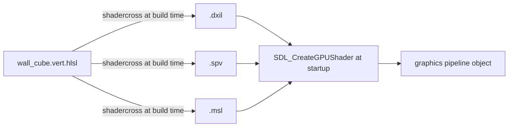

# HLSL Shader Basics

## What it is

HLSL (High-Level Shader Language) is Microsoft's C-like language for programs that run on the GPU. Every shader in this engine is HLSL, offline-compiled via SDL_shadercross to DXIL/SPIR-V/MSL — one source file serves the D3D12, Vulkan, and Metal backends, and no shader compiler ships with the game ([ADR-0009](../../engine/architecture/adr-0009-sdl-gpu-renderer.md)). A draw call needs a pair: a **vertex shader** that runs once per vertex and outputs a clip-space position, and a **fragment shader** that runs once per covered pixel and outputs a color. HLSL's own name for the latter is **pixel shader** — same thing; this handbook says fragment shader everywhere.

## Why you care

Everything visible in the colony — colonist meshes, wall cubes, the terrain under the sun — is drawn by a shader pair you wrote. The whole K1 renderer budget (triangle → textured → camera → blinn-phong → one shadow cascade → skinning → tonemap) is really a sequence of increasingly capable shader pairs. And shaders fail differently from C++: a wrong semantic or register space usually means **nothing draws and nothing errors**, so the conventions on this page are load-bearing.

## Quick start

A minimal pair that draws a wall cube with a camera transform. Vertex shader first:

```hlsl
// HLSL fragment — wall_cube.vert.hlsl
cbuffer ViewProj : register(b0, space1)  // vertex-stage uniforms live in space1
{
    float4x4 mvp;
};

struct VSInput
{
    float3 position : TEXCOORD0;  // vertex attributes: TEXCOORD0, 1, 2, ... no gaps
    float3 color    : TEXCOORD1;
};

struct VSOutput
{
    float4 clip_pos : SV_Position;  // system value: where this vertex lands on screen
    float3 color    : TEXCOORD0;    // outputs restart their own count at TEXCOORD0
};

VSOutput main(VSInput input)
{
    VSOutput output;
    output.clip_pos = mul(mvp, float4(input.position, 1.0));
    output.color    = input.color;
    return output;
}
```

The fragment shader receives the vertex outputs, interpolated across the triangle:

```hlsl
// HLSL fragment — wall_cube.frag.hlsl
struct FSInput
{
    float4 clip_pos : SV_Position;
    float3 color    : TEXCOORD0;
};

float4 main(FSInput input) : SV_Target0  // color written to render target 0
{
    return float4(input.color, 1.0);
}
```

Compile at build time, once per backend:

```bash
shadercross wall_cube.vert.hlsl -o wall_cube.vert.spv    # Vulkan
shadercross wall_cube.vert.hlsl -o wall_cube.vert.dxil   # D3D12
shadercross wall_cube.vert.hlsl -o wall_cube.vert.msl    # Metal
```

!!! tip
    Name files `*.vert.hlsl` / `*.frag.hlsl`. shadercross infers source language, shader stage, and destination format from filenames, and the entry point defaults to `main` — the commands above need no other flags.

These examples use column-vector math like LearnOpenGL: matrix on the left, `mul(mvp, v)`. HLSL's `mul()` accepts both argument orders and silently does row-vector math if you swap them — the cube renders garbage with no warning. This is where the convention bites.

## How it works



At startup the engine asks the GPU API which bytecode format the device accepts and loads that file; compile errors happened in CI, not on a player's machine. Creating the pipeline object that consumes the shader is covered in [SDL_GPU API](sdl-gpu-api.md).

Every struct field carries a **semantic**. System-value semantics (`SV_Position`, `SV_Target0`) tell the pipeline what the value is for. Everything else is user data, and the GPU API's rule is strict: `TEXCOORD0`, incrementing, no gaps — even for values that are not texture coordinates, like the color above or a normal later. The number is how a vertex buffer's attribute layout lines up with `VSInput` ([Meshes on the GPU](meshes-on-the-gpu.md)).

A **cbuffer** holds uniforms — values constant across one draw, like the camera matrix or the sun direction over the map. The CPU pushes raw bytes; the shader overlays its struct. Mirror the layout exactly on the C++ side:

```cpp
struct ViewProj {
    float mvp[16];  // must match the cbuffer byte for byte
};
static_assert(sizeof(ViewProj) == 64, "cbuffer layout drifted");

int main() {}
```

Where each resource must be declared is the GPU API's own register/space convention:

| Resource | Register | Vertex shader | Fragment shader |
|---|---|---|---|
| Sampled textures, then storage textures, then storage buffers | `t` | `space0` | `space2` |
| Samplers (indices match their textures) | `s` | `space0` | `space2` |
| Uniform buffers (cbuffers) | `b` | `space1` | `space3` |

!!! warning
    Those spaces are the GPU API's convention, not a D3D12 default. A fragment-stage cbuffer declared `register(b0, space1)` — the vertex space — compiles cleanly and binds nothing you pushed — reads are undefined: typically zeros or stale vertex-stage data, and Vulkan validation layers flag it.

!!! info
    HLSL also does compute shaders. The GPU API supports them; the K1 budget does not — not in v1.

## Pros / Cons

| | One HLSL source, offline compile | The alternative |
|---|---|---|
| Languages to learn | One | GLSL, MSL, HLSL — one per backend |
| Compile errors surface | At build time, in CI | At runtime, per player machine |
| Shipping | No compiler in the install | A compiler library in the install |
| Iteration | Rebuild step between edit and run | Edit-and-reload of source |
| Risk | shadercross is "preview", but build-time only | Runtime compiler bugs ship |

## What to expect

- Sampling that wall texture inside the fragment shader — declarations at `t0`/`s0`, `space2` — is [Textures](textures.md).
- What actually goes into `mvp` is [Cameras](cameras.md); lighting math in the fragment shader is [Lighting basics](lighting-basics.md).
- Camera uniforms update per **frame**, not per tick — the render side interpolates between fixed 60 Hz ticks: [Render interpolation](render-interpolation.md).

## Go deeper

- [Render pipeline](render-pipeline.md) — where the two programmable stages sit in the fixed pipeline.
- [SDL_GPU API](sdl-gpu-api.md) — turning bytecode into shader objects, then a pipeline.
- [Meshes on the GPU](meshes-on-the-gpu.md) — vertex buffers that feed `VSInput`.
- [ADR-0009](../../engine/architecture/adr-0009-sdl-gpu-renderer.md) — why HLSL, offline, one renderer.

**Sources**

- High-level shader language (HLSL) — Microsoft Learn — https://learn.microsoft.com/en-us/windows/win32/direct3dhlsl/dx-graphics-hlsl — accessed 2026-07-06
- SDL_shadercross — libsdl-org (GitHub) — https://github.com/libsdl-org/SDL_shadercross — accessed 2026-07-06
- SDL_CreateGPUShader (resource binding conventions) — SDL Wiki — https://wiki.libsdl.org/SDL3/SDL_CreateGPUShader — accessed 2026-07-06

**Video**: Shader Basics, Blending & Textures • Shaders for Game Devs [Part 1] — Freya Holmér — 233 min — https://www.youtube.com/watch?v=kfM-yu0iQBk — watch the first ~90 min for shader anatomy (vertex vs fragment, interpolation, swizzling); it uses Unity but the mental model transfers directly.
