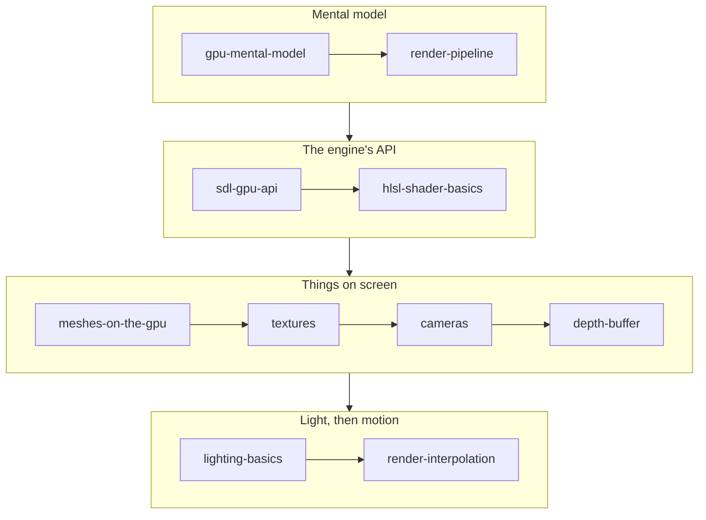

# Rendering

## What it is

This track takes you from "the GPU is a magic box" to the working forward renderer of our colony-sim engine: the SDL3 GPU API, HLSL shaders compiled offline through SDL_shadercross, meshes, textures, a camera, a depth buffer, Blinn-Phong lighting, and the interpolation that bridges the fixed 60 Hz simulation tick to whatever refresh rate the player's monitor runs at. It is the path behind milestone M1 — triangle, textured cube, camera, mesh — inside the K1 scope budget from the [master plan](../../design/master-plan.md).

## Why you care

Rendering is where CPU intuition stops helping. A GPU is not a fast function you call; it is a separate machine on the far side of a bus, running a frame or two behind you, doing only what your recorded command buffers say. Every page here builds on that shift, and every example is drawn from the colony: a colonist-built wall cube, the terrain tileset, one directional sun.

!!! info
    Per ADR-0009 the engine ships exactly one v1 backend — SDL_GPU — and a hard feature fence: Blinn-Phong plus one shadow cascade **is** the whole v1 lighting model. The pre-authorized fallback is flat-shaded art, never a fancier technique. Pages teach that scope and name what is deliberately out.

## How it works

Read in order. The first two pages install the mental model, the next two teach the API and shader language the engine actually speaks, and the rest build the renderer one capability at a time.

| Page | What you'll learn |
|---|---|
| [The GPU Mental Model](gpu-mental-model.md) | The GPU as an asynchronous co-processor you feed command buffers — why data must be uploaded and why sync points stall. |
| [The Graphics Pipeline](render-pipeline.md) | The stages every draw flows through, input assembly to output merge, and which are programmable vs fixed-function. |
| [The SDL3 GPU API](sdl-gpu-api.md) | Device, swapchain, command buffers, passes, pipelines — the acquire → record → submit frame skeleton, and why ADR-0009 picked SDL_GPU. |
| [HLSL Shader Basics](hlsl-shader-basics.md) | Minimal vertex/fragment pairs: semantics, cbuffers, SDL_GPU's binding conventions, and the offline SDL_shadercross step. |
| [Meshes on the GPU](meshes-on-the-gpu.md) | Vertex and index buffers, attribute layouts that must match the shader, transfer-buffer uploads, and the indexed draw. |
| [Textures](textures.md) | Creating, uploading, and sampling images: filtering, wrapping, mipmaps, and sRGB vs linear — the colony tileset without shimmer. |
| [Cameras](cameras.md) | Model, view, and projection matrices; perspective vs orthographic; the camera as an ECS component that yields data. |
| [The Depth Buffer](depth-buffer.md) | The per-pixel depth test, enabling depth state in the pipeline, and z-fighting and precision trade-offs on large maps. |
| [Lighting Basics](lighting-basics.md) | Blinn-Phong with one directional sun over the colony — exactly the K1 budget, nothing more. |
| [Render Interpolation](render-interpolation.md) | Lerping previous/current transforms per entity so a 144 Hz monitor sees smooth colonists from discrete 60 Hz ticks. |

## What to expect

About an evening per page if you type the examples out. By the end you can trace a colonist mesh from a glTF file to a lit, textured, depth-tested, smoothly interpolated frame — and explain why the renderer only ever **reads** simulation state, never mutates it.

## Go deeper

Start with [The GPU Mental Model](gpu-mental-model.md). Before this track, finish [C++ for Game Devs](../cpp/index.md) and read [Fixed timestep](../architecture/fixed-timestep.md) — the interpolation page assumes both. Engine-specific claims trace to the [master plan](../../design/master-plan.md) and [hardening principles](../../design/hardening-principles.md).

Sources:

- SDL3 GPU API documentation — https://wiki.libsdl.org/SDL3/CategoryGPU — accessed 2026-07-06
- LearnOpenGL (concepts transfer directly to SDL_GPU) — https://learnopengl.com/ — accessed 2026-07-06
