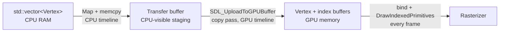

# Meshes on the GPU

## What it is

A mesh on the GPU is two arrays in video memory. The **vertex buffer** holds one record per unique corner — position, normal, texture coordinates. The **index buffer** holds small integers that stitch those corners into triangles, so shared corners are stored once. You fill both through a staging **transfer buffer** inside a **copy pass**, then draw them every frame without re-sending a byte. This page walks one colonist-built wall cube through that path using SDL_GPU.

## Why you care

Your colony map is overwhelmingly static geometry: walls, floors, stockpile shelves. When a colonist finishes a wall on some simulation tick, the render side builds that chunk's mesh **once**; every frame after that is just "bind two buffers, draw". Re-sending vertices each frame would choke the PCIe bus — the slow lane next to GPU memory ([GPU mental model](gpu-mental-model.md)). This **upload-once, draw-many** pattern carries every static mesh the engine will ever draw.

The second thing you are buying is a contract: your C++ vertex struct, the pipeline's vertex input state, and the vertex shader's input struct must all describe **the same bytes**. Get one offset wrong and you get silent garbage, not a compile error.

## Quick start

The CPU side is plain structs in a `std::vector` ([Core containers](../cpp/core-containers.md)):

```cpp
#include <cstddef>
#include <cstdint>
#include <vector>

struct Vertex {
    float px, py, pz;  // position
    float nx, ny, nz;  // normal
    float u, v;        // texture coords — used on the Textures page
};
static_assert(sizeof(Vertex) == 32, "must match the pipeline's vertex input state");
static_assert(offsetof(Vertex, nx) == 12);
static_assert(offsetof(Vertex, u) == 24);

int main() {
    // One face of a wall cube: 4 unique vertices, 2 triangles via 6 indices.
    std::vector<Vertex> vertices = {
        {0, 0, 0, 0, 0, -1, 0, 1},  // bottom-left
        {1, 0, 0, 0, 0, -1, 1, 1},  // bottom-right
        {1, 1, 0, 0, 0, -1, 1, 0},  // top-right
        {0, 1, 0, 0, 0, -1, 0, 0},  // top-left
    };
    std::vector<std::uint16_t> indices = {0, 1, 2, 2, 3, 0};
    return vertices.size() == 4 && indices.size() == 6 ? 0 : 1;
}
```

Getting it into GPU memory is a three-step relay — create the GPU buffers, stage the bytes, record the copy:

```cpp
// fragment — does not compile alone
SDL_GPUBufferCreateInfo vb_info{ .usage = SDL_GPU_BUFFERUSAGE_VERTEX, .size = vertex_bytes };
SDL_GPUBuffer* vertex_buffer = SDL_CreateGPUBuffer(device, &vb_info);
SDL_GPUBufferCreateInfo ib_info{ .usage = SDL_GPU_BUFFERUSAGE_INDEX, .size = index_bytes };
SDL_GPUBuffer* index_buffer = SDL_CreateGPUBuffer(device, &ib_info);

// Stage the bytes in CPU-visible memory...
SDL_GPUTransferBufferCreateInfo tb_info{
    .usage = SDL_GPU_TRANSFERBUFFERUSAGE_UPLOAD,
    .size  = vertex_bytes + index_bytes };
SDL_GPUTransferBuffer* staging = SDL_CreateGPUTransferBuffer(device, &tb_info);
auto* mapped = static_cast<Uint8*>(SDL_MapGPUTransferBuffer(device, staging, false));
std::memcpy(mapped, vertices.data(), vertex_bytes);
std::memcpy(mapped + vertex_bytes, indices.data(), index_bytes);
SDL_UnmapGPUTransferBuffer(device, staging);

// ...then record the staging -> device copy in a copy pass.
SDL_GPUCommandBuffer* cmd = SDL_AcquireGPUCommandBuffer(device);
SDL_GPUCopyPass* copy = SDL_BeginGPUCopyPass(cmd);
SDL_GPUTransferBufferLocation src{ .transfer_buffer = staging, .offset = 0 };
SDL_GPUBufferRegion dst{ .buffer = vertex_buffer, .offset = 0, .size = vertex_bytes };
SDL_UploadToGPUBuffer(copy, &src, &dst, false);   // cycle=false: nothing in flight
src.offset = vertex_bytes;
dst = { .buffer = index_buffer, .offset = 0, .size = index_bytes };
SDL_UploadToGPUBuffer(copy, &src, &dst, false);
SDL_EndGPUCopyPass(copy);
SDL_SubmitGPUCommandBuffer(cmd);
SDL_ReleaseGPUTransferBuffer(device, staging);    // staging done; GPU buffers live on
```

!!! tip
    Batch every static mesh you load into **one** copy pass: begin it once, issue all the uploads, end and submit once. A wall-chunk rebuild after a construction tick works the same way.

## How it works



Three memory regions matter. Your `std::vector` lives in RAM the GPU cannot see. The transfer buffer is CPU-visible staging memory: `SDL_MapGPUTransferBuffer` hands you a raw pointer, you `memcpy`, you unmap. The GPU buffer is device-local memory only the GPU touches. The upload runs on the **GPU timeline**, and the GPU API guarantees you may treat it as finished in any command recorded after it — no manual fences.

The `cycle` flag (false everywhere above) only matters when you **rewrite** a buffer that in-flight GPU work might still be reading; cycling swaps in a fresh internal buffer instead of stalling. Static colony geometry is written once, so `false` is correct — park the concept until you hit per-frame dynamic data.

Why indices? A cube has 8 corners but needs 24 vertices (each face wants its own normal) — still far better than the 36 a raw triangle list would store. Shared corners compound across a whole wall chunk.

Last, the layout contract. The pipeline's vertex input state is the middleman between your struct and the shader — HLSL, offline-compiled via SDL_shadercross to DXIL/SPIR-V/MSL ([ADR-0009](../../engine/architecture/adr-0009-sdl-gpu-renderer.md)):

```cpp
// fragment — does not compile alone
SDL_GPUVertexAttribute attrs[] = {
    { .location = 0, .buffer_slot = 0, .format = SDL_GPU_VERTEXELEMENTFORMAT_FLOAT3, .offset = 0  },
    { .location = 1, .buffer_slot = 0, .format = SDL_GPU_VERTEXELEMENTFORMAT_FLOAT3, .offset = 12 },
    { .location = 2, .buffer_slot = 0, .format = SDL_GPU_VERTEXELEMENTFORMAT_FLOAT2, .offset = 24 },
};
SDL_GPUVertexBufferDescription vb_desc{
    .slot = 0, .pitch = sizeof(Vertex), .input_rate = SDL_GPU_VERTEXINPUTRATE_VERTEX };
// -> SDL_GPUGraphicsPipelineCreateInfo.vertex_input_state at pipeline creation

// Every frame, inside the render pass:
SDL_GPUBufferBinding vb_bind{ .buffer = vertex_buffer, .offset = 0 };
SDL_BindGPUVertexBuffers(render_pass, 0, &vb_bind, 1);
SDL_GPUBufferBinding ib_bind{ .buffer = index_buffer, .offset = 0 };
SDL_BindGPUIndexBuffer(render_pass, &ib_bind, SDL_GPU_INDEXELEMENTSIZE_16BIT);
SDL_DrawGPUIndexedPrimitives(render_pass, index_count, 1, 0, 0, 0);
```

The vertex shader's input struct must mirror it — SDL_shadercross maps `location = N` to semantic `TEXCOORDN`:

```hlsl
// HLSL fragment
struct VSInput {
    float3 position : TEXCOORD0;  // location = 0
    float3 normal   : TEXCOORD1;  // location = 1
    float2 uv       : TEXCOORD2;  // location = 2
};
```

!!! warning
    Nothing cross-checks these three descriptions. Change `Vertex` and forget the attribute offsets, and the shader reads normals as positions — wall cubes smeared across the sky. The `static_assert`s in the first block are your cheapest defense; keep them next to the attribute table.

This cube still sits in clip space; placing it in the colony world is matrix work, covered in [Cameras](cameras.md). Note the handbook uses column-vector math like LearnOpenGL — HLSL `mul()` argument order is where that convention bites.

## Pros / Cons

| Pros | Cons |
| --- | --- |
| Vertices cross the bus once; each draw is a cheap GPU-local read | More ceremony than old GL's `glBufferData`: transfer buffer, map, copy pass, submit |
| Index buffers deduplicate shared vertices | The layout contract is enforced by you, not the compiler |
| One explicit layout works identically across DXIL/SPIR-V/MSL backends | Copy passes + cycling are extra concepts before your first mesh appears |

## What to expect

First runs rarely fail loudly. An invisible cube usually means backface winding or a zero index count; a shredded one means a stride or offset mismatch. Create the device with `debug_mode = true` so validation names most binding mistakes; for the rest, a frame capture (RenderDoc, Xcode GPU capture, PIX on the Windows box) shows the exact bytes each attribute read.

16-bit indices cap a mesh at 65,536 vertices — generous for a wall chunk and half the memory of 32-bit; you choose per mesh at bind time.

!!! info
    Skinned colonist meshes upload the same way but add bone indices and weights per vertex plus a skinning stage — late in the K1 renderer budget and a later milestone, not in v1's static-geometry pages.

## Go deeper

- [SDL_GPU API](sdl-gpu-api.md) — the device, command buffers, and passes this page records into
- [HLSL shader basics](hlsl-shader-basics.md) — the vertex shader consuming this layout
- [Textures](textures.md) — image data rides the same transfer-buffer path (read next)
- [Cameras](cameras.md) — moving the cube from clip space into the colony world
- [RAII](../cpp/raii.md) — wrap buffer handles so a release can never be forgotten
- [ADR-0009](../../engine/architecture/adr-0009-sdl-gpu-renderer.md) — the renderer decision: one API, offline shader compilation

Sources:

- Hello Triangle — LearnOpenGL — https://learnopengl.com/Getting-started/Hello-Triangle — accessed 2026-07-06
- SDL_UploadToGPUBuffer — SDL Wiki — https://wiki.libsdl.org/SDL3/SDL_UploadToGPUBuffer — accessed 2026-07-06
- SDL GPU API Concepts: Data Transfer and Cycling — Moonside Games — https://moonside.games/posts/sdl-gpu-concepts-cycling/ — accessed 2026-07-06
