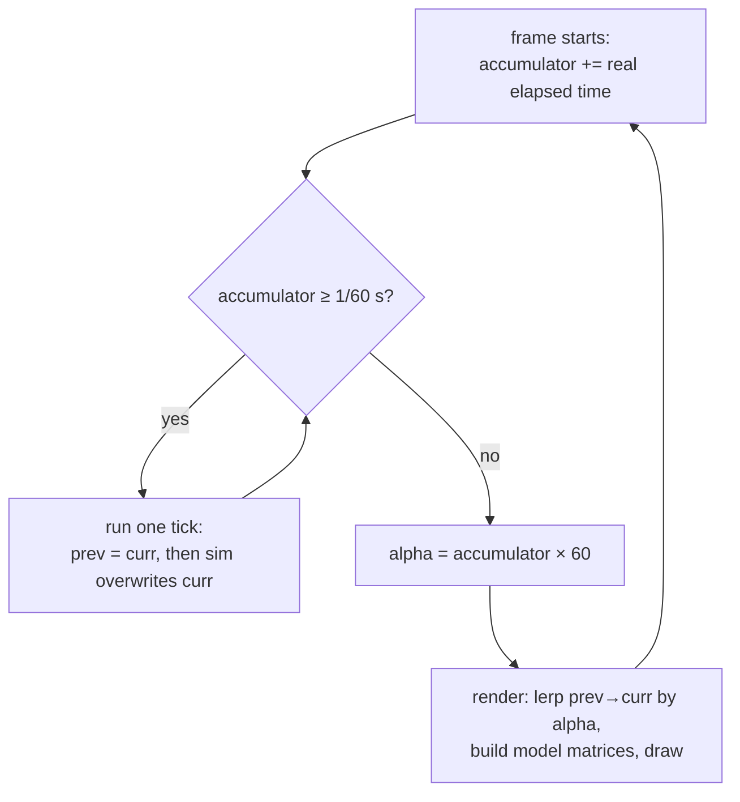

# Render Interpolation

## What it is

The simulation advances in discrete 60 Hz **ticks**; the monitor draws **frames** whenever it can — 144 Hz on a gaming display, 60 Hz on a laptop, less during a spike. Render interpolation bridges the two: every entity keeps its transform from the previous tick **and** the current tick, and each frame the renderer blends between them using the accumulator's leftover fraction, called **alpha**. A colonist who moves in 8 cm hops per tick in the sim glides smoothly across the screen.

## Why you care

At 144 Hz you render roughly 2.4 frames per tick. Without interpolation, two or three consecutive frames show the colonist frozen in place, then she jumps a full tick's distance — visible stutter on exactly the hardware your players brag about. The loop itself (accumulator, dt clamp) lives in [fixed-timestep](../architecture/fixed-timestep.md) and [ADR-0002](../../engine/architecture/adr-0002-fixed-60hz-tick.md); this page is only about what the renderer does with the leftover.

It also enforces the one-way rule: the render system **reads** simulation state and never mutates it. The blended pose exists only for the current frame — server-authoritative tick state is untouched, so per-tick determinism hashes (ADR-0018) don't change.

## Quick start

The math is one lerp per entity. Alpha is `accumulator / tick_dt`, in `[0, 1)` — how far real time has advanced past the last tick.

```cpp
#include <cassert>
#include <cmath>

struct Vec3 { float x, y, z; };

Vec3 lerp(Vec3 a, Vec3 b, float alpha) {
    return { a.x + (b.x - a.x) * alpha,
             a.y + (b.y - a.y) * alpha,
             a.z + (b.z - a.z) * alpha };
}

int main() {
    Vec3 prev{ 2.0f, 0.0f, 5.0f };  // colonist at tick N-1
    Vec3 curr{ 2.1f, 0.0f, 5.0f };  // tick N: walked 10 cm east
    float alpha = 0.25f;            // frame lands 1/4 of the way to tick N+1
    Vec3 draw = lerp(prev, curr, alpha);
    assert(std::abs(draw.x - 2.025f) < 1e-6f);
}
```

In EnTT, "previous and current" are two components. The first thing each tick does is snapshot; the render system takes a **const** registry, so the one-way rule is enforced by the compiler.

```cpp
// fragment — does not compile alone
struct PreviousTransform { Vec3 position; Quat rotation; };
struct CurrentTransform  { Vec3 position; Quat rotation; };

// First thing inside every tick, before any system moves colonists:
void snapshot_transforms(entt::registry& reg) {
    for (auto [e, prev, curr]
         : reg.view<PreviousTransform, const CurrentTransform>().each()) {
        prev.position = curr.position;
        prev.rotation = curr.rotation;
    }
}

// Every frame, alpha handed in by the loop:
void draw_colonists(const entt::registry& reg, float alpha) {
    for (auto [e, prev, curr]
         : reg.view<const PreviousTransform, const CurrentTransform>().each()) {
        Vec3 pos = lerp(prev.position, curr.position, alpha);
        Quat rot = nlerp(prev.rotation, curr.rotation, alpha); // not lerp!
        Mat4 model = translate(pos) * to_mat4(rot);
        push_model_matrix(model); // SDL_PushGPUVertexUniformData under the hood
    }
}
```

As everywhere in this track, examples use column-vector math like LearnOpenGL; when `model` reaches the vertex shader, HLSL `mul()` argument order is where that convention bites. SDL_GPU sees nothing special here — the GPU API just receives a model matrix uniform like any other.

## How it works



After the tick loop drains whole ticks, some time is always left over — too little to simulate, too much to ignore. Rendering `curr` directly displays a moment that doesn't match the frame's real time, which reads as stutter. Blending `prev → curr` by alpha lands the colonist exactly where real time says she should appear — at the price that you're drawing the world **between the two most recent ticks**, i.e. up to one tick (~16.7 ms) in the past.

Positions lerp componentwise; rotations are quaternions, so use **nlerp** (normalize after lerp) or slerp — a componentwise lerp of quaternions denormalizes and shears the colonist mesh mid-turn. One more quaternion quirk: `q` and `-q` encode the same rotation, so if `dot(prev, curr) < 0`, negate one first — otherwise the blend takes the long arc and the colonist whips around for a frame on a tiny turn.

!!! warning
    Teleports smear. When a colonist spawns, a save loads, or the server snaps an entity to a corrected position, set `prev = curr` for that entity in the same tick — otherwise the renderer draws a one-frame streak across the whole map.

!!! info
    Interpolation adds a tick of view latency on top of the server round-trip; that total input-to-display delay is why the **player-controlled** character gets client-side prediction instead ([ADR-0005](../../engine/architecture/adr-0005-predicted-movement-is-cpp.md), networking track). Everything else in the colony interpolates.

## Pros / Cons

| Approach | Pro | Con |
|---|---|---|
| Interpolate prev→curr | never shows a state the sim didn't produce | view runs up to one tick behind |
| Extrapolate curr + velocity | no added latency | guesses wrong — colonist clips the wall cube, then pops back |
| Render curr raw | no extra component | stutter at any refresh rate above 60 Hz |

## What to expect

Cost is trivial: one extra transform per entity (~28 bytes) and one lerp per drawn entity per frame. The bugs are predictable: motion still jittery means alpha comes from the wrong clock or the snapshot runs after movement systems; smooth colonists but a stuttering view means the camera follows `curr` instead of the interpolated pose — interpolate the camera's follow target too.

!!! tip
    Never recompute alpha inside the renderer. The loop in [fixed-timestep](../architecture/fixed-timestep.md) already owns the accumulator — pass `alpha` down as a plain `float` argument, one clock, one truth.

## Go deeper

- [fixed-timestep](../architecture/fixed-timestep.md) — the accumulator loop, dt clamp, where alpha is born
- [ADR-0002](../../engine/architecture/adr-0002-fixed-60hz-tick.md) — why the tick is fixed at 60 Hz
- [cameras](cameras.md) — the model matrix built here meets view/projection there
- [meshes-on-the-gpu](meshes-on-the-gpu.md) — where the model matrix transforms vertices
- [value-semantics](../cpp/value-semantics.md) — why copying small transform structs every tick is cheap
- [lambdas-auto-range-for](../cpp/lambdas-auto-range-for.md) — the structured bindings used in the EnTT loops

**Sources**

- Fix Your Timestep! — Gaffer On Games, https://gafferongames.com/post/fix_your_timestep/ — accessed 2026-07-06
- Game Loop — Game Programming Patterns, https://gameprogrammingpatterns.com/game-loop.html — accessed 2026-07-06
