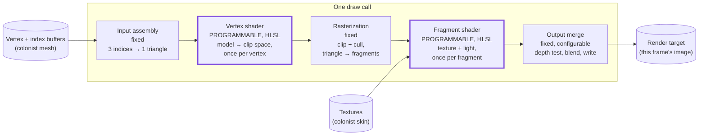

# The Graphics Pipeline

## What it is

The graphics pipeline is the assembly line every draw call travels: **input assembly** reads vertices from buffers, the **vertex shader** positions them, **rasterization** converts each triangle into pixel-sized **fragments**, the **fragment shader** colors each fragment, and **output merge** writes the survivors into the frame's image. Two of the five stages are programmable — you write them in HLSL, offline-compiled via SDL_shadercross to DXIL/SPIR-V/MSL — and the other three are fixed-function hardware you configure but cannot reprogram.

This page is the map the rest of the rendering track plugs into. How the hardware actually executes the map — massively parallel, deeply asynchronous — is [GPU mental model](gpu-mental-model.md).

## Why you care

Everything visible in the colony — colonist meshes, wall cubes, the terrain under them — reaches the screen through this pipeline and only through it. That makes it your debugging map: garbage geometry points at input assembly or the vertex shader; right shape but wrong color points at the fragment shader; right everything but invisible points at rasterization culling or an output-merge test.

It is also the scope map. The K1 renderer budget — triangle → textured → camera → blinn-phong → one shadow cascade → skinning → tonemap — never adds a stage; each step feeds the same five stages richer data ([ADR-0009](../../engine/architecture/adr-0009-sdl-gpu-renderer.md)).

!!! tip
    When a draw misbehaves, walk the stages in order and ask "which stage first sees wrong data?"

## Quick start

Strip away the hardware and the pipeline is two functions you write plus glue you configure:

```cpp
// The pipeline as plain C++: two functions you write, fixed stages you configure.
#include <array>
#include <cstdio>

struct Vec2 { float x, y; };

// Vertex shader: runs once per vertex. Here: shrink the triangle.
Vec2 vertex_shader(Vec2 v) { return {v.x * 0.5f, v.y * 0.5f}; }

// Fragment shader: runs once per covered pixel. Here: flat colonist-blue.
float fragment_shader(Vec2 /*pixel*/) { return 0.55f; }

int main() {
    std::array<Vec2, 3> tri{{{-1.f, -1.f}, {1.f, -1.f}, {0.f, 1.f}}};  // input assembly
    for (Vec2& v : tri) v = vertex_shader(v);          // vertex stage, per vertex
    // rasterization (fixed) would now find every pixel the triangle covers
    float shade = fragment_shader({0.f, 0.f});         // fragment stage, per covered pixel
    std::printf("center pixel shade: %.2f\n", shade);  // output merge: write to the image
}
```

The GPU version differs in scale, not shape: a few thousand vertex-shader runs per colonist mesh, millions of fragment-shader runs for a wall filling the screen — and no invocation can see another's results, which is what lets the hardware run them thousands-wide.

## How it works



Following one colonist mesh through:

- **Input assembly (fixed)**: reads the bound vertex and index buffers and groups every three indices into a triangle, using the vertex layout you declared ([Meshes on the GPU](meshes-on-the-gpu.md)).
- **Vertex shader (yours)**: transforms each vertex from model space to clip space by matrix multiplication ([Cameras](cameras.md)). Examples across this track use column-vector math like LearnOpenGL; the HLSL `mul()` argument order is where that convention bites.
- **Rasterization (fixed)**: clips triangles to the visible volume, discards back-facing ones, and emits one fragment per covered pixel, with vertex outputs (UVs, normals) interpolated across the triangle.
- **Fragment shader (yours)**: computes each fragment's color — sample the skin [texture](textures.md), apply the sun's light ([Lighting basics](lighting-basics.md)).
- **Output merge (fixed, configurable)**: depth-tests the fragment against what is already drawn ([Depth buffer](depth-buffer.md)), optionally blends, and writes to the render target.

!!! info
    GPUs offer more stages — geometry, tessellation, mesh, compute — but none are in v1; the K1 budget needs only these five.

SDL_GPU bakes nearly every fixed-function setting (viewport and scissor stay dynamic) plus the two shaders into one immutable **pipeline state object** at load time ([SDL_GPU API](sdl-gpu-api.md) covers the objects). To the GPU API, a draw is then nothing more than **pipeline state + bound resources + a vertex range**:

```cpp
// fragment — does not compile alone
// One colonist, one draw: pipeline state + bound resources + a vertex range.
SDL_BindGPUGraphicsPipeline(pass, colonist_pipeline);         // shaders + fixed-function config
SDL_BindGPUVertexBuffers(pass, 0, &mesh_binding, 1);          // what input assembly reads
SDL_BindGPUIndexBuffer(pass, &index_binding, SDL_GPU_INDEXELEMENTSIZE_16BIT);  // the indices it groups
SDL_BindGPUFragmentSamplers(pass, 0, &skin_binding, 1);       // what the fragment shader samples
SDL_DrawGPUIndexedPrimitives(pass, index_count, 1, 0, 0, 0);  // the vertex range
```

Rendering the colony is a list of such draws per frame — and "frame" here means the variable-rate rendered image, decoupled from the fixed 60 Hz simulation tick ([Render interpolation](render-interpolation.md) bridges the two).

!!! warning
    A draw that produces nothing is usually not an error — wrong winding order gets culled during rasterization, a failed depth test discards silently. Take a GPU capture and inspect each stage's outputs.

## Pros / Cons

| Pros | Cons |
|---|---|
| One debugging map for every API — D3D12, Vulkan, Metal all share it | Logical order is not execution order; hardware overlaps everything ([GPU mental model](gpu-mental-model.md)) |
| Stage independence explains GPU speed — and why shader invocations cannot share state | Fixed-function stages are set only at pipeline creation — a different blend mode means a whole different pipeline object |
| A cost model falls out: vertices × vertex work + covered pixels × fragment work | Fragment cost scales with screen coverage, not mesh detail — a full-screen wall outweighs a distant, detailed colonist |

## What to expect

Day to day you will write vertex and fragment shaders and rarely revisit fixed-function settings after pipeline creation. Early bugs cluster at stage handoffs: vertex layouts that disagree with the shader's declared inputs, and clip-space positions broken by `mul()` order. A GPU capture tool (Xcode's on macOS, PIX on the Windows box) shows every stage's inputs and outputs — learn one in the same week you draw your first triangle.

## Go deeper

- [GPU mental model](gpu-mental-model.md) — the hardware and asynchrony behind these stages
- [SDL_GPU API](sdl-gpu-api.md) — how pipelines, passes, and bindings become C++ objects
- [HLSL shader basics](hlsl-shader-basics.md) — writing the two programmable stages
- [Meshes on the GPU](meshes-on-the-gpu.md) — the buffers input assembly reads
- [Depth buffer](depth-buffer.md) — the test inside output merge
- [Compilation model](../cpp/compilation-model.md) — shaders compile offline, exactly like C++
- [ADR-0009](../../engine/architecture/adr-0009-sdl-gpu-renderer.md) — why SDL_GPU is the sole v1 renderer

Sources:

- Hello Triangle — LearnOpenGL — https://learnopengl.com/Getting-started/Hello-Triangle — accessed 2026-07-06
- A trip through the Graphics Pipeline 2011: Index — Fabian Giesen — https://fgiesen.wordpress.com/2011/07/09/a-trip-through-the-graphics-pipeline-2011-index/ — accessed 2026-07-06
- SDL3 GPU API (CategoryGPU) — SDL Wiki — https://wiki.libsdl.org/SDL3/CategoryGPU — accessed 2026-07-06
