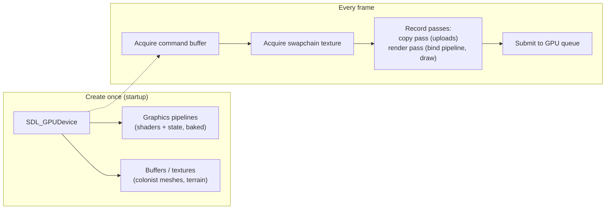

# The SDL3 GPU API

## What it is

SDL_GPU is SDL3's modern graphics API: one set of C functions that drives Vulkan, Direct3D 12, and Metal natively. [Render pipeline](render-pipeline.md) described the stages abstractly; this page is the object model our renderer actually talks to — a **device**, a per-window **swapchain**, **command buffers** you record on the CPU and submit, **render passes** and **copy passes** recorded inside them, and **graphics pipeline** objects that bake shaders plus fixed state into one immutable handle. Shaders are HLSL, offline-compiled via SDL_shadercross to DXIL/SPIR-V/MSL — the GPU API never compiles shaders at runtime ([ADR-0009](../../engine/architecture/adr-0009-sdl-gpu-renderer.md)).

## Why you care

ADR-0009 made the GPU API the **sole v1 backend**: native Metal on macOS means no MoltenVK translation layer to debug alone, the concept count is roughly one-fifth of Vulkan's for a first-time graphics programmer, and — per the engine's no-interface-without-two-implementations rule — there is **no RHI abstraction** until a second backend actually exists. Every step of the K1 renderer budget (triangle → textured → camera → blinn-phong → one shadow cascade → skinning → tonemap) is assembled from the handful of objects on this page; the rest of this track just fills in their parameters.

## Quick start

Startup creates the device and claims the window — once. You declare which compiled shader formats you ship, and SDL picks the backend:

```cpp
// fragment — does not compile alone
SDL_GPUDevice* device = SDL_CreateGPUDevice(
    SDL_GPU_SHADERFORMAT_SPIRV | SDL_GPU_SHADERFORMAT_DXIL | SDL_GPU_SHADERFORMAT_MSL,
    true /* debug mode: keep it on until ship */, nullptr);
SDL_ClaimWindowForGPUDevice(device, window);
```

Every frame then runs the same **acquire → record → submit** skeleton, at whatever rate the display allows — independent of the fixed 60 Hz simulation tick:

```cpp
// fragment — does not compile alone
SDL_GPUCommandBuffer* cmd = SDL_AcquireGPUCommandBuffer(device);

SDL_GPUTexture* swapchain = nullptr;
SDL_WaitAndAcquireGPUSwapchainTexture(cmd, window, &swapchain, nullptr, nullptr);
if (!swapchain) {                       // window minimized — nothing to draw to
    SDL_CancelGPUCommandBuffer(cmd);
    return;
}

SDL_GPUColorTargetInfo color = {};
color.texture     = swapchain;
color.clear_color = SDL_FColor{0.53f, 0.81f, 0.92f, 1.0f};  // sky over the colony map
color.load_op     = SDL_GPU_LOADOP_CLEAR;
color.store_op    = SDL_GPU_STOREOP_STORE;

SDL_GPURenderPass* pass = SDL_BeginGPURenderPass(cmd, &color, 1, nullptr);
SDL_BindGPUGraphicsPipeline(pass, wallPipeline);   // built once at load time
SDL_DrawGPUPrimitives(pass, 36, 1, 0, 0);          // one wall cube, 12 triangles — vertex data setup: meshes-on-the-gpu.md
SDL_EndGPURenderPass(pass);

SDL_SubmitGPUCommandBuffer(cmd);        // GPU takes over; CPU moves on
```

!!! tip
    Keep the **SDL_gpu_examples** repo open in a tab. Every K1 feature — clear screen, textured quad, depth buffer, stencil — has a matching minimal example you can diff your code against.

## How it works

Objects split into two lifetime classes. **Create-once** (startup, destroy at shutdown): the device, shaders, pipelines, mesh buffers, textures. Pipeline creation is expensive validation work, so all K1 pipelines — walls, colonists, sky — are built at load time, never mid-frame. **Per-frame** (cheap, never stored across frames): command buffers, the swapchain texture, render and copy passes.



Submission is asynchronous: `SDL_SubmitGPUCommandBuffer` returns immediately, so the GPU may still be reading **last** frame's data while the CPU writes **this** frame's. That is the problem **cycling** solves. A GPU buffer or texture is secretly a container of internal copies; passing `cycle = true` on a write rotates to a fresh internal copy instead of stomping one still in flight — no fences, no manual synchronization:

```cpp
// fragment — does not compile alone
// Colonist positions changed this tick — refill the instance transfer buffer.
void* mapped = SDL_MapGPUTransferBuffer(device, transferBuf, true);  // cycle
SDL_memcpy(mapped, colonistTransforms, transformBytes);
SDL_UnmapGPUTransferBuffer(device, transferBuf);
// Later, inside a copy pass: SDL_UploadToGPUBuffer(copyPass, &src, &dst, true);
```

!!! warning
    Cycling has two edges. `cycle = false` on a resource the GPU is still reading corrupts frames in flight (flickering colonists). `cycle = true` gives you a **fresh, undefined** copy — previous contents are gone, so cycle only when you rewrite the whole thing. Rule of thumb: per-frame data cycles; load-time data never needs to.

!!! info
    The GPU API also offers compute passes and multi-threaded command recording. Neither is in the K1 budget — not in v1.

## Pros / Cons

| Pros | Cons |
|---|---|
| Native Metal/D3D12/Vulkan from one codebase — no translation layer | Younger API; smaller body of tutorials than Vulkan/OpenGL |
| Explicit modern shape (command buffers, passes, baked pipelines) — transfers to Vulkan later | No bindless, mesh shaders, or ray tracing — irrelevant to K1 |
| Cycling replaces fence-level synchronization for per-frame data | SDL_shadercross is still "preview" — a build-time risk only, per ADR-0009 |
| Valve-backed maintenance inside SDL3 itself | One vendor's abstraction; fallback is cutting features, never swapping APIs |

## What to expect

- Authoring the HLSL that pipelines consume, and the offline compile step: [HLSL shader basics](hlsl-shader-basics.md).
- Vertex layouts, transfer-buffer uploads, and real draw calls for colonist meshes: [Meshes on the GPU](meshes-on-the-gpu.md).
- Texture and sampler creation: [Textures](textures.md).
- When matrices arrive in [Cameras](cameras.md), this track uses column-vector math like LearnOpenGL — HLSL `mul()` argument order is where that bites.
- Wrap `SDL_GPUDevice*` and pipeline handles in `std::unique_ptr` with custom deleters at the engine's edge: [RAII](../cpp/raii.md).

## Go deeper

- [GPU mental model](gpu-mental-model.md) — why the API is shaped around batching work for a parallel machine.
- [Render pipeline](render-pipeline.md) — the stages a graphics pipeline object configures.
- [Meshes on the GPU](meshes-on-the-gpu.md) — the copy pass put to work.
- [ADR-0009](../../engine/architecture/adr-0009-sdl-gpu-renderer.md) — the decision record this page explains.

**Sources**

- SDL3 GPU API (CategoryGPU) — SDL Wiki — https://wiki.libsdl.org/SDL3/CategoryGPU — accessed 2026-07-06
- SDL_gpu_examples — TheSpydog (GitHub) — https://github.com/TheSpydog/SDL_gpu_examples — accessed 2026-07-06
- SDL GPU API Concepts: Data Transfer and Cycling — Moonside Games — https://moonside.games/posts/sdl-gpu-concepts-cycling/ — accessed 2026-07-06
