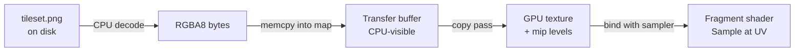

# Textures

## What it is

A texture is an image parked in GPU memory so the fragment shader can read — **sample** — it while shading. Each vertex in a mesh carries a **UV coordinate**, a 2D position inside the image running from (0,0) to (1,1). The rasterizer interpolates UVs across every triangle, just like the vertex colors in [meshes-on-the-gpu](meshes-on-the-gpu.md), and sampling the colony tileset at the interpolated UV is what turns a gray wall cube into bricks.

## Why you care

Every visible surface in the colony — wall tiles, floorboards, colonist clothes — gets its color this way. Textures are also purely a **frame**-side concern: the fixed 60 Hz simulation tick never reads them, so nothing on this page can touch server-authoritative state. What does bite is the plumbing: pick the wrong color format and the map looks washed out or banded; skip mipmaps and distant floors shimmer whenever the camera pans.

## Quick start

Getting the tileset onto walls with SDL_GPU takes three moves: create the texture, push pixels through a **transfer buffer**, then bind texture-plus-sampler before the draw.

```cpp
// fragment — does not compile alone
// One-time upload of the 256×256 RGBA colony tileset.
SDL_GPUTextureCreateInfo tex_info{};
tex_info.type   = SDL_GPU_TEXTURETYPE_2D;
tex_info.format = SDL_GPU_TEXTUREFORMAT_R8G8B8A8_UNORM_SRGB; // color data
tex_info.usage  = SDL_GPU_TEXTUREUSAGE_SAMPLER
                | SDL_GPU_TEXTUREUSAGE_COLOR_TARGET;  // needed for mip gen
tex_info.width  = 256;
tex_info.height = 256;
tex_info.layer_count_or_depth = 1;
tex_info.num_levels = 9;                        // full mip chain: log2(256)+1
SDL_GPUTexture* tileset = SDL_CreateGPUTexture(device, &tex_info);

SDL_GPUTransferBufferCreateInfo tb_info{};
tb_info.usage = SDL_GPU_TRANSFERBUFFERUSAGE_UPLOAD;
tb_info.size  = 256 * 256 * 4;
SDL_GPUTransferBuffer* staging = SDL_CreateGPUTransferBuffer(device, &tb_info);

void* mapped = SDL_MapGPUTransferBuffer(device, staging, false);
std::memcpy(mapped, decoded_png_pixels, tb_info.size);
SDL_UnmapGPUTransferBuffer(device, staging);

SDL_GPUCommandBuffer* cmd = SDL_AcquireGPUCommandBuffer(device);
SDL_GPUCopyPass* copy = SDL_BeginGPUCopyPass(cmd);
SDL_GPUTextureTransferInfo src{ .transfer_buffer = staging, .offset = 0 };
SDL_GPUTextureRegion dst{ .texture = tileset, .w = 256, .h = 256, .d = 1 };
SDL_UploadToGPUTexture(copy, &src, &dst, false);
SDL_EndGPUCopyPass(copy);
SDL_GenerateMipmapsForGPUTexture(cmd, tileset); // fills levels 1..8
SDL_SubmitGPUCommandBuffer(cmd);
SDL_ReleaseGPUTransferBuffer(device, staging); // safe once the copy is submitted
```

The texture holds pixels; a **sampler** holds the rules for reading them. The GPU API keeps them separate so one sampler can serve every tileset.

```cpp
// fragment — does not compile alone
SDL_GPUSamplerCreateInfo samp_info{};
samp_info.min_filter  = SDL_GPU_FILTER_LINEAR;
samp_info.mag_filter  = SDL_GPU_FILTER_LINEAR;
samp_info.mipmap_mode = SDL_GPU_SAMPLERMIPMAPMODE_LINEAR;      // trilinear
samp_info.address_mode_u = SDL_GPU_SAMPLERADDRESSMODE_REPEAT;  // walls tile
samp_info.address_mode_v = SDL_GPU_SAMPLERADDRESSMODE_REPEAT;
SDL_GPUSampler* sampler = SDL_CreateGPUSampler(device, &samp_info);

// Each frame, inside the render pass, before drawing walls:
SDL_GPUTextureSamplerBinding binding{ .texture = tileset, .sampler = sampler };
SDL_BindGPUFragmentSamplers(render_pass, 0, &binding, 1);
```

On the shader side — HLSL, offline-compiled via SDL_shadercross to DXIL/SPIR-V/MSL, never at runtime ([ADR-0009](../../engine/architecture/adr-0009-sdl-gpu-renderer.md)) — sampling is one line:

```hlsl
// HLSL fragment
Texture2D    Tileset : register(t0, space2);
SamplerState Samp    : register(s0, space2);

float4 main(float2 uv : TEXCOORD0) : SV_Target
{
    return Tileset.Sample(Samp, uv); // filtering + wrapping happen here
}
```

Why `t0, space2` is covered in [hlsl-shader-basics](hlsl-shader-basics.md).

## How it works



The GPU can't read your process memory directly, so pixels stage through a CPU-visible transfer buffer, and a copy pass moves them into fast GPU-local memory once. After that, three sampler rules decide what every `Sample` call returns:

- **Filtering** — a UV almost never lands dead-center on a texel. `NEAREST` grabs the closest texel (crisp pixel art); `LINEAR` blends the four neighbors (smooth surfaces).
- **Wrapping** — UVs outside 0–1 either `REPEAT` (one brick tile paints a whole wall) or clamp to the edge.
- **Mipmaps** — prescaled half-size copies (256→128→…→1). When a floor tile is far away and covers two pixels, the GPU samples a small mip instead of skipping across the full-size image, which is what kills shimmer.

!!! tip
    `SDL_GenerateMipmapsForGPUTexture` builds the whole chain in one call at load time — good enough until an offline asset pipeline exists.

The last decision is color space. Image files store **sRGB** (perceptually spaced) values, but lighting math needs **linear** light:

```cpp
#include <cassert>
#include <cmath>

// What the GPU does for free when the texture format ends in _SRGB.
float srgb_to_linear(float s) {
    return (s <= 0.04045f) ? s / 12.92f
                           : std::pow((s + 0.055f) / 1.055f, 2.4f);
}

int main() {
    // 50% gray in a PNG is only ~21% physical light.
    assert(std::abs(srgb_to_linear(0.5f) - 0.214f) < 0.001f);
}
```

Using a `_UNORM_SRGB` format makes the hardware apply that curve on every sample, so the fragment shader always works in linear.

!!! warning
    Apply the sRGB conversion exactly once. An `_SRGB` format **plus** a manual `pow(color, 2.2)` in the shader renders the colony too dark; plain `_UNORM` with no conversion renders it washed out, and the missing precision in dark tones shows up as banding on shadowed walls.

## Pros / Cons

| Decision | Option | Pro | Con |
|---|---|---|---|
| Filtering | `NEAREST` | crisp pixel-art tiles | blocky up close, aliases far away |
| Filtering | `LINEAR` + trilinear mips | smooth, shimmer-free | slight blur; atlas bleeding |
| Wrapping | `REPEAT` | one tile covers a long wall | seams if art isn't tileable |
| Wrapping | `CLAMP_TO_EDGE` | safe for atlases, UI | can't tile |
| Format | `_UNORM_SRGB` | correct color for free | wrong for data (normal maps) |
| Format | `_UNORM` | right for data maps | banding if used for albedo |

## What to expect

Uncompressed RGBA8 is fat: the 256×256 tileset with mips is ~349 KB, but one 4096×4096 texture is ~89 MB of VRAM — budget before authoring. Typical first-week symptoms map to causes cleanly: too dark or washed out means sRGB handled twice or never; shimmer while panning means `num_levels = 1`; neighboring tiles bleeding into each other in an atlas means linear filtering is reading adjacent tiles (pad each tile's border, or go `NEAREST`); an upside-down tileset means the PNG decoder's top-left origin disagrees with your UV convention — pick one at import and add it to `test_conventions.cpp`.

!!! info
    Compressed formats (BC7), texture arrays, and streaming are not in v1 — the K1 renderer budget stops at tonemap ([master plan](../../design/master-plan.md)).

## Go deeper

- [meshes-on-the-gpu](meshes-on-the-gpu.md) — where the UV attribute lives in the vertex buffer
- [hlsl-shader-basics](hlsl-shader-basics.md) — sampler binding slots and register spaces
- [depth-buffer](depth-buffer.md) — depth textures and render targets
- [lighting-basics](lighting-basics.md) — how the sampled color interacts with the sun over the map
- [sdl-gpu-api](sdl-gpu-api.md) — command buffers, copy passes, submission
- [RAII](../cpp/raii.md) — wrap `SDL_ReleaseGPUTexture` so tilesets free themselves

**Sources**

- Textures — LearnOpenGL, https://learnopengl.com/Getting-started/Textures — accessed 2026-07-06
- SDL_CreateGPUTexture — SDL Wiki, https://wiki.libsdl.org/SDL3/SDL_CreateGPUTexture — accessed 2026-07-06
- SDL_gpu_examples — TheSpydog (GitHub), https://github.com/TheSpydog/SDL_gpu_examples — accessed 2026-07-06
