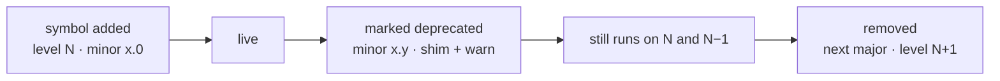

# Versioning a Mod API

## What it is

Versioning a mod API is the promise that content written against the engine today still loads tomorrow. Two version numbers do the work, on two different things. The engine binary will carry a full **semver** — `MAJOR.MINOR.PATCH`. The mod API will carry its own version, bumped **independently** of the engine ([ADR-0015](../../engine/architecture/adr-0015-luau-modding.md)): an engine patch can ship without touching a single mod. A mod pins one number — its **API level**, the mod-API major, like a Factorio game version or an Android API level — and the engine will run the current level and the one before it.

## Why you care

The product bet is that "a friend adds an enemy with a JSON file + 20 lines of Luau, hash-verified into the co-op session, and a bad mod can't crash the game or corrupt saves." That mod has to keep working across updates, or the ecosystem the engine exists for never forms. Versioning is the contract that lets content outlive the build it was written against.

The join handshake's hash match is **compatibility and honesty** — is everyone running the same rules? — not anti-cheat ([ADR-0013](../../engine/architecture/adr-0013-json-authored-bitstream-wire.md)). Versioning keeps that check kind: it tells a joining player *why* a mod mismatched — too old, too new, one bump behind — instead of failing blind.

## Quick start

A mod declares the level it targets. Full manifest layout is [Mod packaging](./mod-packaging.md); the field that matters here:

```json
{ "api_level": 5 }
```

That integer will let the engine decide load, shim, or refuse. It will be checked against the IDL/JSON descriptor ([ADR-0015](../../engine/architecture/adr-0015-luau-modding.md)) — one entry per symbol, the single source of truth behind the generated reference and deprecation checks:

```json
{
  "symbol": "world.spawn",
  "since": 1,
  "deprecated": "5.2",
  "replaced_by": "world.spawn_at",
  "removed_in": 6
}
```

## How it works

Semver fixes what each engine bump may break. From the spec: increment MAJOR for "incompatible API changes," MINOR when you "add functionality in a backward compatible manner," PATCH for "backward compatible bug fixes." A MINOR also "MUST be incremented if any public API functionality is marked as deprecated," and "there should be at least one minor release that contains the deprecation" before a MAJOR removes it — the deprecation policy in one line.

The engine will support a two-level window — level N and N−1, dropping N−2 ([modding-product design](../../design/designs-modding-product.md)). A mod one major behind loads through **deprecation shims**: the old symbol stays, forwards to its replacement, warns once. Removal waits for the next major.



The gate itself is a pure integer check — no Luau, no I/O:

```cpp
#include <cstdio>

// Engine advertises the current mod-API level N; it also keeps N-1 alive.
enum class Verdict { Run, RunWithShims, RefuseTooOld, RefuseTooNew };

Verdict gate(int mod_level, int engine_level) {
    if (mod_level > engine_level)      return Verdict::RefuseTooNew;
    if (mod_level < engine_level - 1)  return Verdict::RefuseTooOld;
    if (mod_level == engine_level - 1) return Verdict::RunWithShims;
    return Verdict::Run;
}

int main() {
    int n = 5;  // engine speaks levels 5 and 4
    int cases[] = {6, 5, 4, 3};
    const char* note[] = {"too new", "current", "prev (shims)", "too old"};
    for (int i = 0; i < 4; ++i)
        std::printf("level %d (%-12s) -> verdict %d\n",
                    cases[i], note[i], static_cast<int>(gate(cases[i], n)));
}
```

The shim will be generated from the descriptor, so its warning text and removal version are never hand-written:

```luau
-- fragment — generated from the IDL entry for one deprecated symbol
function world.spawn(kind, x, y)  -- old name, kept for level N-1
    warn_once("world.spawn deprecated since 5.2; use world.spawn_at (gone in level 6)")
    return world.spawn_at(kind, { x = x, y = y })
end
```

Saved games are the harder half — a save embeds the mod list and levels it was written with (roadmap [M8b](../../engine/roadmap.md)). The exemplars solve it with **migrations**: Factorio ships per-version `.json` and `.lua` files that "fix up a save file which was used in an older version"; Roblox tags every deprecated member in its reference so authors meet the replacement before it is gone.

!!! warning
    A single API level is **not** the mod-API semver — it is only its major. The level answers "will this load"; the descriptor answers "with what warnings." Don't collapse the two.

!!! info
    The save side of versioning — migration files, golden-fixture saves, the versioned header — is [Serialization basics](../architecture/serialization-basics.md), not this page.

## Pros / Cons

- **Pro:** one integer tells a modder whether a mod will load.
- **Pro:** the IDL descriptor will make deprecation checks and the reference mechanical — a CI diff will catch an accidental break before release.
- **Pro:** first-party gameplay rides the same public API ([ADR-0006](../../engine/architecture/adr-0006-first-party-as-a-mod-ratchet.md)), so a break shows up in the base game first.
- **Con:** the N/N−1 window means genuinely old mods eventually stop loading — support is bounded.
- **Con:** shims are real code to write, test, and eventually delete.
- **Con:** save migrations are per-change work that never amortizes.

## What to expect

None of this exists yet — scripting and the IDL land at M6 ([roadmap](../../engine/roadmap.md)), versioned saves and the migration policy at M8b. Because the descriptor is the single source of truth from M6 day one ([ADR-0015](../../engine/architecture/adr-0015-luau-modding.md)), the generated reference and the deprecation check cannot drift: change the API, both regenerate. Day to day it stays small — most bumps are additive minors, most mods never touch a deprecated symbol, and those that do get warnings first.

## Go deeper

- [Mod packaging](./mod-packaging.md) — the manifest that declares `api_level`, and the hash check.
- [Binding a script API](./binding-a-script-api.md) — how the IDL descriptor generates the bindings this page versions.
- [Luau overview](./luau-overview.md) — the language the API is exposed in.
- [Hot reload](./hot-reload.md) — swapping a mod's code in a running session.
- [Honest limits of mod security](./honest-limits-of-mod-security.md) — why the hash is compatibility, not a boundary.
- [Serialization basics](../architecture/serialization-basics.md) — save-format versioning and migrations in general.
- [ADR-0015: Luau is the modding language](../../engine/architecture/adr-0015-luau-modding.md) — canonical for the IDL, independent semver, deprecation rule.
- [ADR-0006: First-party-as-a-mod ratchet](../../engine/architecture/adr-0006-first-party-as-a-mod-ratchet.md) — dogfooding the API so breaks surface early.
- [ADR-0013: JSON-authored, bitstream wire](../../engine/architecture/adr-0013-json-authored-bitstream-wire.md) — where the hash and mod list live.

**Sources**

- Semantic Versioning 2.0.0 — https://semver.org — accessed 2026-07-06
- Factorio API docs — Migrations — https://lua-api.factorio.com/latest/auxiliary/migrations.html — accessed 2026-07-06
- Factorio Runtime API docs (versioned reference exemplar) — https://lua-api.factorio.com/latest/ — accessed 2026-07-06
- Roblox Engine API Reference (deprecation-tagged API exemplar) — https://create.roblox.com/docs/reference/engine — accessed 2026-07-06
