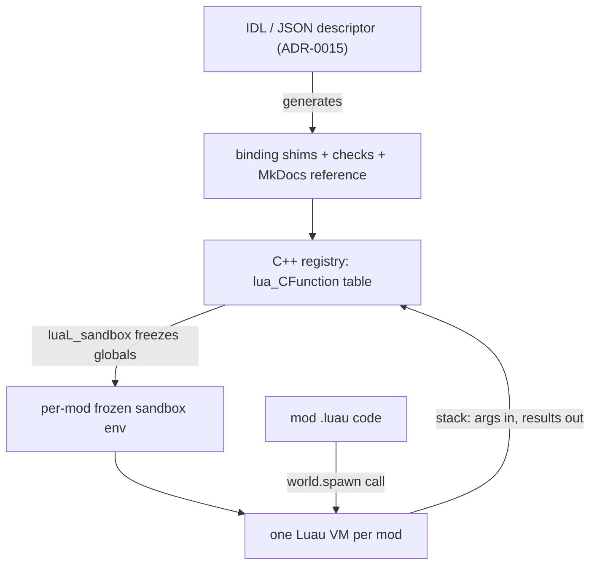

# Binding a Script API

## What it is

**Binding** is making one C++ function callable from a Luau mod. Luau keeps the classic Lua 5.1 C API, so the bridge is the same **virtual stack** every embedded Lua uses: a binding is a `lua_CFunction` that reads its arguments off the stack, does the work in C++, pushes its results back, and returns how many it pushed. The engine will register these functions into each mod's sandboxed environment, and will declare the whole surface once in an IDL/JSON descriptor from M6 day one ([ADR-0015](../../engine/architecture/adr-0015-luau-modding.md)).

## Why you care

A binding is the exact seam where untrusted mod code touches the authoritative C++ sim. Every value crossing it is hostile input — no safer than a network packet ([serialization-basics](../architecture/serialization-basics.md)). This is where the sandbox promise is kept or broken. The claim, verbatim from the master plan:

> a friend adds an enemy with a JSON file + 20 lines of Luau, hash-verified into the co-op session, and a bad mod can't crash the game or corrupt saves.

A binding that trusts its arguments is how "can't crash the game" quietly becomes "did." That is why the API will be defined once in an IDL, and why every new binding will land with an abuse test ([ADR-0015](../../engine/architecture/adr-0015-luau-modding.md)). The sandbox is containment, not an OS-level security boundary.

## Quick start

A mod calls a plain function:

```luau
-- fragment
local id = world.spawn("goblin", 4)   -- this call crosses into C++
```

The C++ side is a `lua_CFunction`. It validates every argument before touching the sim:

```cpp
// fragment — does not compile alone
#include <lua.h>
#include <lualib.h>

// Exposed as world.spawn(kind, count) inside each mod's sandbox.
static int l_world_spawn(lua_State* L) {
    const char* kind = luaL_checkstring(L, 1);   // arg 1, or raise on wrong type
    int count = luaL_checkinteger(L, 2);         // arg 2
    if (count < 1 || count > 64)                 // this binding's contract
        luaL_error(L, "spawn: count %d out of [1,64]", count);
    EntityHandle h = SpawnAuthoritative(kind, count);  // the C++ sim owns truth
    lua_pushinteger(L, h.value);                 // leave one result on the stack
    return 1;                                    // ...and say we left one
}
```

The engine will register it — in the real build, generated from the IDL descriptor, then frozen into the sandbox by `luaL_sandbox`:

```cpp
// fragment — does not compile alone
// Generated from the IDL (ADR-0015); the table is frozen, not writable by mods.
static const luaL_Reg kWorldApi[] = {
    {"spawn", l_world_spawn},
    {nullptr, nullptr},
};
```

## How it works

The stack is the entire conversation. Argument 1 sits at index 1, argument 2 at index 2; the `luaL_check*` helpers read and type-check them, `lua_pushinteger` leaves a result, and `return 1` tells Luau how many results to hand back. Nothing else passes between the two languages.



Two rules keep the seam safe. First, **validate like a packet**: a binding owns a contract (`count` in [1, 64]) and rejects anything outside it, because a mod can pass any number, `nil`, a table, or `NaN`. The pure-C++ shape of that check, standalone:

```cpp
#include <cassert>
#include <cmath>
#include <cstdint>
#include <optional>

// What a binding must do to every argument a mod hands it:
// treat it as a hostile packet, not a trusted call.
std::optional<std::uint32_t> checked_spawn_count(double requested) {
    constexpr std::uint32_t kMax = 64;             // this binding's contract
    if (!(requested >= 1.0) || requested > kMax)   // NaN fails the >= test
        return std::nullopt;                       // reject: nothing spawned
    return static_cast<std::uint32_t>(requested);
}

int main() {
    assert(checked_spawn_count(8).value() == 8);
    assert(!checked_spawn_count(0));               // below [1,64] contract
    assert(!checked_spawn_count(-1));              // negative
    assert(!checked_spawn_count(1e9));             // four-billion-goblin raid
    assert(!checked_spawn_count(std::nan("")));    // NaN out of Luau math
}
```

Second, **mind the unwind**. A Lua error (`luaL_error`) unwinds the C stack to the nearest `pcall`. Compiled as C that unwind is `longjmp` and skips C++ destructors; Luau built as C++ turns it into a real exception. Either way the discipline is identical: validate with `luaL_check*` at the very top, before you hold a lock or an RAII handle ([raii](../cpp/raii.md)), so a raise can never strand a resource.

!!! warning
    Never hand a mod a raw `entt::entity` or a sim pointer via `lua_pushlightuserdata`. A stale or forged pointer is a crash or a corrupt save. Cross the boundary with validated integer handles instead → [handles-not-pointers](./handles-not-pointers.md).

## Pros / Cons

| Pros | Cons |
| --- | --- |
| One tiny, testable function per exposed capability | Every argument is untrusted; validation is on you |
| The IDL keeps code, checks, and docs from drifting | Manual stack bookkeeping is easy to miscount |
| `luaL_check*` rejects bad types before any work | `longjmp` errors skip C++ destructors if misused |
| Bindings are the sandbox's real enforcement point | Wide APIs are wide attack surface — each needs a test |

## What to expect

Scripting lands at **M6** ([ADR-0015](../../engine/architecture/adr-0015-luau-modding.md)); until then this is planned, not built. The IDL will generate both the binding checks and the MkDocs reference, so the docs cannot drift from the code. Each binding will ship with a hostile fixture — the suite is ≥15 evil `.luau` files. You will not be able to bind into predicted movement; that path stays pure C++ ([ADR-0005](../../engine/architecture/adr-0005-predicted-movement-is-cpp.md)), and first-party features migrate onto this same public API as a ratchet ([ADR-0006](../../engine/architecture/adr-0006-first-party-as-a-mod-ratchet.md)). Expect the abuse test, not the happy path, to be the hard part.

!!! tip
    Write the abuse test first: feed the binding `nil`, a giant number, a wrong type, and a `NaN`, then assert it rejects each. Run it under sanitizers ([debugging-with-sanitizers](../cpp/debugging-with-sanitizers.md)) — a boundary bug is a memory bug.

## Go deeper

- [handles-not-pointers](./handles-not-pointers.md) — entity references across the boundary (the safe alternative to raw pointers)
- [api-versioning](./api-versioning.md) — evolving the API without breaking mods
- [script-resource-budgets](./script-resource-budgets.md) — per-binding CPU auditing rationale
- [sandboxing](./sandboxing.md) — the frozen environment a binding registers into
- [luau-overview](./luau-overview.md) — the language on the other side of the stack
- [command-funnel](../architecture/command-funnel.md) — mods act by issuing commands, not by mutating the sim in place
- [serialization-basics](../architecture/serialization-basics.md) — the same "validate untrusted input at the seam" habit
- [footguns-from-other-languages](../cpp/footguns-from-other-languages.md) — why `longjmp` and manual stacks surprise newcomers
- [ADR-0015](../../engine/architecture/adr-0015-luau-modding.md) — canonical for the Luau sandbox, VM-per-mod, and IDL decisions

**Sources**

- Programming in Lua (1st ed.), ch. 24 — An Overview of the C API — https://www.lua.org/pil/24.html — accessed 2026-07-06
- Programming in Lua (1st ed.), ch. 26 — Calling C from Lua — https://www.lua.org/pil/26.html — accessed 2026-07-06
- luau-lang/luau — GitHub (Lua 5.1 C API compatibility, `luaL_sandbox`) — https://github.com/luau-lang/luau — accessed 2026-07-06

Video: [Embedding Lua in C++ #1 (javidx9)](https://www.youtube.com/watch?v=4l5HdmPoynw) — 35:32. Watch the first ~15 min for a live `lua_State`, stack push/pop, and registering a C function — the exact loop this page formalizes.
