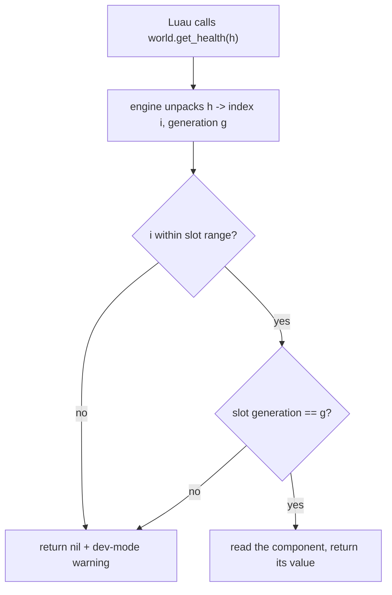

# Handles, Not Pointers

## What it is

A **handle** is a small integer a mod holds in place of a pointer. The planned Luau API will hand scripts a 64-bit opaque value — not a memory address — packing two fields: a **slot index** (which array element) and a **generation counter** (how many times that slot has been reused). Handles will be the only way a mod names an entity, passed by value; the sandbox exposes no raw C++ pointer or FFI to script (ADR-0015). The scheme itself is design intent for the M6 scripting layer, grounded in EnTT's versioned entity id (ADR-0010).

The real data will live in the engine's own arrays; the engine will validate a handle's generation before touching the slot it names. A mismatch means the entity the mod remembers is already gone.

## Why you care

Coming from a garbage-collected language, a reference stays valid as long as you hold it. C++ makes no such promise: the entity a mod points at can vanish mid-tick — killed, despawned, or swapped by a [hot reload](hot-reload.md) — and a raw pointer to freed memory is a use-after-free that corrupts a save or crashes far from its cause.

The mod boundary is where that is unaffordable. The engine's promise, verbatim from the master plan (design goal 8):

> a friend adds an enemy with a JSON file + 20 lines of Luau, hash-verified into the co-op session, and a bad mod can't crash the game or corrupt saves.

Handles deliver the second half. Every operation on a **stale** handle is planned to be a safe no-op returning `nil`, plus a dev-build warning — the mod gets a clear "that entity is gone", never undefined behavior.

## Quick start

The engine keeps the arrays; the mod holds only the opaque handle:

```cpp
#include <cassert>
#include <cstdint>
#include <vector>

// A mod never sees this struct — only the opaque 64-bit value.
struct Handle { std::uint64_t bits{0}; };

constexpr std::uint32_t index_of(Handle h)      { return std::uint32_t(h.bits & 0xFFFF'FFFF); }
constexpr std::uint32_t generation_of(Handle h) { return std::uint32_t(h.bits >> 32); }
constexpr Handle make_handle(std::uint32_t i, std::uint32_t g) {
    return Handle{(std::uint64_t(g) << 32) | i};
}

struct Health { int hp; };

struct World {
    std::vector<Health>        slots;       // the real data — mods can't touch it
    std::vector<std::uint32_t> generation;  // one counter per slot

    Handle spawn(int hp) {
        const std::uint32_t i = std::uint32_t(slots.size());
        slots.push_back(Health{hp});
        generation.push_back(1);            // 0 is reserved for "never issued"
        return make_handle(i, 1);
    }

    void kill(Handle h) {
        if (Health* p = resolve(h)) { p->hp = 0; ++generation[index_of(h)]; }
    }

    // The whole safety story: validate the generation before returning a pointer.
    Health* resolve(Handle h) {
        const std::uint32_t i = index_of(h);
        if (i >= slots.size())                 return nullptr;  // out of range
        if (generation[i] != generation_of(h)) return nullptr;  // stale -> no-op
        return &slots[i];
    }
};

int main() {
    World w;
    Handle goblin = w.spawn(30);
    assert(w.resolve(goblin) != nullptr);   // fresh handle resolves
    w.kill(goblin);                         // the slot's generation bumps
    assert(w.resolve(goblin) == nullptr);   // same bits, now a safe no-op
}
```

On the Luau side:

```luau
-- fragment
local goblin = world.spawn("goblin")   -- returns an opaque handle
world.kill(goblin)                     -- generation bumps, engine-side
print(world.get_health(goblin))        -- nil: stale handle is a safe no-op
```

## How it works

Each slot carries a version number; destroying an entity **bumps** it. A handle stores the generation it was minted with, so once a slot is reused, an old handle and the new one differ in their high bits. Validation is a single integer compare — cheap enough to run on every API call:



This is a well-worn pattern: Bitsquid's ID lookup table and floooh's "handles are the better pointers" build cross-system references this way, because a handle can be validated where a pointer cannot. It is also how the engine's ECS will name entities: EnTT's `entt::entity` is a versioned integer whose version increases when an entity is released and its index recycled (ADR-0010), so `registry.valid()` catches this staleness. The mod handle will be that id, re-exported as opaque bits.

One choice answers three problems. **Hot reload** will tear down a mod's VM and rebuild it, yet handles held across it still validate against the live world. **Save/load** will write handles as plain integers — no pointer fix-up. **Replication** will ship those same integers over the wire (ADR-0013), where a raw pointer could never travel.

!!! info
    Join-time hash matching of the mod list is compatibility and honesty — everyone runs the same code — not anti-cheat, and unrelated to handle validation. The server stays authoritative regardless (ADR-0005).

## Pros / Cons

**Pros**

- A stale reference is a defined `nil`, not undefined behavior — containment at the mod boundary.
- Handles survive hot reload, save/load, and replication unchanged; a pointer survives none.
- Validation is one comparison, and the id already exists in EnTT (ADR-0010).

**Cons**

- Every access pays a lookup and a branch — negligible, but not free.
- The generation counter is finite; 32 bits make wraparound astronomically unlikely, not impossible.
- Handles say nothing about ownership or lifetime — that stays a C++ concern ([ownership](../cpp/ownership-smart-pointers.md)).

## What to expect

When scripting lands at M6 (ADR-0015; the engine is pre-M1 today), a mod will spawn entities and keep their handles indefinitely. Code defensively: treat every handle as possibly stale and check the return. The dev-mode warning points at **where** a script held a handle too long. The guarantee is real but narrow: a stale handle is safe, yet a VM zero-day is still arbitrary code execution, so run strangers' mods on a dedicated server in a container (ADR-0015).

!!! warning
    A handle is not a subscription. Holding one does **not** keep the entity alive, nor does it announce the death — you learn of it only when a call returns `nil`. To react to a death, a mod listens for the event; it never polls a handle.

## Go deeper

- [Hot reload](hot-reload.md) — the teardown/rebuild flow these handles survive.
- [Sandboxing](sandboxing.md) — the VM jail the handle boundary sits inside.
- [The ECS Pattern](../architecture/ecs-pattern.md) — EnTT's versioned `entt::entity`, the same id underneath.
- [Ownership with smart pointers](../cpp/ownership-smart-pointers.md) — who deletes what, on the C++ side.
- [Footguns from other languages](../cpp/footguns-from-other-languages.md) — the dangling-pointer bugs handles design out.
- [ADR-0015: Luau is the modding language](../../engine/architecture/adr-0015-luau-modding.md) — the sandbox and API rules.
- [ADR-0010: EnTT is the ECS](../../engine/architecture/adr-0010-entt-ecs.md) — versioned entity ids.

**Sources**

- Handles are the better pointers — floooh — https://floooh.github.io/2018/06/17/handles-vs-pointers.html — accessed 2026-07-06
- Managing Decoupling Part 4: The ID Lookup Table — Bitsquid — http://bitsquid.blogspot.com/2011/09/managing-decoupling-part-4-id-lookup.html — accessed 2026-07-06
- skypjack/entt — GitHub — https://github.com/skypjack/entt — accessed 2026-07-06

**Video**: [RustConf 2018 Closing Keynote — Catherine West](https://www.youtube.com/watch?v=aKLntZcp27M) — 42 min. Watch the generational-index segment after this page: it derives the same index+generation handle from scratch as the fix for dangling references.
