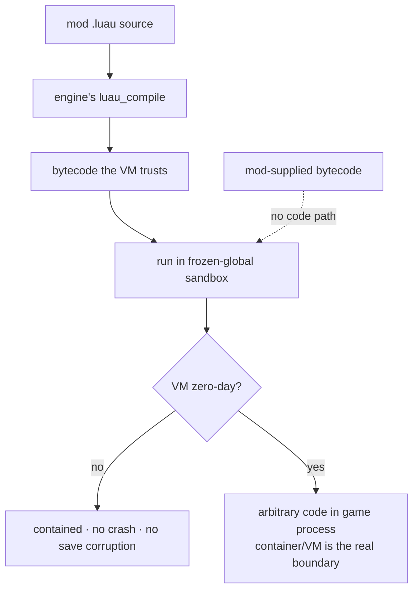

# Honest Limits of Mod Security

## What it is

This page is the fine print. [Sandboxing](./sandboxing.md) covers how the engine will confine a mod; this page states what that confinement cannot promise — the master plan makes honesty here a rule, not a footnote.

The sentence to memorize: the sandbox is **containment, not an OS-level security boundary** ([ADR-0015](../../engine/architecture/adr-0015-luau-modding.md)). The engine will never be marketed as "secure." The promise, verbatim from the plan, is bounded: **a friend adds an enemy with a JSON file + 20 lines of Luau, hash-verified into the co-op session, and a bad mod can't crash the game or corrupt saves.** That is a claim about accidents and ordinary bugs — not a guarantee against a determined attacker.

## Why you care

You are loading code written by strangers into your game's own process. Knowing the exact shape of that trust separates an honest product from a lie that gets someone owned.

Two facts follow from containment-not-isolation. First, a memory-safety zero-day in the Luau VM means **arbitrary code execution in the game process** — the sandbox blocks the documented API, not a bug in the C++ beneath it. Luau's own docs concede "the sandboxing isn't formally proven." Second, therefore, **dedicated servers running strangers' mods should run in a container or VM** ([ADR-0015](../../engine/architecture/adr-0015-luau-modding.md)) — OS-level isolation is the real boundary. Even Roblox, who built Luau against hostile code, pays a bug bounty for VM escapes: a hardened sandbox is not a solved one.

Hash matching, separately, is **compatibility and honesty** — is everyone running the same game? — never anti-cheat; that belongs to [Mod Packaging](./mod-packaging.md).

## Quick start

The single decision behind every limit here: **the engine will only ever compile mod source; it will never load mod-supplied bytecode** ([ADR-0015](../../engine/architecture/adr-0015-luau-modding.md)).

```cpp
// fragment — does not compile alone
// The only accepted input is source the engine compiles itself.
size_t len = 0;
char* bc = luau_compile(src, src_len, nullptr, &len);  // our compiler
luau_load(L, "=mod", bc, len, 0);                       // our bytecode
free(bc);
// No code path ever calls luau_load on bytes a mod shipped.
```

## How it works

A source-level sandbox blocks `io`, `os`, and `require`-off-disk — the doors you can see. Hand-crafted bytecode walks past all of them: freed from the invariants the compiler guarantees, it can forge object layouts, read and write arbitrary memory a byte at a time, flip a page to executable, and jump in. Having built exactly that exploit, corsix.org concludes "Lua should be sandboxed at the operating-system-process level, as opposed to at the Lua level." Luau deletes the vector instead — `string.dump` and `load` are gone, and the VM "assumes that the bytecode was generated by the Luau compiler."



The other classic vectors are not escapes but denial-of-service: an infinite loop, or a memory bomb like `string.rep(x, 2^30)`. The CPU interrupt and ~64 MB cap that answer them live in [Script resource budgets](./script-resource-budgets.md). And every bound C++ function is a fresh hole if it trusts its inputs — a stale or forged entity id from a mod must meet validation, never a raw pointer ([Handles, not pointers](./handles-not-pointers.md)).

!!! warning
    "Contained" is a promise about your friend's buggy mod, not about an adversary holding a VM exploit. Host strangers' mods on a dedicated server only inside a container or throwaway VM, and never tell a user the engine is "secure."

## Pros / Cons

- **Pro:** the bounded promise holds — an ordinary bad mod can't crash the game or corrupt saves.
- **Pro:** refusing mod bytecode closes the classic Lua escape structurally, not by policy.
- **Pro:** every documented limit is pinned by a hostile-mod fixture (ADR-0015).
- **Con:** a VM memory-safety zero-day is in-process code execution — containment, not isolation.
- **Con:** dedicated servers hosting strangers' mods still need a container or VM around them.
- **Con:** the model asks you to keep saying "not secure" when marketing wishes you wouldn't.

## What to expect

A documented limit that no test exercises is only a hope. The standing proof will be the **hostile-mod fixture suite — ≥15 evil `.luau` files** — where every limit above will land with an abuse test, and every new binding will arrive with its own ([ADR-0015](../../engine/architecture/adr-0015-luau-modding.md); master plan). The fixtures will load forged bytecode, spin infinite loops, exhaust memory, and forge handles; a limit is "done" only when those fixtures stay green under ASan/UBSan in CI ([Debugging with sanitizers](../cpp/debugging-with-sanitizers.md)). Save corruption is bounded further by writing only under the pref-path ([ADR-0021](../../engine/architecture/adr-0021-writes-under-prefpath.md)).

!!! info
    Out of scope, on purpose: sandbox construction ([Sandboxing](./sandboxing.md)), quota enforcement ([Script resource budgets](./script-resource-budgets.md)), and why the join-hash is honesty, not anti-cheat ([Mod Packaging](./mod-packaging.md)).

## Go deeper

- [Sandboxing](./sandboxing.md) — the environment this page qualifies.
- [Script resource budgets](./script-resource-budgets.md) — the answer to exhaustion vectors.
- [Handles, not pointers](./handles-not-pointers.md) — a forged id hits validation, not a pointer.
- [Binding a script API](./binding-a-script-api.md) — every binding is a trust boundary.
- [Mod Packaging](./mod-packaging.md) — the join-hash is honesty, not anti-cheat.
- [Debugging with sanitizers](../cpp/debugging-with-sanitizers.md) — how a fixture catches a real escape.
- [The command funnel](../architecture/command-funnel.md) — the one door mod mutations enter.
- [Serialization basics](../architecture/serialization-basics.md) — the save path to protect.
- [Determinism limits](../physics/determinism-limits.md) — why script stays off the predicted path.
- [ADR-0015](../../engine/architecture/adr-0015-luau-modding.md) — canonical for every limit here.
- [ADR-0005](../../engine/architecture/adr-0005-predicted-movement-is-cpp.md) — the code the sandbox never touches.
- [ADR-0021](../../engine/architecture/adr-0021-writes-under-prefpath.md) — the save-corruption boundary.

**Sources**

- Malicious LuaJIT bytecode — corsix.org — https://www.corsix.org/content/malicious-luajit-bytecode — accessed 2026-07-06
- Embedding a sandboxed Luau virtual machine — Luau — https://luau.org/sandbox — accessed 2026-07-06
- lua-users wiki: Sand Boxes (http-only) — http://lua-users.org/wiki/SandBoxes — accessed 2026-07-06
- Roblox bug bounty program — HackerOne — https://hackerone.com/roblox — accessed 2026-07-06
