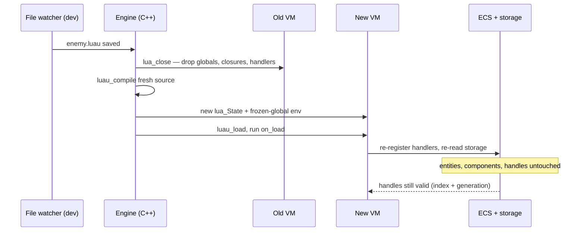

# Hot Reload for Mods

## What it is

Hot reload is editing a mod's Luau source, saving the file, and seeing the change in the already-running game — no restart, no rebuild. In dev mode the engine will watch a mod's files; on save it will throw the mod's entire Luau VM away, recompile the source, and re-run the mod's `on_load` to rebind its handlers (planned for M6, [ADR-0015](../../engine/architecture/adr-0015-luau-modding.md)). The world underneath — entities, components, the save — will keep ticking at 60 Hz.

This is a Luau source reload. Hot-swapping the C++ engine itself (DLL reload) is a harder problem, not planned here; a C++ change still means a full rebuild.

## Why you care

The whole reason to embed a script is iteration in a file-save instead of a recompile-and-relink cycle ([Why embed scripting](./why-embed-scripting.md)). As Elias Daler puts it: "you can change parts of your program/game logic without recompiling and even without reloading your program." A colony sim's feel lives in thousands of small numbers — spawn rates, damage, timers — and you will tweak them constantly.

Reload will be cheap here because the engine will compile mod **source** in-process ([Luau overview](./luau-overview.md)); recompiling 20 lines of Luau is microseconds, not a link step. One caveat: the file watcher is a **dev-mode** loop. Shipping a mod into a co-op session will go through hash-verified packaging ([Mod packaging](./mod-packaging.md)), not the watcher.

## Quick start

The one rule that will make reload work: **durable state will live in components and the `storage` API, never in script globals.** A global is part of the VM, and the VM is what will be destroyed on reload.

```luau
-- fragment
-- WRONG: this counter is a VM global — it resets to 0 on every reload.
local kills = 0
events.on("entity_killed", function() kills = kills + 1 end)
```

```luau
-- fragment
-- RIGHT: storage outlives the VM, so the count survives a reload.
events.on("entity_killed", function()
    storage.set("kills", storage.get("kills") + 1)
end)
```

`storage` will be a per-mod namespace the engine flushes atomically with the save, under the pref-path ([ADR-0021](../../engine/architecture/adr-0021-writes-under-prefpath.md)). Because the fresh VM will re-read `storage` and re-query components on load, it will pick up exactly where the old one left off.

## How it works

Teardown will be wholesale, not a diff. The engine will close the old VM (`lua_close`), dropping every global, closure, upvalue, and registered handler at once. Then it will recompile the source, build a fresh sandboxed environment ([Sandboxing](./sandboxing.md)), and run `on_load`, which re-registers the mod's event handlers.

```cpp
// fragment — does not compile alone
void reload_mod(Mod& mod, const char* src, size_t src_len) {
    lua_close(mod.L);                       // drop the old VM whole
    mod.L = luaL_newstate();
    build_frozen_env(mod.L);                // rebuild the sandbox
    size_t bc_len = 0;
    char* bc = luau_compile(src, src_len, nullptr, &bc_len);
    if (luau_load(mod.L, "=mod", bc, bc_len, 0) == 0)
        lua_pcall(mod.L, 0, 0, 0);          // runs on_load, rebinds handlers
    free(bc);
}
```

Entity handles will survive because a handle will be a 64-bit opaque value (index + generation), not a pointer into the VM ([Handles, not pointers](./handles-not-pointers.md)). A handle sitting in a component or in `storage` is just a number; the new VM will validate it with `entity:isValid()` exactly as the old one did.



## Pros / Cons

- **Pro:** iteration in a file-save — no recompile, no relink.
- **Pro:** state survives because it lives in the world, not the VM.
- **Pro:** the reload rule (`storage`/components, not globals) is the same habit that makes save/load and replication work ([ECS pattern](../architecture/ecs-pattern.md)).
- **Con:** dev-mode only — never the shipping or co-op path.
- **Con:** state hidden in globals is lost every reload (the reload is how you find out).
- **Con:** teardown is wholesale — in-flight timers and coroutines are dropped and re-armed by `on_load`, not resumed.
- **Con:** C++ engine changes still need a full rebuild; no DLL hot reload.

## What to expect

- The reload will rebuild everything and keep the state — the Tomorrow Corp workflow of "rebuild, keep the world alive" (video below).
- Handlers will fire in load order after `on_load` — deterministic and documented.
- A syntax or compile error will leave no half-loaded mod: the old VM is already gone, so the mod will disable itself cleanly with a line-level console error (an M6 modder-error-UX exit criterion). Fix the file, save again, and it reloads.

!!! tip
    Treat every reload as a free correctness check. If a value resets when you save, it was hiding in a VM global — move it into `storage` or a component and the bug is fixed for save/load too.

!!! info
    Where the watcher finds a mod's files, and how load order is resolved, belong to [Mod packaging](./mod-packaging.md). This page is only the teardown-and-rebuild loop.

## Go deeper

- [Handles, not pointers](./handles-not-pointers.md) — why an entity handle stays valid across a VM swap.
- [Mod packaging](./mod-packaging.md) — where the watcher reads from, load order, and the join-handshake hash check.
- [Sandboxing](./sandboxing.md) — the frozen-global environment the new VM rebuilds.
- [Luau overview](./luau-overview.md) — why the engine compiles source, never bytecode.
- [Script resource budgets](./script-resource-budgets.md) — the CPU and memory limits every reload rebuilds under.
- [RAII](../cpp/raii.md) — `lua_close` as scoped teardown, the C++ pattern behind a clean VM drop.
- [ECS pattern](../architecture/ecs-pattern.md) — components as the durable home for state a VM can't keep.
- [Serialization basics](../architecture/serialization-basics.md) — how `storage` flushes with the save (ADR-0013).
- [ADR-0015: Luau is the modding language](../../engine/architecture/adr-0015-luau-modding.md) — canonical for the VM, sandbox, and reload model.
- [ADR-0021: Writes under pref-path](../../engine/architecture/adr-0021-writes-under-prefpath.md) — where `storage` lives.
- [ADR-0006: First-party-as-a-mod](../../engine/architecture/adr-0006-first-party-as-a-mod-ratchet.md) — the base game reloads through the same loop.

**Sources**

- How We Make Games at Tomorrow Corp — Our Custom Tools Tech Demo — https://tomorrowcorporation.com/posts/how-we-make-games-at-tomorrow-corp-our-custom-tools-tech-demo — accessed 2026-07-06
- Using Lua with C++ (Elias Daler) — https://edw.is/using-lua-with-cpp/ — accessed 2026-07-06
- Luau — Getting Started — https://luau.org/getting-started/ — accessed 2026-07-06

**Video:** [Tomorrow Corporation Tech Demo](https://www.youtube.com/watch?v=72y2EC5fkcE) — 14 min — watch to see the whole hot-reload-everything loop: edit code, keep the world alive, rewind it.
