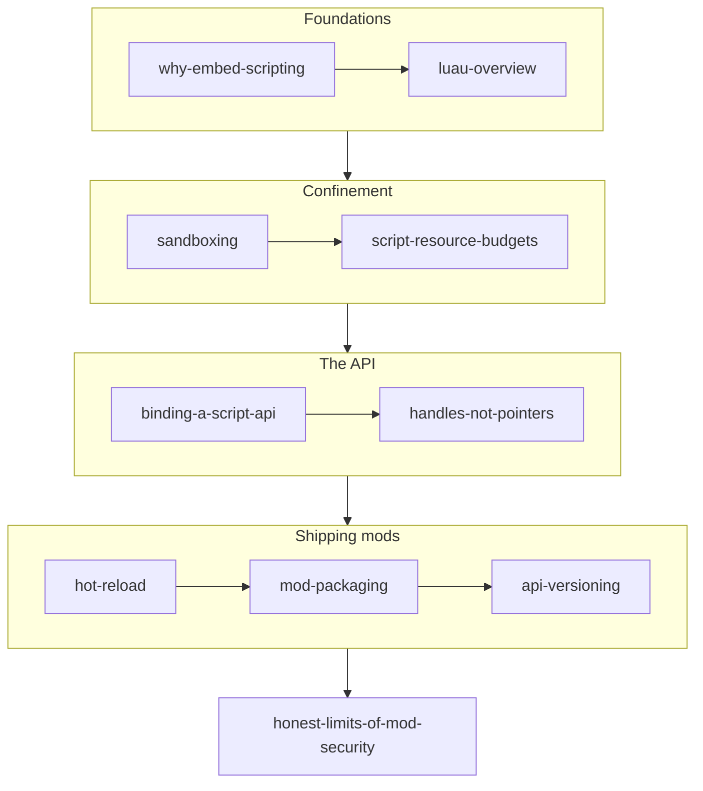

# Scripting & Modding

## What it is

This track is the modding subsystem end to end: how the engine will let players change the game without a C++ compiler. The plan is an embedded Luau virtual machine per mod, running in-process on the fixed 60 Hz tick, confined by a sandbox and reached through a hand-bound API ([ADR-0015](../../engine/architecture/adr-0015-luau-modding.md)). The engine is pre-M1 — none of this is built — so every engine claim here is written in planned tense and linked to its ADR.

## Why you care

You are an experienced programmer, new to C++ and to shipping a moddable engine. Embedding a scripting language has three classic hard problems, and this track is organized around them: a hostile mod that never returns control, a stale reference that corrupts the host, and an API that breaks every mod the day it changes. The engine's answers — one frozen VM per mod, opaque generational handles, a versioned IDL descriptor — outlive this engine. They are the reusable craft.

## How it works

Read top to bottom. The pages move from motivation, to the VM and how it is caged, to the C++/Luau boundary, to shipping and evolving real mods — closing on an honest accounting of what the sandbox does not protect.

| Page | Takeaway |
|---|---|
| [Why Embed a Scripting Language](why-embed-scripting.md) | Iteration without recompiles, behavior as data, modding without a toolchain — and the C++/script line the engine will draw ([ADR-0005](../../engine/architecture/adr-0005-predicted-movement-is-cpp.md)). |
| [Luau Overview](luau-overview.md) | Roblox's Lua 5.1 derivative: gradual typing, a fast interpreter, hostile code as its founding requirement. |
| [Sandboxing a Luau VM](sandboxing.md) | One VM per mod, a frozen builtin table, no bytecode loading, a C++-resolved VFS jail (ADR-0015). |
| [Script Resource Budgets](script-resource-budgets.md) | The interrupt callback, allocator hook, and poison flag that will keep a runaway mod from stalling the 60 Hz tick. |
| [Binding a Script API](binding-a-script-api.md) | How C++ functions become Luau-callable via the Lua stack — and why the API is defined once in an IDL descriptor. |
| [Handles, Not Pointers](handles-not-pointers.md) | Mods will see 64-bit generational handles; every op on a stale handle is a safe nil, matching EnTT's entity id ([ADR-0010](../../engine/architecture/adr-0010-entt-ecs.md)). |
| [Hot Reload for Mods](hot-reload.md) | Tear the VM down, recompile, re-run `on_load` — feasible because durable state lives in components, not script globals. |
| [Mod Packaging](mod-packaging.md) | A mod as an id-addressed directory with a manifest, plus the co-op join handshake that checks id, version, and SHA-256. |
| [Versioning a Mod API](api-versioning.md) | A single integer API level, support for N and N−1, and deprecation shims that warn before removal. |
| [Honest Limits of Mod Security](honest-limits-of-mod-security.md) | The sandbox is containment, not OS isolation — run strangers' mods in a container, and the fixture suite proves each limit. |

## What to expect

Roughly an evening per page. By the end you can reason about how a mod loads, what it can and cannot touch, and why each safety choice is the one that survives hot reload, save/load, and replication. You will not find working engine code — there is none yet — but you will find the design the engine commits to (ADR-0015) and the abuse tests that will hold it to account.

!!! warning "Read the last page too"
    [Honest Limits of Mod Security](honest-limits-of-mod-security.md) is not optional. The sandbox is containment against accidents and casual abuse, never OS-level isolation. If you run a dedicated server on strangers' mods, treat the process as untrusted and jail it in a container.

## Go deeper

New to the C API this all rests on? Work through the [C++ track](../cpp/index.md) first — the [stack and ownership](../cpp/ownership-smart-pointers.md) pages especially. Handles echo EnTT's versioned entity id from the [Architecture track](../architecture/ecs-pattern.md); the server-authoritative line these mods respect is drawn in [Netcode](../netcode/server-authority.md). Start here at [Why Embed a Scripting Language](why-embed-scripting.md).

Sources:

- Luau — official site — https://luau.org/ — accessed 2026-07-06
- Embedding a sandboxed Luau virtual machine — https://luau.org/sandbox/ — accessed 2026-07-06
- luau-lang/luau — source repository — https://github.com/luau-lang/luau — accessed 2026-07-06
- ADR-0015: Luau modding — https://github.com/IsItJeff/game-engine/blob/main/docs/engine/architecture/adr-0015-luau-modding.md — accessed 2026-07-06
