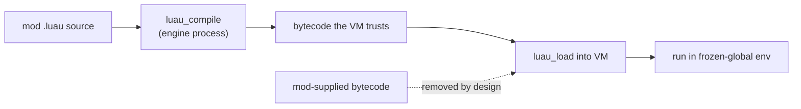

# Luau Overview

## What it is

Luau (lowercase u, "LOO-ow") is "a fast, small, safe, gradually typed embeddable scripting language derived from Lua" — a heavily modified Lua 5.1 runtime with a rewritten interpreter, open-sourced by Roblox under the MIT license. It keeps Lua 5.1's C API and most of its syntax, then adds three things mainline Lua lacks: a gradual type system, a built-in linter, and an interpreter tuned to run fast without a JIT. [Why embed scripting](./why-embed-scripting.md) made the case for scripting at all; this page is the specific language the engine will embed.

The founding requirement is the interesting part. Luau grew up running code written by millions of strangers, so its own docs state it plainly: "Luau is safe to embed. Broadly speaking, this means that even in the face of untrusted (and in Roblox case, actively malicious) code, the language and the standard library don't allow unsafe access."

## Why you care

The engine will script every mod in Luau — one VM per mod — landing at milestone M6 ([ADR-0015](../../engine/architecture/adr-0015-luau-modding.md)). Mods will drive server-authoritative sim logic and presentation, never the client-predicted movement path, which stays C++ ([ADR-0005](../../engine/architecture/adr-0005-predicted-movement-is-cpp.md)). The product bet is that "a friend adds an enemy with a JSON file + 20 lines of Luau, hash-verified into the co-op session, and a bad mod can't crash the game or corrupt saves."

Read that claim precisely. The sandbox is **containment**, not an OS-level security boundary — the engine is never marketed as "secure" ([ADR-0015](../../engine/architecture/adr-0015-luau-modding.md)). Hash matching between players is a **compatibility and honesty** check (same mods, same versions on both ends), not anti-cheat ([ADR-0015](../../engine/architecture/adr-0015-luau-modding.md)). Luau is what will make the containment half of that promise credible without a separate process per mod.

## Quick start

A mod's Luau reads like Lua with optional type annotations:

```luau
-- fragment
local function on_spawned(enemy: Entity, tick: number)
    enemy.health = 40
    enemy.faction = "hostile"
end
```

The embedding contract is the load-bearing detail. The engine will compile mod **source** in-process and run the bytecode it produced — it will never accept bytecode from a mod:

```cpp
// fragment — does not compile alone
size_t len = 0;
char* bc = luau_compile(src, src_len, nullptr, &len);  // engine compiles SOURCE
int rc = luau_load(L, "=enemy_mod", bc, len, 0);        // load OUR bytecode only
free(bc);
if (rc == 0) lua_pcall(L, 0, 0, 0);                     // run under a budget
```

!!! info
    Building the frozen-global environment `lua_pcall` runs inside — no `io`, no `os`, no `require` off disk — is its own page: [Sandboxing](./sandboxing.md).

## How it works

Luau's safety posture starts at the door most embeddings leave open: loading bytecode.



Mainline Lua ships `load` and `string.dump`, and its `loadstring` will accept precompiled chunks — but "using untrusted bytecode may lead to exploits" because "bytecode is hard to validate." Luau's answer is blunt: "To achieve memory safety, access to function bytecode has been removed." `string.dump` and `load` are gone; the VM "assumes that the bytecode was generated by the Luau compiler." So the only way in is source the engine compiles itself — the classic Lua escape vector is structurally closed, not merely discouraged.

The interpreter is the other half. Luau is "focused on, first and foremost, stable high performance code in interpreted context" — a JIT "is not available on many platforms," so native codegen is "an optional component," disabled on macOS per ADR-0015. Its "highly tuned portable bytecode interpreter" can "match the performance of LuaJIT interpreter" on some workloads with no native code at all. On a fixed 60 Hz tick ([Fixed timestep](../architecture/fixed-timestep.md)), a predictable interpreter beats a JIT that warms up unevenly.

!!! warning
    Gradual types are a linting aid, erased before execution — they do not enforce anything at runtime. Treat `enemy: Entity` as documentation the analyzer checks, not a guard on the value a mod actually passes.

## Pros / Cons

| Pros | Cons |
|---|---|
| Engineered against hostile code as a founding goal | Smaller ecosystem than mainline Lua or LuaJIT |
| No bytecode loading — closes the classic escape vector | Gradual types are erased at runtime, not enforced |
| Fast portable interpreter, no JIT dependency | Codegen off on macOS (ADR-0015) leaves perf on the table |
| MIT, Lua 5.1 C API, actively maintained by Roblox | Sandbox is containment, never an OS boundary |

ADR-0015 rejected LuaJIT (Apple Silicon and maintenance risk), QuickJS (JS is not the game-modding lingua franca), and native C++ plugins (a permanent security invariant).

## What to expect

- The frozen-global environment each VM runs in: [Sandboxing](./sandboxing.md).
- Enforcing the "can't crash the game" half — CPU interrupts and the ~64 MB memory cap: [Script resource budgets](./script-resource-budgets.md).
- What the sandbox honestly cannot promise, including the memory-safety zero-day caveat: [Honest limits of mod security](./honest-limits-of-mod-security.md).

## Go deeper

- [Why embed scripting](./why-embed-scripting.md) — the case for a mod layer at all.
- [Binding a script API](./binding-a-script-api.md) — how C++ functions reach Luau.
- [Handles, not pointers](./handles-not-pointers.md) — why mods never hold a raw `Entity*`.
- [Footguns from other languages](../cpp/footguns-from-other-languages.md) — Lua's own gotchas for the C++ reader.
- [Serialization basics](../architecture/serialization-basics.md) — the JSON side of a mod (ADR-0013).
- [ADR-0015](../../engine/architecture/adr-0015-luau-modding.md) — the Luau decision, rejections, and security invariant.
- [ADR-0006](../../engine/architecture/adr-0006-first-party-as-a-mod-ratchet.md) — first-party gameplay migrates onto the same mod API.
- [ADR-0021](../../engine/architecture/adr-0021-writes-under-prefpath.md) — where mods and their writes live on disk.

**Sources**

- Why Luau? — luau.org — https://luau.org/why — accessed 2026-07-06
- Luau Sandboxing (bytecode removal, safe-to-embed) — https://luau.org/sandbox — accessed 2026-07-06
- Luau Performance (interpreter, optional codegen) — https://luau.org/performance — accessed 2026-07-06
- luau-lang/luau — GitHub — https://github.com/luau-lang/luau — accessed 2026-07-06
- Luau — Roblox Creator Docs — https://create.roblox.com/docs/luau — accessed 2026-07-06
